# ERP PRO — المخطط المعماري للنواة المالية (Financial Architecture Blueprint)

**النوع:** تصميم معماري / تصميم تدفقات مالية / تصميم محاسبي / تصميم سلامة قاعدة البيانات / تصميم تقارير وتسويات
**النطاق:** النواة المالية فقط (Financial Core) — Stack: C# / .NET 9 / EF Core / PostgreSQL
**الحالة:** مسودة معتمدة للمراجعة — **ليست مهمة تنفيذ**. لا تُعدَّل شيفرة الإنتاج، ولا تُنشأ Migrations، ولا يُعاد بناء Handlers، ولا يُطبَّق RBAC، بناءً على هذا المستند وحده.
**المصدر الجذري لكل توصية:** هذا المستند لا يقترح شيئاً من فراغ. كل بند إمّا:

* موثّق من سلوك شيفرة فعلي (Existing Source Code Behavior) — يُذكر بصيغة `الملف:السطر`،
* أو مبني على بنية Entity/Schema فعلية،
* أو مأخوذ حرفياً من نتيجة تدقيق جنائي سابق (`AUDIT_REPORT.md`، بتاريخ 2026-07-08، الملقّب هنا بـ"التدقيق الجنائي")،
* أو مبدأ محاسبي قياسي (IFRS/GAAP)،
* أو متطلب عمل صريح يحتاج قرار من المالك — ويُعلَّم عندها `Decision Required`.

كل توصية غير مؤكدة من الشيفرة الحالية تُعلَّم `Needs Code Verification`، وكل تصميم جديد غير موجود اليوم يُعلَّم `Proposed Architecture`. لا يوجد بند "حسّن المحاسبة" غامض في هذا المستند — كل توصية تُجيب صراحة: ما الحدث المالي الذي تضبطه؟ ما البيانات التي تحتاجها؟ ما انتقال الحالة الذي يُطلقها؟ ما قيد الأستاذ الذي تُنشئه؟ ما حارس قاعدة البيانات الذي يحميها؟ وما التقرير/التسوية التي تكتشف فشلها؟

---

## 0. ملخص تنفيذي وربط بالتدقيق الجنائي

التدقيق الجنائي (`AUDIT_REPORT.md`) فحص الشيفرة الفعلية (لا بيانات إنتاج) ووجد أن الأساس المحاسبي قوي حيث يوجد أصلاً (قيود متوازنة، معاملات ذرّية عند الاعتماد)، لكن توجد 18 ثغرة معمارية (F-01 إلى F-18)، أبرزها:

* تكلفة شراء القماش الصيني الفعلية لا تصل أبداً إلى حساب الموردين الدائن (F-01).
* الضريبة/VAT غير محسوبة إطلاقاً (F-02).
* مدفوعات الموردين يمكن ترحيلها بلا ربط بفاتورة أو أمر شراء أو حاوية (F-03).
* الاعتماد المتزامن يمكن أن يُرحّل نفس الفاتورة مرتين (F-04).
* لا يوجد Income Statement أو Balance Sheet ولا فحص A = L + E تلقائي (F-09).
* لا توجد قيود مفاتيح خارجية (Foreign Keys) على كامل المخطط المالي الأساسي (F-07).

هذا المستند يحوّل كل ثغرة من هذه الثغرات إلى تصميم معماري كامل: تدفق حالة (Workflow)، قيد محاسبي (Posting Matrix)، حارس قاعدة بيانات (Database Integrity)، وتقرير/تسوية يكتشف الانحراف مستقبلاً (Reporting & Reconciliation). القسم 6 يجمع هذا الربط في جدول واحد صريح.

---

## 1. Financial Business Vision

### 1.1 لماذا توجد النواة المالية

النواة المالية في ERP PRO ليست طبقة تقارير فوقية يمكن الاستغناء عنها — هي **مصدر الحقيقة الوحيد** لكل ما يلي، ويجب أن يُشتق كل تقرير ومؤشر في النظام من نفس المصدر (`JournalEntryLines` المرحّلة)، لا من حسابات مستقلة تعيد اختراع نفس الرقم:

| المجال | أين يُفترض أن يُحسب اليوم | الحالة الفعلية (مرجع) |
|---|---|---|
| Accounts Receivable | `AccountingAccountIds.AccountsReceivable` عبر `PostSalesInvoiceApprovalAsync` | ✅ يُرحَّل فعلياً عند الاعتماد (`IntegratedAccountingService.cs:68-100` بحسب التدقيق) |
| Accounts Payable | `AccountingAccountIds.AccountsPayable` عبر `PostPurchaseInvoiceAsync` / `PostContainerApprovalAsync` | ⚠️ يعمل لمسار الشراء التقليدي فقط؛ **لا يعمل** لتكلفة القماش الصيني (F-01) |
| Inventory Value | `AccountingAccountIds.InventoryAsset` | ⚠️ يُرحَّل لكنه يستثني ثمن شراء القماش على مسار الصين (F-14) |
| Cost of Goods Sold | `AccountingAccountIds.CostOfGoodsSold` | ✅ يُرحَّل صحيحاً على المبيعات (`InventoryEngine.IssueForInvoiceAsync`) |
| Revenue | `AccountingAccountIds.SalesRevenue` | ✅ يُرحَّل عند الاعتماد |
| Sales Tax / VAT | لا يوجد حساب `Sales_Tax_Payable` في `AccountingAccountIds` اليوم | ❌ غير موجود إطلاقاً (F-02) — `Proposed Architecture` |
| Cash and Bank | `AccountingAccountIds.CashUsd`، `Cashbox` aggregate | ✅ موجود لصندوق نقدي واحد أساسي؛ حسابات بنكية متعددة `Needs Code Verification` |
| Supplier Balances | `SupplierAggregate.Balance` (in-memory) | ⚠️ لا فحص مطابقة تلقائي مع الأستاذ العام (يُغطّى في القسم 5) |
| Customer Balances | `CustomerAggregate.Balance` + `CreditLimitChecker` | ✅ موجود وتُفحص حدود الائتمان فعلياً |
| Partner Capital | `CapitalTransaction` (جدول خاص) | ⚠️ معزول عن الأستاذ العام بعد الرصيد الافتتاحي (F-13) |
| Profit/Loss | لا يوجد تقرير Income Statement فعلي | ❌ `IncomeStatementTemplate` قالب فارغ فقط (F-09) |
| Audit and Reconciliation | `AuditLogEntity` / `AuditLog.Record` | ⚠️ موجود لكنه يُستدعى من 3 نقاط فقط في كامل النظام (انظر §4.7) |

### 1.2 المشكلات التجارية الأساسية التي يجب حلّها

1. **منع أي مستند مالي من التأثير على العمل دون مصدر قابل للتتبع** — اليوم: `journal_entries` بلا أي Foreign Key على `SourceDocumentId` (F-07)؛ لا شيء يمنع قيداً معزولاً عن أي مستند مصدر.
2. **منع الترحيل المكرر** — اليوم: `PostIfNotExistsAsync` هو فحص-ثم-تنفيذ (check-then-act) بلا فهرس فريد يدعمه (F-04) — عرضة لسباق تزامن حقيقي.
3. **منع مدفوعات موردين غير مرتبطة** — اليوم: `PurchaseInvoiceId` اختياري على `PaymentVoucher` (F-03).
4. **ضمان أن لكل حركة مخزون قيمة مالية** — اليوم: صحيح جزئياً؛ حركة الصنف الصيني تُقيَّم بتكلفة الشحن فقط دون ثمن الشراء (F-14).
5. **ضمان أن كل حاوية استيراد تنتج AP وقيمة مخزون صحيحتين** — اليوم: القيد الوحيد هو Dr Landing-Cost-Clearing / Cr AP للمصاريف المشتركة فقط؛ ثمن القماش (`ChinaInvoiceAmountUsd`) لا يُذكر في أي قيد إطلاقاً (F-01).
6. **ضمان أن كل عملية بيع تنتج AR وإيراد وضريبة و COGS وخصم مخزون صحيحة** — الضريبة مفقودة بالكامل (F-02)؛ الباقي صحيح.
7. **ضمان أن كل تصحيح يمر عبر Reversal أو Return أو Credit Note أو Write-off — لا تعديل/حذف صامت** — Sales Return مطبّق وصحيح (نموذج يُحتذى به، §6.4 من التدقيق)؛ لا يوجد Reversal للفاتورة المعتمدة (F-16)؛ لا يوجد Write-off (F-12).
8. **ضمان أن Trial Balance و Income Statement و Balance Sheet تُشتق من نفس مصدر القيود** — Trial Balance والدفتر (Ledger) موجودان وصحيحان (`AccountingReportRepository.GetTrialBalanceAsync`)؛ Income Statement و Balance Sheet غير موجودين فعلياً (F-09).
9. **ضمان مطابقة أرصدة العملاء/الموردين مع الأستاذ العام** — لا تسوية تلقائية موجودة اليوم؛ مصمَّمة في §5.5.
10. **ضمان مطابقة تقييم المخزون مع الأستاذ العام** — لا تسوية تلقائية موجودة اليوم؛ مصمَّمة في §5.5.

### 1.3 مبادئ ERP PRO المالية (غير قابلة للتفاوض)

| # | المبدأ | الحالة الحالية |
|---|---|---|
| 1 | لا يمكن تعديل مستند مالي مُرحَّل مباشرة | ✅ مطبّق جزئياً (`EnsureStatus`/`EnsureEditable` على `SalesInvoiceAggregate`)، لكن غير مطبّق بشكل موحّد على كل المستندات — `Needs Code Verification` لكل نوع مستند |
| 2 | المستندات المُرحَّلة تُصحَّح فقط عبر Reversal أو تسوية مرتبطة | ⚠️ موجود لـ Sales Return فقط؛ غائب لبقية المستندات (F-16) |
| 3 | كل قيد أستاذ يجب أن يملك مستند مصدر | ✅ منطقياً (كل `Post*` يأخذ Aggregate)، لكن **غير مفروض على مستوى قاعدة البيانات** (F-07) |
| 4 | كل مستند مصدر يُرحَّل مرة واحدة فقط | ⚠️ فحص تطبيقي فقط بلا ضمان قاعدة بيانات (F-04، F-10) |
| 5 | كل دفعة يجب أن تُربط بغرض مالي محدد | ❌ غير مفروض على مدفوعات الموردين (F-03) |
| 6 | كل حركة AP/AR يجب أن تكون قابلة للتسوية | ⚠️ ممكنة يدوياً؛ لا تسوية تلقائية دورية (يُصمَّم في §5.5) |
| 7 | كل حركة مخزون يجب أن تحمل تكلفة | ⚠️ صحيح إلا لمسار الصين (F-14) |
| 8 | كل مبلغ ضريبة يجب أن يكون قابلاً للتفسير حسب النسبة والجهة والفاتورة المصدر | ❌ غير موجود (F-02) |
| 9 | كل جدول مالي يجب أن يملك سلامة على مستوى قاعدة البيانات | ❌ صفر Foreign Keys على المخطط المالي الأساسي (F-07) |
| 10 | التقارير يجب ألا تعتمد على قيم محسوبة في الواجهة | ✅ Trial Balance/Ledger يُحسبان من `JournalEntryLines` مباشرة؛ يجب الحفاظ على هذا النمط لأي تقرير جديد |
| 11 | يمكن قفل الفترات المالية | ❌ لا يوجد مفهوم "Financial Period" في الشيفرة إطلاقاً — `Proposed Architecture` بالكامل |
| 12 | الأرشفة لا تُخفي الحقيقة المالية المُرحَّلة أبداً | ❌ `HasQueryFilter` مطبّق على 6 جداول من ~20 فقط (F-15) |
| 13 | سجلات التدقيق يجب أن تلتقط انتقالات الحالة المالية | ⚠️ `AuditLog` موجود لكن يُستدعى من 3 نقاط فقط (حاوية، تسوية عميل، تجاوز سعر مبيعات) |

### 1.4 النطاقات التجارية المشمولة

Sales Invoice · Sales Return / Credit Memo · Receipt Voucher · Purchase Order · Goods Receipt / GRN (`Proposed Architecture` — غير موجود اليوم) · Purchase Invoice · Payment Voucher · China Container Import · Landing Cost · Inventory Activation · Stock Movement · Customer Opening Balance · Supplier Opening Balance · Partner Capital · Expenses · Bad Debt / Write-Off (`Proposed Architecture`) · Tax (`Proposed Architecture`) · Period Closing (`Proposed Architecture`) · Financial Reporting.

### 1.5 خارج النطاق صراحة لهذا المستند

* تنفيذ RBAC الفعلي خارج النطاق (لكن F-05 من التدقيق يُذكر في §6 لأنه خطر مالي مباشر، ويُحجز له مكان صريح في التصميم: Maker-Checker على `ApproveSalesInvoiceHandler`).
* إعادة تصميم الواجهة خارج النطاق.
* تنفيذ الشيفرة الفعلي خارج النطاق.
* التحقق من بيانات الإنتاج خارج النطاق — لم يُفتح أي اتصال بقاعدة بيانات حقيقية أو بعيدة لإعداد هذا المستند، تماماً كما في التدقيق الجنائي السابق.
* مع ذلك، يحجز هذا التصميم أماكن صريحة لـ: الصلاحيات (`permissionService.CanAsync` نمط موجود بالفعل ويُعاد استخدامه)، Maker-Checker (جديد)، التدقيق (`AuditLog` موسّع)، وضوابط الاعتماد.

---

## 2. ERP Financial Workflow

منهجية هذا القسم: لكل تدفق — الاسم، الغرض، الحالات (Enum الفعلي إن وُجد + الحالات المقترحة الجديدة)، الانتقالات المسموحة، من/ما الذي يُطلق الانتقال، هل يُرحِّل إلى GL، هل يغيّر المخزون، هل يغيّر AR/AP، هل يمكن الإلغاء، هل يتطلب Reversal، أحداث التدقيق المطلوبة، مفتاح Idempotency المطلوب، ومرجع المستند المصدر المطلوب.

### 2.1 Sales Invoice Workflow

**الحالة الفعلية اليوم** (`ERPSystem.Domain/Enums/SalesInvoiceStatus.cs`): `Draft(0) → AwaitingDetailing(1) → Detailed(2) → ReadyForApproval(3) → Approved(4) → Printed(5) → Delivered(6)`، مع `Cancelled(7)`, `PartiallyReturned(8)`, `Returned(9)` كحالات جانبية. **لا توجد حالياً** حالتا `PartiallyPaid`/`Paid` كقيمة Status منفصلة — حالة السداد تُشتق اليوم من `ReceiptAllocation`/`CollectedAmount` وليست عموداً في `SalesInvoiceStatus` (`Needs Code Verification` عبر `GetSalesInvoiceOperationsCenterHandler`). **لا توجد** حالة `Reversed` ولا `Archived` كحالة صريحة (الأرشفة عبر `IsArchived` منفصل عن `Status`).

| الحالة | موجودة فعلاً؟ | الوصف |
|---|---|---|
| Draft | ✅ | يمكن تعديلها بالكامل (`EnsureEditable`) |
| AwaitingDetailing | ✅ | بعد `SendToWarehouse()`؛ ينتظر تفصيل أطوال الأثواب |
| Detailed | ✅ | بعد `CompleteDetailing()` — كل الأطوال أُدخلت وصحيحة |
| ReadyForApproval | ✅ | حالة وسيطة اختيارية عبر `MarkReadyForApproval()` |
| Approved | ✅ | `Approve()` — يُرحِّل GL ويخصم المخزون **ذرياً** ضمن معاملة واحدة (`ApproveSalesInvoiceHandler`، موثّق في التدقيق §6.1) |
| Printed | ✅ | `Print()` |
| Delivered | ✅ | `Deliver()` — ينشئ `DeliveryNote` |
| PartiallyPaid / Paid | ❌ `Proposed Architecture` | تُشتق اليوم من مطابقة `CollectedAmount` مقابل `GrandTotal`؛ التصميم المقترح: إبقاء الاشتقاق الحالي لغرض القراءة، لكن **عدم** إضافة عمود `Status` مكرر لتفادي ازدواج مصدر الحقيقة (Decision Required: هل يُكتفى بالاشتقاق أم يُضاف عمود مادي لتسريع الاستعلامات؟) |
| Reversed | ❌ `Proposed Architecture` | مطلوبة لإغلاق الثغرة F-16 — انظر §3.5 |
| CancelledBeforePosting | ⚠️ موجودة باسم `Cancelled` فقط، وتُمنع صراحة إن كانت الحالة `Approved/Printed/Delivered` (`SalesInvoiceAggregate.Cancel():273-280`) | التسمية الحالية تُغطي المطلوب فعلياً |
| Archived | ⚠️ عبر `IsArchived` منفصل | يجب ألا يُخفي الأثر المالي (انظر §4.6) |

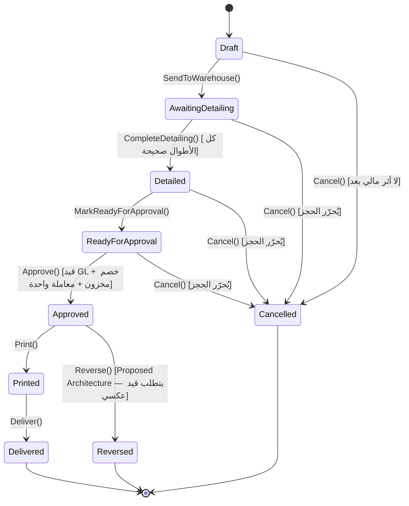

**قواعد:**

* Draft قابلة للتعديل الكامل — مؤكد (`EnsureEditable` يرفض أي تعديل خارج `Draft`).
* `WarehouseDetailed`/`Detailed` تعني: تم اختيار الكمية على مستوى التوب (Roll-level) — مؤكد عبر `SalesInvoiceRollDetail` و`WarehouseDetailingValidator.CanCompleteDetailing`.
* `ReadyForApproval` تعني: اجتازت كل التحقق — اليوم `InvoiceCanBeApprovedSpecification` تتحقق من (الحالة، صحة كل الأطوال، الإجمالي > 0) فقط. **لا تتحقق من الضريبة (غير موجودة) ولا من حد الفترة المالية (غير موجود)** — كلاهما `Proposed Architecture` يُضاف كشرط إضافي للمواصفة.
* `Approved`/`Posted` (في ERP PRO الحالة الواحدة `Approved` تُمثّل الاثنين معاً) يجب أن تُنشئ أثر GL والمخزون بشكل ذرّي — **مؤكد فعلاً**: `ApproveSalesInvoiceHandler` يفتح `unitOfWork.BeginTransactionAsync`، وعند أي استثناء يستدعي `RollbackTransactionAsync` (مؤكد من هذه الجلسة: انظر معالجة الخطأ "Cannot sell more meters than remaining on roll" التي رجعت بالكامل دون أثر جزئي).
* بعد الترحيل، لا تعديل مباشر مسموح — **مؤكد** (`EnsureStatus` يرفض أي عملية خارج القائمة المسموحة).
* التصحيح بعد الترحيل يتطلب Sales Return أو Credit Memo أو Reversal — Sales Return موجود وصحيح؛ Reversal **غير موجود** (F-16، `Proposed Architecture`).
* حالة الدفع (Paid) تعتمد على تخصيص الإيصال (Receipt Allocation) — مؤكد عبر `ReceiptAllocation`/`CollectedAmount` في `GetSalesInvoiceOperationsCenterHandler`.
* الأرشفة يجب ألا تُزيل الأثر المالي من التقارير — **غير مضمون اليوم** لأن Query Filter الأرشفة غير مطبَّق على `journal_entries` (F-15) — لكنه مطبَّق فعلاً على `sales_invoices` نفسها.

**الأحداث المحاسبية المطلوبة:** اعتماد فاتورة البيع (✅ موجود) · تسجيل COGS (✅ موجود، جزء من نفس القيد) · خصم المخزون (✅ موجود، ذرّي مع القيد) · تسجيل ضريبة مستحقة (❌ F-02) · تسجيل الخصم (✅ موجود، `SalesDiscounts`) · تخصيص الإيصال (✅ موجود عبر `PostReceiptVoucherAsync`، لكن في معاملة منفصلة عن الاعتماد — ملاحظة تصميمية: هذا صحيح محاسبياً لأن الإيصال حدث لاحق مستقل، وليس خللاً) · Reversal/Return (⚠️ Return فقط).

**Idempotency المطلوب:** `SourceType=SalesInvoice, SourceId=InvoiceId, EventType=Approval` — اليوم الفحص يتم عبر `PostIfNotExistsAsync` بـ `SourceType+SourceId` فقط بلا `EventType` وبلا فهرس فريد في قاعدة البيانات (F-04). **مصدر مستند مطلوب:** `SalesInvoiceId` — موجود ضمنياً كوسيطة للدالة، لكن غير مربوط بـ FK حقيقي (F-07).

---

### 2.2 Sales Return / Credit Memo Workflow

**الحالة الفعلية:** `SalesReturnAggregate.Status` من نوع `VoucherStatus` المشترك (`Draft(0) → Approved(1) → Posted(2)`, مع `Cancelled(3)`, `Reversed(4)`). التدقيق يصف هذا التدفق بأنه **الأفضل تنفيذاً في كامل النظام** — "استخدمه كنموذج عند إصلاح الفجوات الأخرى" (نص حرفي من §6.4 من التدقيق).

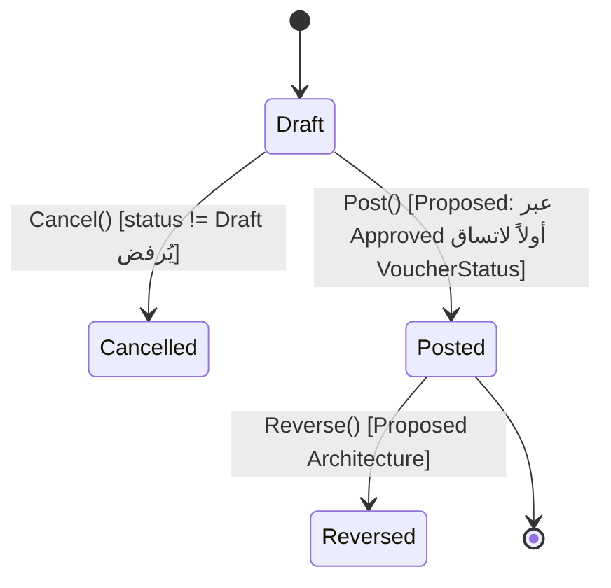

**قواعد:**

* يجب أن يرجع لفاتورة بيع أصلية — **مؤكد**: `OriginalInvoiceId`/`OriginalInvoiceNumber` حقول إلزامية على `SalesReturnAggregate`؛ لا مسار لمذكرة ائتمان مستقلة (Standalone) اليوم — Decision Required إن كان العمل يحتاج ذلك مستقبلاً.
* يجب أن يُعيد المخزون إن أُعيدت البضاعة فعلياً — `Needs Code Verification` لدالة استرجاع المخزون الدقيقة (لم تُفحص في هذه الجلسة بعمق؛ التدقيق يذكر أن "المخزون يُستعاد" ضمن §6.4 دون سطر دقيق).
* يجب أن يعكس الإيراد/AR/الضريبة/COGS حسب الفاتورة الأصلية — **مؤكد جزئياً**: `PostSalesReturnAsync` يعكس Revenue و AR و COGS (مؤكد من التدقيق: "Dr Sales Revenue / Cr Accounts Receivable / Dr Inventory Asset / Cr COGS")، لكن **لا يوجد عكس ضريبة لأن الضريبة أصلاً غير موجودة** (F-02 ينسحب هنا أيضاً).
* يجب ألا يتجاوز الكمية/القيمة القابلة للإرجاع من الفاتورة الأصلية — `Needs Code Verification` (لم يُفحص وجود Guard صريح لهذا في `SalesReturnLine`).
* يجب أن يُنشئ أثراً تدقيقياً — `Needs Code Verification` (لم يُفحص استدعاء `AuditLog.Record` من هذا المسار تحديداً).

**الأحداث المحاسبية:** موجودة ومتوازنة فعلاً (مرجع مباشر: `IntegratedAccountingService.cs:180-213 PostSalesReturnAsync`، مذكور بنفس الأرقام في التدقيق).

---

### 2.3 Receipt Voucher Workflow

**الحالة الفعلية:** `ReceiptVoucher.Status` من نوع `VoucherStatus`: `Draft → Approved → Posted`, مع `Cancelled`/`Reversed` معرَّفتين في الـEnum لكن **غير مُستخدَمتين فعلياً** في منطق `ReceiptVoucher.Cancel` (الكيان لا يملك دالة `Cancel` أصلاً بخلاف `PaymentVoucher` و`CashboxTransfer` — `Needs Code Verification`: تأكيد عدم وجود مسار إلغاء لسند القبض تحديداً).

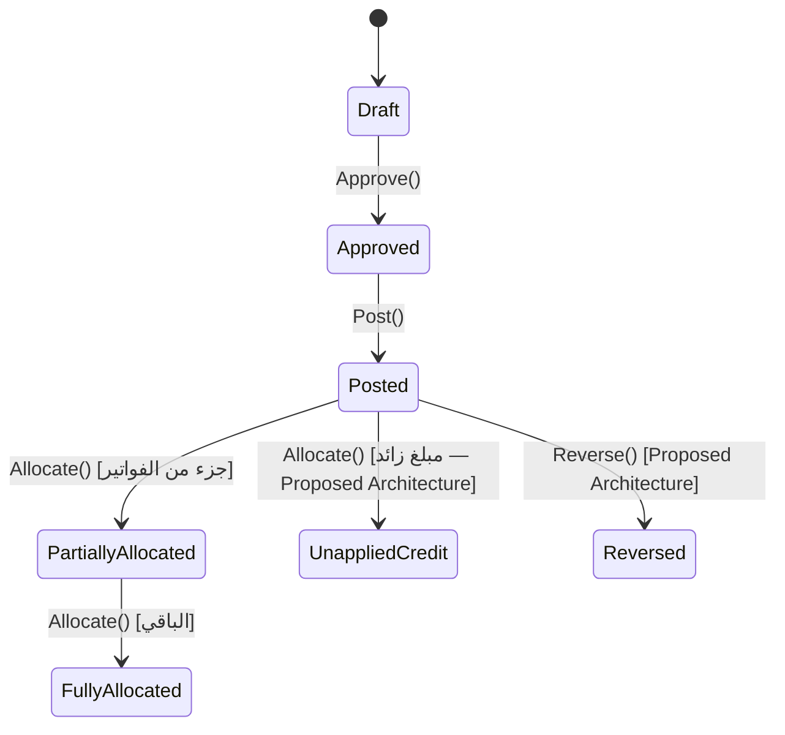

**قواعد:**

* يجب ربط السند بعميل — **مؤكد**: `CustomerId` إلزامي على `ReceiptVoucher.CreateDraft`.
* يمكن تخصيصه لفاتورة أو أكثر — **مؤكد**: `Allocate(Guid invoiceId, Money amount)` تضيف إلى `_allocations` (علاقة متعددة).
* الدفع الزائد يجب ألا يختفي؛ يجب أن يُنشئ رصيد ائتمان غير مخصَّص / التزاماً على العميل — **❌ غير موجود** (F-08 — الجانب المقابل لـ AR): لا يوجد مفهوم "Unapplied Credit" في `ReceiptVoucher` أو `CustomerAggregate` اليوم؛ الحماية الوحيدة هي أن `Money` يرفض القيم السالبة (`Money.cs:11-19`)، وهذا يمنع الرصيد السالب لكنه لا يُسجّل الفائض كالتزام — `Proposed Architecture` بالكامل.
* يجب أن يملك مرجعاً خارجياً أو مفتاح Idempotency عند توفره — **❌ غير موجود** (F-18): لا حقل مرجع/شيك/Idempotency على `ReceiptVoucherEntity`.
* نفس الإيصال الواقعي يجب ألا يُرحَّل مرتين بصمت — **❌ غير مضمون** (F-18 + الاعتماد فقط على رقم السند المولَّد آلياً، والذي يُنشأ جديداً في كل مرة).
* الـ Reversal يجب أن يُعيد AR/الرصيد المفتوح بشكل صحيح — `Proposed Architecture` بالكامل (§3.5).

---

### 2.4 Purchase Order Workflow

**الحالة الفعلية:** `PurchaseOrderStatus`: `Draft(0) → Sent(1) → Received(2) → Cancelled(3)`. هذه أبسط بكثير مما يطلبه التصميم المستهدف — **لا توجد** حالات `Submitted`/`Approved`/`PartiallyReceived`/`FullyReceived`/`PartiallyInvoiced`/`FullyInvoiced`/`Closed`/`Archived` اليوم؛ كل هذه `Proposed Architecture`.

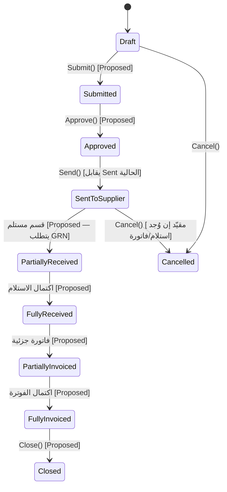

**قواعد:**

* أمر الشراء لا يُرحِّل إلى GL افتراضياً — **مؤكد**: لا استدعاء لـ `IIntegratedAccountingService` من أي مسار متعلق بـ `PurchaseOrder` (تأكيد إضافي على ما ذكره التدقيق في §5.2 — لا GRN ولا التزام محاسبي).
* أمر الشراء التزام (Commitment) لا AP — مبدأ محاسبي قياسي، ومتوافق مع الحالة الحالية (لا ترحيل إطلاقاً).
* يجب أن يغذّي GRN ومطابقة فاتورة الشراء — **❌ مستحيل اليوم لأن GRN غير موجود بتاتاً** (مؤكد صراحة في §5.2 من التدقيق: "Goods Receipt / GRN — does not exist anywhere in the codebase").
* يجب حفظ الكمية والسعر والعملة والمورد لأغراض المطابقة — `Needs Code Verification` لحقول `PurchaseOrderLine` الدقيقة (رُصدت `FabricItemId`, `Description`, `Quantity`, `UnitCost`, `LineTotal` فقط — لا حقل عملة صريح على السطر، `Needs Code Verification` لعملة الرأس).
* قواعد الإلغاء تعتمد على وجود استلام أو فاتورة — **غير مطبّق اليوم** لأن `PurchaseOrderStatus.Cancel()` (`PurchasingEntities.cs:282`) لا شرط له إطلاقاً (`public void Cancel() => Status = PurchaseOrderStatus.Cancelled;`) — هذه ثغرة تصميمية إضافية غير مذكورة صراحة كرقم F في التدقيق الأصلي، تُسجَّل هنا كـ`Proposed Architecture` تحت مظلة F-03/F-07.

---

### 2.5 Goods Receipt / GRN Workflow — `Proposed Architecture` بالكامل

**مؤكد من التدقيق (§5.2): لا يوجد أي كيان GRN في الشيفرة اليوم.** هذا التصميم جديد بالكامل ويُعتبر شرطاً مسبقاً لإغلاق F-03.

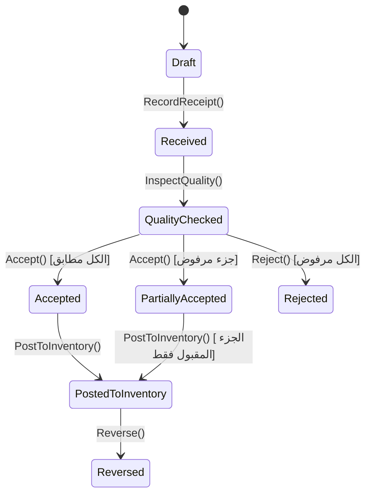

**قواعد (تصميم جديد):**

* يجب أن يرجع لأمر شراء أو مستند استيراد/حاوية معتمد — حقل `PurchaseOrderId` (اختياري) و`ChinaContainerId` (اختياري، أحدهما إلزامي).
* GRN يُسجّل الكميات المستلمة فعلياً — منفصل تماماً عن الفاتورة.
* GRN هو الحقيقة الفيزيائية؛ فاتورة الشراء هي المطالبة المالية من المورد — هذا الفصل هو ما يمكّن Three-Way Match (§3.3، `ThreeWayMatchEngine`).
* PO + GRN + Invoice يجب أن يدعموا مطابقة ثلاثية.
* GRN قد يُنشئ محاسبة "مخزون في الطريق" أو "مستلم غير مفوتَر" (Received Not Invoiced) حسب السياسة المحاسبية المختارة — **Decision Required**: هل يُرحَّل GRN إلى GL فوراً (`Dr Inventory / Cr GRN-Clearing`) أم يُنتظر وصول الفاتورة؟
* أي كمية مرفوضة يجب ألا تصبح مخزوناً قابلاً للبيع — Guard على مستوى `FabricRollStatus` الجديد `QuarantinedByGRN` (امتداد لـ `FabricRollStatus` الحالي: `Available/Reserved/Sold/Wasted/InTransit`).

---

### 2.6 Purchase Invoice Workflow

**الحالة الفعلية:** `PurchaseInvoiceStatus`: `Draft(0) → Approved(1) → Posted(2) → Cancelled(3)`, مع `PartiallyPaid(4)`, `Paid(5)`. **لا توجد** حالتا `Matched`/`Exception` اليوم — كلتاهما تتطلبان GRN (§2.5) لتُصبحا ممكنتين فعلياً.

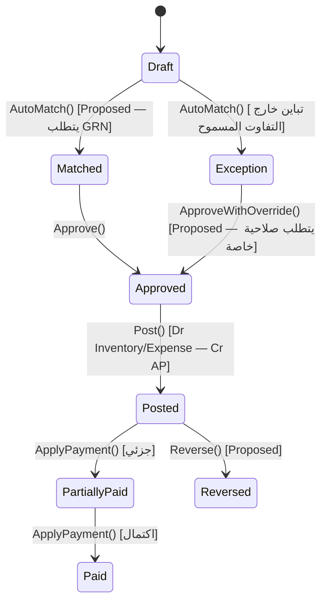

**قواعد:**

* يجب أن يرجع لمورد — **مؤكد**: `SupplierId` إلزامي.
* للبضائع، يجب أن يرجع لـ PO/GRN/سطر حاوية — **❌ غير مفروض اليوم**؛ `ConvertPurchaseOrderToInvoiceHandler` ينسخ الكمية المطلوبة 1:1 دون أي مقارنة بما استُلم فعلياً (مؤكد من التدقيق §F-03، `PurchaseHandlers.cs:291-340`).
* يجب ألا يُرحَّل إذا فشلت المطابقة خارج التفاوت المسموح — **❌ لا يوجد مفهوم Three-Way Match إطلاقاً اليوم**.
* يجب أن يُرحِّل AP — **✅ مؤكد**: `PostPurchaseInvoiceAsync` (`IntegratedAccountingService.cs:140-178`، القيد: `Dr Inventory Asset/Expense — Cr Accounts Payable`).
* يجب أن يُحدِّث قيمة المخزون أو المصروف حسب نوع الفاتورة — **✅ مؤكد** عبر `PurchaseLineType.Inventory/Expense`.
* يجب أن يدعم ضريبة الشراء المدخلة (Input VAT) إن انطبقت — **❌ غير موجود** (امتداد لـ F-02 على جانب الشراء).
* الفوترة الزائدة والناقصة يجب أن تكون استثناءات مرئية — `Proposed Architecture`، تتطلب GRN أولاً.
* تخصيص الدفعة يجب أن يُخفِّض AP — **✅ مؤكد**: `PurchaseInvoice.ApplyPayment`، لكن **بحد أقصى صامت** (`Math.Min(amount, Remaining.Amount)`) يُسقط الفائض دون أثر — هذا هو الشق الآخر من F-08.

---

### 2.7 Payment Voucher Workflow

**الحالة الفعلية:** `PaymentVoucher.Status` من نوع `VoucherStatus` أيضاً، لكن الكيان يملك فقط `Approve()`/`Post()` بلا أي شرط انتقال (`public void Approve() => Status = VoucherStatus.Approved;` بلا حارس) — أضعف من `ReceiptVoucher` الذي يملك حراسة (`Only draft vouchers can be approved`).

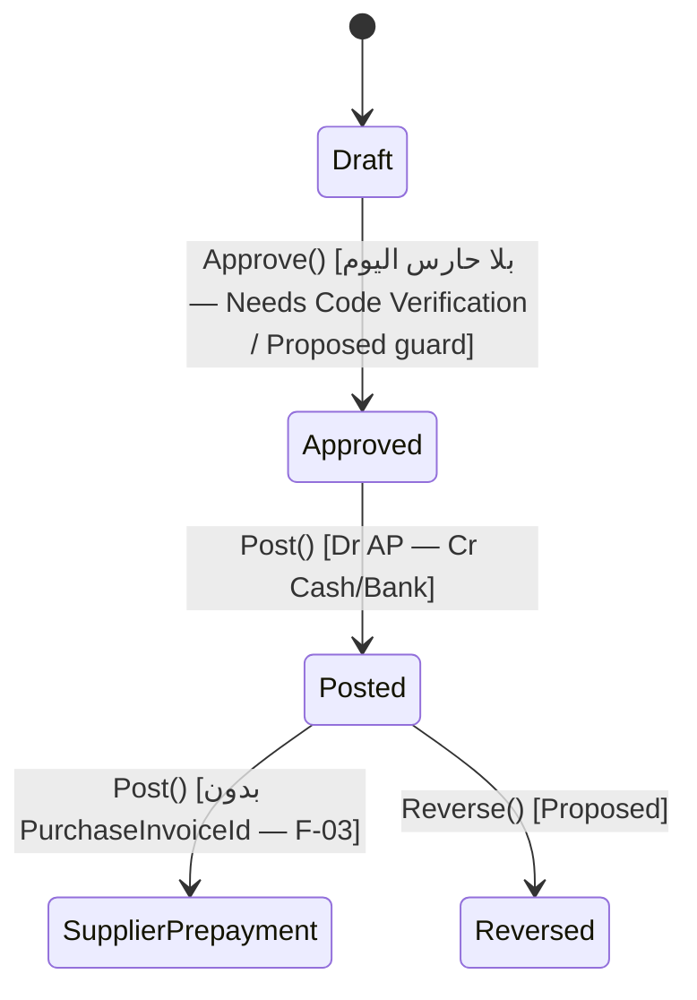

**قواعد:**

* يجب ربط الدفعة بمورد — **مؤكد** (`SupplierId` إلزامي).
* دفعة البضائع يجب أن تُربط بفاتورة شراء/PO/GRN/حاوية — **❌ اختياري فعلياً** (F-03: `RecordPaymentVoucherCommand.PurchaseInvoiceId` قابل لـ null، والربط يُنفَّذ فقط `if (command.PurchaseInvoiceId is Guid invoiceId)` — `FinanceHandlers.cs:217-233`).
* دفعة قبل الفاتورة يجب أن تُرحَّل كدفعة مقدَّمة للمورد لا أن تختفي — **❌ غير موجود** — لا يوجد مسار "Supplier Prepayment" في الشيفرة إطلاقاً؛ حالياً الدفعة بلا فاتورة تُخفِّض رصيد المورد الإجمالي فقط بلا أي أثر منفصل (F-08 نفسه من زاوية الدفع).
* الدفع الزائد يجب أن يُنشئ Debit غير مخصَّص / دفعة مقدَّمة على المورد — **❌ غير موجود**، الجزء الآخر من F-08 (`PurchaseInvoice.ApplyPayment` يسقط الزائد صامتاً بينما `supplierAgg.Supplier.ApplyPostedPayment(voucher.Amount)` يخصم المبلغ الكامل من رصيد المورد الكلي — عدم اتساق مباشر موثّق حرفياً في F-08).
* يجب أن يملك مصدر نقدي/بنكي — **مؤكد** (`CashboxId` إلزامي).
* يجب أن يملك حماية Idempotency — **❌ غير موجود** (F-18، ينطبق على `PaymentVoucher` كما ينطبق على `ReceiptVoucher`).
* الـ Reversal يجب أن يُعيد AP/الدفعة المقدَّمة بشكل صحيح — `Proposed Architecture` بالكامل.

---

### 2.8 China Container Import Workflow — الأهم لأنه القناة السائدة (500+ حاوية/سنة)

**الحالة الفعلية:** `ChinaContainerStatus`: `Draft(0) → InTransit(1) → Arrived(2) → UnderReview(3) → LandingCostReviewed(4) → Approved(5) → InWarehouse(6) → Closed(7)`, مع `Archived(8)`, `Cancelled(9)`. لا توجد حالياً حالات `APPosted`/`PartiallyPaid`/`Paid`/`Reversed` منفصلة على الحاوية نفسها — دفعات المورد تُدار عبر `PaymentVoucher` مستقلة (§2.7) بلا ربط حتمي بالحاوية (F-03).

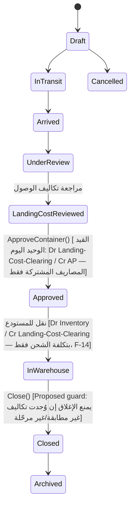

**الفجوة الحرجة (F-01 + F-14 مجتمعتين، بالاستشهاد الحرفي من التدقيق):**

```
القيد الوحيد الذي تُنشئه أي حاوية اليوم (IntegratedAccountingService.cs:24-44):
  Dr AccountingAccountIds.LandingCostClearing   totalExpenses   (شحن + تأمين + جمارك + تخليص فقط)
  Cr AccountingAccountIds.AccountsPayable       totalExpenses

القيد المفقود بالكامل — لا يظهر في أي مكان بالشيفرة:
  Dr Inventory-in-Transit   ChinaInvoiceAmountUsd × ExchangeRateToLocalCurrency
  Cr Accounts Payable       ChinaInvoiceAmountUsd × ExchangeRateToLocalCurrency
```

كما أن `CalculateContainerCostPerMeter` (`InventoryEngine.cs:1297-1303`) تقسم `LandingCost.TotalSharedExpenses` فقط على إجمالي الأمتار — بينما تكلفة التوب الفردي `FabricRoll.CostPerMeter` (نفس الملف، الأسطر 96-99) تجمع التكلفتين بشكل صحيح. **هذا يعني أن النظام ينتج رقمين متضاربين لنفس المفهوم داخل نفس الحاوية** — هذا هو جوهر F-14.

**قواعد:**

* مبلغ فاتورة المورد الصيني يجب أن يُلتقط — **✅ مؤكد**: `ChinaInvoiceAmountUsd` عمود موجود على `ContainerAggregate` (أُضيف عبر Migration مخصصة `AddChinaInvoiceAmountUsd` بحسب التدقيق) لكنه **معزول عن أي قيد محاسبي**.
* سعر الصرف يجب أن يُلتقط ويُقفل عند الترحيل — `Needs Code Verification` لوجود `ExchangeRateToLocalCurrency` بالضبط بهذا الاسم على `ContainerAggregate` (مذكور في التدقيق كصيغة مقترحة للقيد المفقود، لم يُتحقق حرفياً من اسم الحقل في هذه الجلسة).
* تكلفة شراء القماش يجب أن تُرحَّل إلى AP — ❌ الفجوة F-01 نفسها.
* تكاليف الوصول (Landing Costs) يجب أن تُرحَّل إلى AP/نقدية/تصفية حسب المصدر — ✅ موجود جزئياً (AP فقط اليوم؛ نقدية/بنك مباشرة `Needs Code Verification`).
* المخزون في الطريق يجب أن يشمل تكلفة القماش — ❌ غير موجود (لا مفهوم "Inventory In Transit" منفصل لحاويات الصين اليوم؛ الانتقال هو مباشرة من Landing-Cost-Clearing إلى Inventory عند "نقل للمستودع").
* القيمة النهائية للمخزون يجب أن تشمل تكلفة القماش + تكاليف الوصول الموزَّعة — ❌ الفجوة F-14 (التوب الفردي صحيح، الحركة الإجمالية للدفعة/الحركة ليست كذلك).
* تكلفة التوب، تكلفة المتر، تكلفة الدفعة، وتكلفة حركة المخزون يجب أن تستخدم محرك تكلفة موحّد واحد (`CostingEngine`) — ❌ اليوم يوجد **حسابان منفصلان** لنفس المفهوم (`FabricRoll.CostPerMeter` الصحيح، و`CalculateContainerCostPerMeter` الناقص) — هذا بالضبط سبب وجود `CostingEngine` موحّد في §3.3.
* لا تفعيل مخزون قبل اكتمال تخصيص التكلفة — `Needs Code Verification` لوجود Guard صريح يمنع `InWarehouse` قبل `LandingCostStatus.Approved`؛ الترتيب المنطقي للحالات (`LandingCostReviewed` قبل `Approved` قبل `InWarehouse`) يوحي بوجود هذا الترتيب، لكن لم يُفحص Guard برمجي صريح.
* لا إغلاق AP دون فاتورة مورد — `Needs Code Verification` (لا يوجد اليوم مفهوم "إغلاق AP للحاوية" أصلاً لأن AP نفسها غير موجودة لثمن القماش — F-01).
* لا إغلاق حاوية مع تكاليف غير مطابقة أو قيود غير مُرحَّلة — ❌ غير مفروض اليوم؛ `Close()` (`Needs Code Verification` لموقعها الدقيق) لا تتحقق من هذا الشرط بحسب الأدلة المتاحة.

**الأحداث المحاسبية المطلوبة (`Proposed Architecture` لما هو مفقود):**

| الحدث | Dr | Cr | الحالة |
|---|---|---|---|
| فاتورة المورد الصيني (القماش) | Inventory In Transit | Accounts Payable | ❌ مفقود بالكامل (F-01) |
| فاتورة تكاليف الوصول | Landing Cost Clearing أو Inventory In Transit | AP / Cash / Bank | ✅ AP موجود؛ Cash/Bank المباشر `Needs Code Verification` |
| تفعيل المخزون (نقل للمستودع) | Inventory | Inventory In Transit / Landing Cost Clearing | ⚠️ موجود لكن بقيمة ناقصة (F-14) |
| دفعة المورد | Accounts Payable | Cash / Bank | ✅ موجود عبر `PaymentVoucher`، لكن غير مربوط إلزامياً بالحاوية (F-03) |

---

### 2.9 Inventory Movement Workflow

**الحالة الفعلية:** `StockMovementStatus`: `Draft(0) → Posted(1) → Cancelled(2) → Reversed(3)`. أقرب بكثير للتصميم المستهدف من بقية التدفقات.

**قواعد:**

* كل حركة مخزون يجب أن تملك مستند مصدر — ✅ مؤكد عبر `ReferenceType`/`ReferenceId` (`DocumentType` enum) على `StockMovementLineEntity`، لكن **بلا FK فعلي** (F-07 ينسحب هنا أيضاً).
* كل حركة مخزون مالية يجب أن تحمل تكلفة الوحدة — ✅ مؤكد (`UnitCost`/`TotalValue` على `StockMovementLineEntity`).
* يجب أن يكون الطول المتبقي السالب مستحيلاً على مستويي الدومين وقاعدة البيانات — ⚠️ **الدومين فقط**: `FabricRoll.DeductLength` (الطبقة المجالية) يحرس الطرح، لكن `FabricRollEntity` (الطبقة التي يتعامل معها EF Core فعلياً) بلا أي حماية، ولا يوجد `CHECK ("RemainingLengthMeters" >= 0)` في أي Migration (F-17، صفر نتائج لبحث `CHECK|AddCheckConstraint`).
* حركة مستوى التوب يجب أن تُطابق حركة المخزون والأستاذ العام — تسوية مصمَّمة في §5.5 (بند 4).
* التسويات المخزنية تتطلب سبباً وتدقيقاً — `Needs Code Verification` لوجود حقل `Reason` إلزامي على مسار التسوية الحالي.

---

### 2.10 Opening Balance Workflow

**الحالة الفعلية:** `OpeningBalanceStatus`: `Draft(0) → PendingApproval(1) → Approved(2) → Posted(3) → Locked(4)`, مع `Archived(5)`, `Rejected(6)`. **هذا التدفق هو الأكثر اكتمالاً من ناحية الـ FK** — التدقيق يذكر صراحة أن Opening Balances من أصل 3 وحدات فقط (مع Expenses وCapital) تملك Foreign Keys حقيقية.

**قواعد:**

* الأرصدة الافتتاحية يجب أن تُرحَّل إلى GL — ✅ مؤكد عبر `PostOpeningBalanceDocumentAsync` الموحّد (`IIntegratedAccountingService`)، وهو Idempotent فعلياً حسب توثيق الواجهة ("Idempotent per document id").
* الأرصدة الافتتاحية للعملاء/الموردين يجب أن تُطابق AR/AP — تسوية مصمَّمة في §5.5.
* قيمة المخزون الافتتاحية يجب أن تُطابق حساب أصول المخزون — تسوية مصمَّمة في §5.5.
* رأس المال الافتتاحي للشركاء يجب أن يُطابق حساب حقوق الملكية — ✅ ملاحظة إيجابية: هذا **الاستثناء الوحيد** الذي فيه رأس المال مربوط فعلياً بـ GL (`OpeningBalanceEngine.cs:660-666` بحسب F-13 من التدقيق) — لكن فقط عند الافتتاح، وليس لاحقاً.
* بعد القفل، لا يُسمح إلا بقيود تسوية — ⚠️ حالة `Locked` **موجودة كقيمة Enum**، لكن `Needs Code Verification` لوجود منطق فعلي يفرض هذا القيد عند محاولة تعديل مستند مقفل.
* يوجد أيضاً استخدامان قديمان "Obsolete" لترحيل مباشر (`PostSupplierOpeningBalanceAsync`/`PostCustomerOpeningBalanceAsync`) يتجاوزان تدفق `OpeningBalanceDocument` الموحّد — يجب إزالتهما نهائياً في مرحلة تنفيذ مستقبلية (مُعلَّمان `[Obsolete]` في الشيفرة نفسها بالفعل، وهو مؤشر جيد أن الفريق يعرف المشكلة).

---

### 2.11 Partner Capital Workflow

**الحالة الفعلية:** `CapitalApprovalStatus` على كل `CapitalTransaction`: `Pending(0) → Approved(1)`, مع `Rejected(2)`. أنواع المعاملات (`CapitalTransactionType`) غنية فعلياً: `InitialInvestment, AdditionalInvestment, CapitalIncrease, PartialWithdrawal, FullWithdrawal, InvestmentTransfer, ManualAdjustment, CurrencyAdjustment, ProfitDistribution, LossDistribution`.

**الفجوة (F-13، مؤكدة حرفياً):** `CurrentCapitalBase`/`TotalInvestmentsBase`/`TotalWithdrawalsBase` على `CapitalPartner` (`CapitalEntities.cs:148-158`) تُحسب بالكامل من جمع صفوف `CapitalTransaction` المعتمدة **في الذاكرة** — و`IIntegratedAccountingService` **لا يملك أي دالة `PostCapitalTransaction`-ية**، و`CapitalHandlers.cs` **لا يستدعي خدمة المحاسبة إطلاقاً** لأي معاملة بعد الرصيد الافتتاحي.

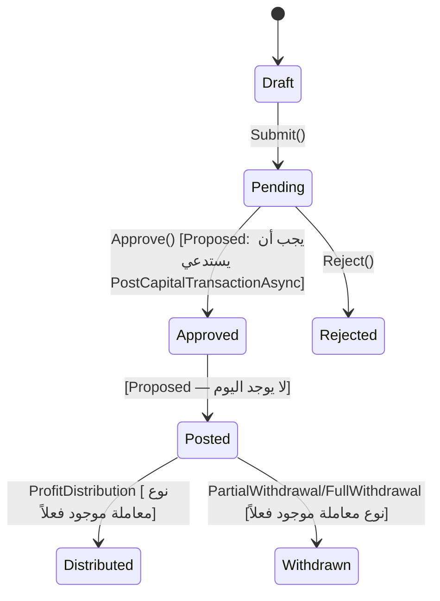

**قواعد (تصميم الإصلاح):**

* المساهمات الرأسمالية يجب أن تُرحَّل إلى GL — ❌ فقط عند الافتتاح (F-13).
* السحوبات يجب أن تُرحَّل إلى GL — ❌ (F-13).
* توزيع الربح/الخسارة يجب أن يُرحَّل إلى GL — ❌ (F-13، رغم وجود نوعي المعاملة `ProfitDistribution`/`LossDistribution` جاهزين في الـEnum — الفجوة برمجية بحتة في الربط، وليست في نمذجة البيانات).
* دفتر رأس المال الفرعي يجب أن يُطابق حسابات حقوق الملكية — تسوية مصمَّمة في §5.5.
* وحدة رأس المال يجب ألا تبقى معزولة عن GL — التصميم: إضافة `PostCapitalTransactionAsync(CapitalTransaction, CancellationToken)` إلى `IIntegratedAccountingService` يُستدعى من `CapitalHandlers.cs` عند `Approve()`، بقيد: `Dr/Cr Cash-or-Bank` مقابل `Cr/Dr AccountingAccountIds.PartnerCapital` (الحساب موجود بالفعل: `a1000010-...`) — حسب اتجاه `SignedBaseAmount` (موجود فعلاً وصحيح الإشارة: سالب للسحب/توزيع الخسارة).

---

### 2.12 Bad Debt / Write-Off Workflow — `Proposed Architecture` بالكامل

**مؤكد من التدقيق (F-12): بحث شامل عن `BadDebt`, `WriteOff`, `AllowanceForDoubtfulAccounts` في كامل المستودع لا يُعيد أي نتيجة شيفرة — الآلية غير موجودة إطلاقاً.**

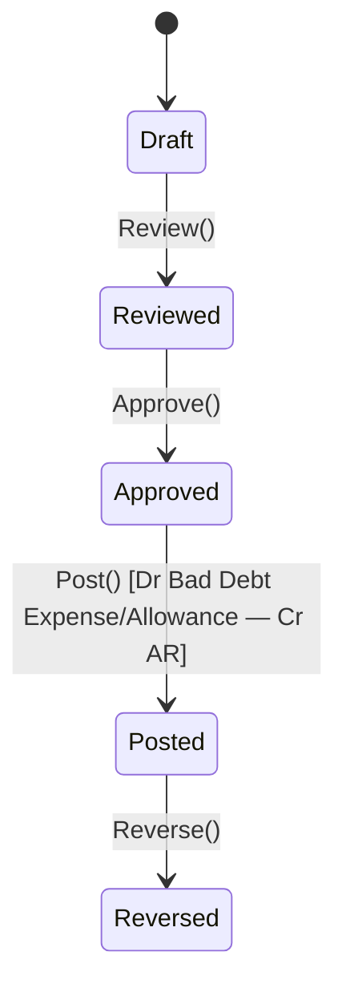

**قواعد (تصميم جديد):**

* يجب أن يرجع لعميل وفاتورة محدَّدة.
* يجب أن يتطلب سبباً.
* يجب أن يُرحِّل: `Dr Bad Debt Expense` (أو `Allowance for Doubtful Accounts` حسب السياسة المختارة — **Decision Required**: مباشر أم مخصَّص؟) `/ Cr Accounts Receivable`.
* يجب أن يُخفِّض الرصيد القابل للتحصيل للعميل.
* يجب الحفاظ على أثر تدقيقي كامل.
* حساب GL مطلوب جديد: `BadDebtExpense` تحت مجموعة Expenses (غير موجود اليوم في `AccountingAccountIds` — يجب إضافته).

---

### 2.13 Financial Period Lock Workflow — `Proposed Architecture` بالكامل

**مؤكد: لا يوجد أي مفهوم "Financial Period" في الشيفرة اليوم** (بحث `FinancialPeriod|PeriodLock` لم يُعد أي نتيجة).

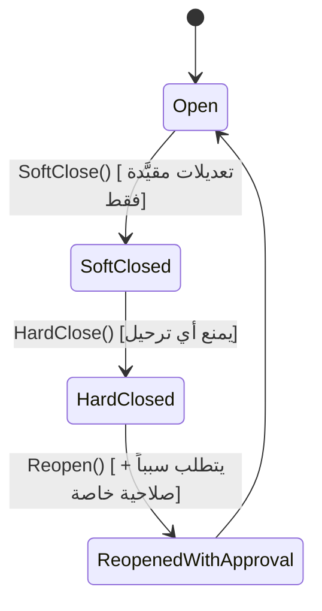

**قواعد (تصميم جديد):**

* الفترة المفتوحة تسمح بالترحيل الطبيعي.
* الفترة "مغلقة جزئياً" تسمح بتسويات مقيَّدة فقط (حساب/صلاحية محدَّدة).
* الفترة "مغلقة كلياً" تمنع أي ترحيل.
* إعادة الفتح تتطلب سبباً تدقيقياً.
* التقارير يجب أن تُظهر حالة الفترة.
* **كل خدمة ترحيل يجب أن تفحص حالة الفترة قبل الترحيل** — هذا يعني تعديل `PostingEngine` (§3.3) ليكون نقطة العبور الوحيدة، ويفحص `FinancialPeriodLockService.EnsureOpenAsync(postingDate)` قبل أي `SaveChangesAsync` محاسبي. هذا أهم قرار معماري في هذا القسم لأنه **يفرض توحيد كل نقاط الترحيل عبر بوابة واحدة** بدلاً من الاستدعاء المباشر المتناثر لـ `IIntegratedAccountingService` من كل Handler كما هو الحال اليوم.

---

## 3. Accounting Posting Matrix

### 3.1 جدول الترحيل الكامل

الأعمدة: كود الحدث · الحدث التجاري · المستند المصدر · انتقال الحالة المُطلِق · Dr · Cr · صيغة المبلغ · قاعدة العملة · قاعدة الضريبة · أثر المخزون · أثر AR/AP · مفتاح Idempotency · حدث العكس · التحقّقات المطلوبة · معالجة الفشل.

> **مفتاح الحالة:** ✅ = مطبَّق ومؤكَّد من الشيفرة اليوم. ⚠️ = مطبَّق جزئياً / بفجوة موثَّقة. ❌ = غير مطبَّق (`Proposed Architecture`).

#### Sales

| # | الحدث | المصدر | الانتقال | Dr | Cr | صيغة المبلغ | العملة | الضريبة | المخزون | AR/AP | Idempotency Key | حدث العكس | تحقّقات | معالجة الفشل | الحالة |
|---|---|---|---|---|---|---|---|---|---|---|---|---|---|---|---|
| 1 | اعتماد فاتورة بيع | SalesInvoice | ReadyForApproval→Approved | AccountsReceivable | SalesRevenue | `GrandTotal + خصم السطر` (الإيراد الإجمالي قبل الخصم) | عملة الفاتورة (اليوم افتراضياً USD) | — | خصم (متزامن) | AR + | `SalesInvoice:{Id}:Approval` | Reversal (§3.5) | `InvoiceCanBeApprovedSpecification` + `CreditLimitChecker` | Rollback كامل للمعاملة (مؤكَّد فعلياً هذه الجلسة) | ✅ |
| 2 | تسجيل الخصم | SalesInvoice (ضمن #1) | نفس القيد | SalesDiscounts | — (جزء من صافي #1) | `Σ DiscountAmount` للأسطر | نفس عملة الفاتورة | — | — | — | نفس #1 | نفس #1 | — | — | ✅ |
| 3 | تسجيل ضريبة مبيعات مستحقة | SalesInvoice | نفس القيد | AccountsReceivable (ضمن الإجمالي) | **Sales_Tax_Payable** (حساب جديد مطلوب) | `TaxableAmount × TaxRate` | نفس عملة الفاتورة | حسب `TaxEngine` (§3.3) | — | AR + / Liability + | نفس #1 | Reversal | `TaxEngine.Resolve(rate)` | يمنع الاعتماد إن تعذّر تحديد النسبة | ❌ `Proposed Architecture` (F-02) |
| 4 | تسجيل COGS | SalesInvoice (ضمن #1) | نفس القيد | CostOfGoodsSold | InventoryAsset | `Σ (meters × roll.CostPerMeter)` | محلي | — | خصم | — | نفس #1 | نفس #1 | التوب المخصَّص يملك أمتاراً كافية (مؤكَّد فعلياً — أُصلح خلال هذه الجلسة ليُتحقَّق منه عند التفصيل لا عند الاعتماد) | يمنع الاعتماد برسالة واضحة | ✅ |
| 5 | خصم المخزون | SalesInvoice (ضمن #1) | نفس القيد | — (ضمن #4) | — | `meters` من `FabricRoll.RemainingLengthMeters` | — | — | خصم مباشر على `FabricRoll` + `WarehouseStock` | — | نفس #1 | يُعاد عبر `ReleaseForInvoiceAsync`/Reversal | راجع #4 | راجع #4 | ✅ |
| 6 | ترحيل سند قبض | ReceiptVoucher | Draft→Posted | Cash/Bank (Cashbox) | AccountsReceivable | `Amount` | عملة الصندوق | — | — | AR − | `ReceiptVoucher:{Id}:Post` | Reversal | العميل موجود | — | ✅ (لكن بلا Idempotency فعلي، F-18) |
| 7 | دفعة زائدة من عميل / رصيد غير مخصَّص | ReceiptVoucher.Allocate | تخصيص يتجاوز الفواتير المفتوحة | Cash/Bank (ضمن #6) | **Customer Unapplied Credit** (حساب Liability جديد) | `Amount − Σ المخصَّص للفواتير` | نفس #6 | — | — | Liability + | — | يُطبَّق لاحقاً على فاتورة جديدة | يمنع تجاهل الفائض | إيقاف الترحيل الصامت الحالي (الاعتماد على `Money` لرفض السالب فقط) | ❌ `Proposed Architecture` (F-08) |
| 8 | مرتجع مبيعات | SalesReturn | Draft→Posted | SalesRevenue | AccountsReceivable | `revenueReversal` | نفس الفاتورة الأصلية | عكس الضريبة (بعد تطبيق #3) | استرجاع | AR − | `SalesReturn:{Id}:Post` | — (هو نفسه Reversal) | يرجع لفاتورة أصل + لا يتجاوز الكمية القابلة للإرجاع | — | ✅ جزئياً (بلا ضريبة لأنها غير موجودة) |
| 8ب | مرتجع مبيعات — COGS | SalesReturn (ضمن #8) | نفس القيد | InventoryAsset | CostOfGoodsSold | `cogsReversalAmount` | محلي | — | استرجاع | — | نفس #8 | — | — | — | ✅ |
| 9 | عكس اعتماد فاتورة بيع | SalesInvoice.Reverse | Approved→Reversed | SalesRevenue + عكس الضريبة | AccountsReceivable + استرجاع COGS | مطابق تماماً لـ#1 بإشارة معكوسة | نفس الفاتورة | عكس #3 | استرجاع الأطوال على نفس الأتواب إن أمكن فيزيائياً | AR − | `SalesInvoice:{Id}:Reversal` | — (هو نفسه) | فحص الفترة المالية غير مقفلة (§2.13) | يرفض العكس إن كانت الأتواب استُهلكت في مبيعات لاحقة (`InventoryException`) | ❌ `Proposed Architecture` (F-16) |
| 10 | إعدام دين معدوم | WriteOffReceivable | Approved→Posted | Bad Debt Expense (حساب جديد) | AccountsReceivable | `WriteOffAmount` (يدوي بموافقة) | عملة الفاتورة | — | — | AR − | `WriteOff:{Id}:Post` | Reversal | يتطلب سبباً + صلاحية `finance.writeoff.approve` | — | ❌ `Proposed Architecture` (F-12) |

#### Purchasing

| # | الحدث | المصدر | الانتقال | Dr | Cr | صيغة المبلغ | العملة | الضريبة | المخزون | AR/AP | Idempotency Key | حدث العكس | تحقّقات | معالجة الفشل | الحالة |
|---|---|---|---|---|---|---|---|---|---|---|---|---|---|---|---|
| 11 | ترحيل فاتورة شراء | PurchaseInvoice | Approved→Posted | InventoryAsset أو OperatingExpenses (حسب `PurchaseLineType`) | AccountsPayable | `TotalAmount` | عملة الفاتورة | — | زيادة (بضائع) | AP + | `PurchaseInvoice:{Id}:Post` | `ReversePurchaseInvoiceAsync` (✅ موجود فعلاً) | مطابقة PO/GRN — `Proposed` (اليوم لا تحقق) | — | ✅ الترحيل، ❌ المطابقة (F-03) |
| 12 | ضريبة مدخلات شراء | PurchaseInvoice (ضمن #11) | نفس القيد | **VAT_Input** (حساب جديد) | AccountsPayable (ضمن الإجمالي) | `TaxableAmount × InputTaxRate` | نفس #11 | حسب `TaxEngine` | — | AP + | نفس #11 | نفس #11 | — | — | ❌ `Proposed Architecture` |
| 13 | ترحيل دفعة مورد | PaymentVoucher | Draft→Posted | AccountsPayable | Cash/Bank | `Amount` | عملة الصندوق | — | — | AP − | `PaymentVoucher:{Id}:Post` | Reversal | **يجب أن يصبح `PurchaseInvoiceId` إلزامياً للبضائع** | — | ⚠️ يعمل، لكن بلا ربط إلزامي (F-03) |
| 14 | دفعة مقدَّمة / زائدة لمورد | PaymentVoucher بلا فاتورة أو تتجاوز المتبقي | Post() | AccountsPayable (أو **Supplier Prepayment** الجديد) | Cash/Bank | `Amount` أو الفائض فقط | نفس #13 | — | — | Asset + (Prepayment) | — | يُطبَّق لاحقاً | يمنع الإسقاط الصامت الحالي (`Math.Min`) | — | ❌ `Proposed Architecture` (F-08) |
| 15 | عكس فاتورة شراء | PurchaseInvoice.Reverse | Posted→Reversed | AccountsPayable | InventoryAsset/Expense | مطابق لـ#11 معكوساً | — | — | استرجاع | AP − | `PurchaseInvoice:{Id}:Reversal` | — | فحص الفترة المالية | — | ✅ **موجود فعلاً** (`ReversePurchaseInvoiceAsync` — هذا استثناء إيجابي، Purchasing أفضل من Sales هنا) |
| 16 | تباين المطابقة الثلاثية | GRN مقابل PO مقابل Invoice | Exception state | — (لا قيد إلا بعد الموافقة اليدوية) | — | فرق الكمية أو السعر | — | — | — | — | — | — | يتطلب Override بصلاحية | يحجب `Post()` حتى تُحسم | ❌ `Proposed Architecture` |
| 17 | فرق السعر (Price Variance) | GRN مقابل PO | ضمن #16 | Price Variance (حساب جديد، اختياري) | AccountsPayable | `(InvoicePrice − POPrice) × Qty` | — | — | — | — | — | — | — | — | ❌ `Proposed Architecture` — **Decision Required**: هل يُرحَّل الفرق لحساب مستقل أم يُعدَّل على تكلفة المخزون مباشرة؟ |
| 18 | فرق الكمية (Quantity Variance) | GRN مقابل PO | ضمن #16 | — | — | `ReceivedQty − OrderedQty` | — | — | تسجيل استثناء فقط، لا قيد تلقائي | — | — | — | — | — | ❌ `Proposed Architecture` |

#### China Import

| # | الحدث | المصدر | الانتقال | Dr | Cr | صيغة المبلغ | العملة | الضريبة | المخزون | AR/AP | Idempotency Key | حدث العكس | تحقّقات | معالجة الفشل | الحالة |
|---|---|---|---|---|---|---|---|---|---|---|---|---|---|---|---|
| 19 | فاتورة مورد صيني (القماش) | Container | LandingCostReviewed→Approved (موسَّعة) | **InventoryInTransit** (حساب جديد) | AccountsPayable | `ChinaInvoiceAmountUsd × ExchangeRate` | USD→محلي مقفل عند الترحيل | — | زيادة (في الطريق) | AP + | `Container:{Id}:FabricInvoicePost` | Reversal | سعر صرف > 0، مبلغ > 0 | يمنع اعتماد الحاوية دون هذا المبلغ | ❌ **مفقود بالكامل — F-01، أولوية حرجة** |
| 20 | فاتورة تكاليف الوصول | Container.LandingCost | نفس انتقال #19 | LandingCostClearing | AccountsPayable/Cash/Bank | `TotalSharedExpenses` | محلي/USD | — | — | AP + | `Container:{Id}:LandingCostPost` | Reversal | — | — | ✅ موجود |
| 21 | جمارك/رسوم | Container.LandingCost (بند فرعي من #20) | نفس القيد | LandingCostClearing (أو حساب Customs مستقل) | AccountsPayable | جزء من `TotalSharedExpenses` | — | — | — | — | — | — | — | — | ⚠️ مدمج ضمن #20 اليوم — **Decision Required**: هل تُفصَّل الجمارك/التأمين/الشحن في حسابات GL مستقلة لأغراض التقرير (§5.3) أم تبقى مجمَّعة؟ |
| 22 | تأمين/شحن | نفس #21 | نفس القيد | نفس #21 | نفس #21 | جزء من `TotalSharedExpenses` | — | — | — | — | — | — | — | — | ⚠️ نفس ملاحظة #21 |
| 23 | إثبات المخزون في الطريق | Container (عند وصول فاتورة القماش) | ضمن #19 | — | — | — | — | — | — | — | — | — | — | — | ❌ `Proposed Architecture` (يعتمد على #19) |
| 24 | تخصيص تكاليف الوصول | Container.LandingCost → كل توب | LandingCostReviewed | — (توزيع داخلي، لا قيد GL منفصل) | — | حسب طريقة التخصيص (أمتار/قيمة/وزن/عدد أتواب — **Decision Required**، انظر §8 سؤال 19) | — | — | تحديث `FabricRoll.CostPerMeter` | — | — | — | تخصيص واحد لكل حاوية (لا تكرار) | — | ✅ يعمل على مستوى التوب الفردي؛ ❌ لا يُستخدم على مستوى الدفعة/الحركة (F-14) |
| 25 | تفعيل المخزون (نقل للمستودع) | Container→InWarehouse | InWarehouse | InventoryAsset | InventoryInTransit + LandingCostClearing (بعد إصلاح #19) | `Σ FabricRoll.CostPerMeter × RemainingLengthMeters` (بعد توحيد `CostingEngine`) | محلي | — | تفعيل | — | `Container:{Id}:StockActivation` | Reversal | تخصيص التكلفة مكتمل (#24) | يمنع التفعيل دون تخصيص كامل | ⚠️ موجود بقيمة ناقصة اليوم (F-14)؛ سيُصبح ✅ بعد دمج #19 |
| 26 | فرق صرف (FX) | Container (إن اختلف سعر الصرف بين تاريخ الفاتورة وتاريخ الدفع) | PaymentVoucher against Container | FX Loss / **FX Gain** (حسابان جديدان) | AccountsPayable أو العكس | `(RatePayment − RateInvoice) × AmountUsd` | — | — | — | AP تسوية | — | — | — | — | ❌ `Proposed Architecture` بالكامل — **Decision Required**: هل تُقفل الحاويات بعملة واحدة (USD) بلا حاجة لفروق صرف؟ (سؤال 2 في §8) |
| 27 | فحص إغلاق الحاوية | Container→Closed | Closed | — | — | — | — | — | — | — | — | — | لا تكاليف غير مطابقة/غير مرحَّلة، AP مغلقة أو صفر | يحجب `Close()` | ❌ `Proposed Architecture` (Guard غير مؤكَّد اليوم) |

#### Inventory

| # | الحدث | المصدر | الحالة |
|---|---|---|---|
| 28 | استلام مخزون (Stock Receipt) | GRN/Container | ✅ موجود (`MovementType.Import/Purchase`) |
| 29 | صرف مخزون (Stock Issue) | SalesInvoice | ✅ موجود (`MovementType.Sale`) |
| 30 | تحويل مخزون (Stock Transfer) | `InventoryTransferWizard` | ✅ موجود (`MovementType.Transfer`) |
| 31 | تسوية زيادة مخزون | Stocktake | ✅ موجود (`MovementType.Adjustment`/`Stocktake`) — `Needs Code Verification` لإلزامية السبب |
| 32 | تسوية نقص مخزون | Stocktake | نفس #31 |
| 33 | منع مخزون سالب | كل عملية خصم | ❌ لا CHECK constraint (F-17)؛ حراسة الدومين فقط |
| 34 | تصحيح طول توب مع تدقيق | `FabricRoll` يدوي | `Needs Code Verification` لمسار تصحيح مباشر (خارج البيع/الاسترجاع) |

#### Cash/Bank, Capital/Equity, Closing — راجع §2.3، §2.7، §2.11، §2.13 لتفاصيل القواعد؛ القيود تتبع نفس نمط الجداول أعلاه ولا تُكرَّر هنا لتفادي الإطناب. البنود 35–47 من `task.md` جميعها إما `Proposed Architecture` (Bank Fee مستقل، Bank Reconciliation، Period Closing entries، Retained Earnings transfer) أو تُغطّى ضمنياً بالبنود أعلاه (Cashbox Receipt/Payment ضمن #6/#13، Partner Capital ضمن §2.11).

### 3.2 مجموعات دليل الحسابات المطلوبة (Chart of Accounts)

**الموجود فعلياً اليوم** (`ERPSystem.Application/Common/AccountingAccountIds.cs`، بمعرّفات GUID ثابتة):

| المجموعة | الحساب | الحالة |
|---|---|---|
| Assets | `InventoryAsset` | ✅ |
| Assets | `CashUsd` | ✅ |
| Assets | `AccountsReceivable` | ✅ |
| Liabilities | `AccountsPayable` | ✅ |
| Revenue | `SalesRevenue`, `SalesDiscounts` (Contra-Revenue) | ✅ |
| COGS | `CostOfGoodsSold` | ✅ |
| Expenses | `OperatingExpenses` | ✅ |
| Contra/Clearing | `LandingCostClearing` | ✅ |
| Equity | `OpeningBalanceEquity`, `PartnerCapital` | ✅ |
| Roots (للتجميع الهرمي) | `RootAssets/RootLiabilities/RootEquity/RootRevenue/RootExpense` | ✅ |

**المفقود ويجب إضافته (`Proposed Architecture`):**

| المجموعة | الحساب المقترح | مطلوب من أجل |
|---|---|---|
| Assets | `InventoryInTransit` | F-01، الحدث #19 |
| Assets | `SupplierPrepayments` | F-08، الحدث #14 |
| Assets | `PrepaidExpenses` | مبدأ محاسبي عام — لا يوجد مستهلك حالياً في الشيفرة يستدعيه، لكنه مطلوب مستقبلاً |
| Assets | `VAT_Input` (ضريبة مشتريات مدخلة) | الحدث #12 |
| Liabilities | `Sales_Tax_Payable` (VAT Output) | F-02، الحدث #3 |
| Liabilities | `CustomerUnappliedCredit` | F-08، الحدث #7 |
| Liabilities | `AccruedExpenses` | مبدأ عام، غير مستخدم حالياً |
| Expenses | `BadDebtExpense` | F-12، الحدث #10 |
| Expenses | `BankFees` | البند 38 من `task.md` |
| Expenses | `Freight`, `Customs`, `Clearance`, `Insurance` (فصل `LandingCostClearing` الحالي) | تقرير Container Cost Sheet §5.3 — **Decision Required** (البند 21/22 أعلاه) |
| COGS | `InventoryVariance` | لالتقاط فروق الجرد (البنود 31/32) |
| Contra/Clearing | `SuspenseAccount` | فقط إن سُمح به صراحة من المالك ويظهر في تقرير مخصَّص — **Decision Required**، لا يُفعَّل افتراضياً |

### 3.3 تصميم محرك الترحيل (Posting Engine)

كل الخدمات التالية `Proposed Architecture` كتجميع موحّد، رغم أن أجزاءً منها (`IIntegratedAccountingService`, `AccountingAggregate.ValidateBalanced`) **موجودة فعلياً اليوم** وتُشكّل الأساس الذي يُبنى عليه هذا التصميم — لا يُقترح استبدالها، بل **توحيدها خلف بوابة واحدة**.

| الخدمة | المسؤولية | المدخلات | المخرجات | ما يجب ألا تفعله | من يستدعيها | حارس قاعدة البيانات الداعم |
|---|---|---|---|---|---|---|
| `PostingEngine` | نقطة الدخول الوحيدة لأي ترحيل مالي؛ تُنسّق `FinancialPeriodLockService` → `IdempotencyService` → `JournalEntryFactory` → `JournalEntryValidator` → الحفظ | `AccountingEvent` واحد | رقم قيد أستاذ + حالة النجاح/الفشل | لا تُرحِّل مباشرة دون المرور بكل الخطوات أعلاه؛ لا تفترض توازن القيد (تفوّض ذلك لـ`JournalEntryValidator`) | كل Handler محاسبي (`ApproveSalesInvoiceHandler`, `PostPurchaseInvoiceHandler`, إلخ) بدلاً من استدعاء `IIntegratedAccountingService` مباشرة كما يحدث اليوم | فهرس فريد `journal_entries(SourceType, SourceId, EventType)` (§4.2) |
| `AccountingEvent` | كائن قيمة (Value Object) يصف حدثاً مالياً واحداً بشكل معياري: `SourceType`, `SourceId`, `EventType`, `PostingDate`, `Lines[]` | بيانات من الـHandler | — | لا منطق عمل داخله، بيانات فقط | `PostingEngine` فقط | — |
| `JournalEntryFactory` | تحويل `AccountingEvent` إلى `AccountingAggregate` (القيد الفعلي بخطوطه) | `AccountingEvent` | `AccountingAggregate` غير محفوظ | لا تحفظ في قاعدة البيانات | `PostingEngine` | — |
| `JournalEntryValidator` | يستدعي `AccountingAggregate.ValidateBalanced()` **الموجود فعلياً اليوم** + فحوصات إضافية (لا سطر بمدين وحساب صفر، لا سطر بدين ودائن معاً) | `AccountingAggregate` | نجاح/فشل + رسالة | لا يُعدِّل القيد، فقط يتحقق | `PostingEngine` | `CHECK` قيود §4.3 |
| `IdempotencyService` | يفحص وجود قيد سابق بنفس `SourceType+SourceId+EventType` قبل الترحيل؛ **يستبدل** `PostIfNotExistsAsync` الحالي غير الآمن (F-04) | المفتاح الثلاثي | القيد الموجود إن وُجد، أو إذن بالمتابعة | لا تعتمد على فحص في الذاكرة فقط — يجب أن تعتمد على فهرس فريد حقيقي في قاعدة البيانات كخط دفاع أخير | `PostingEngine` | فهرس فريد §4.2 (بند أول) |
| `FinancialPeriodLockService` | يفحص أن `PostingDate` يقع ضمن فترة `Open` قبل أي ترحيل | `PostingDate`, `CompanyId` | إذن/رفض | لا تسمح بالترحيل الرجعي في فترة `HardClosed` دون Override موثَّق | `PostingEngine` (وأي تعديل على مستند بعد ترحيله) | جدول `FinancialPeriods` جديد (§4 عام) |
| `ReversalEngine` | يُنشئ `AccountingAggregate` معكوساً لقيد موجود، ويُحدِّث حالة المستند المصدر إلى `Reversed` | القيد الأصلي + سبب | قيد عكسي جديد مرتبط | لا يحذف القيد الأصلي أبداً | مسارات §3.5 (Sales Reverse، Purchase Reverse — الأخير **موجود فعلاً** عبر `ReversePurchaseInvoiceAsync` ويُستخدم كنموذج) | — |
| `TaxEngine` | يحلّ نسبة الضريبة الواجبة التطبيق حسب إعداد الشركة/الجهة، ويحسب مبلغ الضريبة | الفاتورة/السطر + إعداد الضريبة | `TaxAmount`, `TaxRate`, `TaxAccountId` | لا تفترض نسبة ثابتة مبرمَجة (كما في `TaxRate = 0.15m` القديمة في `Core/Sales/SalesModels.cs:90-92` — واجهة قديمة غير مربوطة، يجب عدم تكرار هذا الخطأ) | `CreateSalesInvoiceDraftHandler`/`ApproveSalesInvoiceHandler`, `PostPurchaseInvoiceHandler` | `CHECK` نسبة الضريبة بين 0 و1 (§4.3) |
| `CostingEngine` | مصدر واحد لحساب `CostPerMeter` بكل السياقات (توب فردي، دفعة، حركة مخزون) — **يستبدل الحسابين المتضاربين الحاليين** (`FabricRoll.CostPerMeter` الصحيح و`CalculateContainerCostPerMeter` الناقص، F-14) | تكلفة الشراء + تكاليف الوصول الموزَّعة + إجمالي الأمتار | `CostPerMeter` موحّد لكل استخدام | لا حساب مستقل ثانٍ في أي مكان آخر بالشيفرة | `InventoryEngine` بكل مساراته | — |
| `ThreeWayMatchEngine` | يقارن PO ↔ GRN ↔ Invoice على مستوى الكمية والسعر ضمن تفاوت مسموح | 3 مستندات | `Matched` أو `Exception` مع تفاصيل الفرق | لا تُرحِّل تلقائياً عند `Exception` دون Override صريح | `PostPurchaseInvoiceHandler` (بعد بناء GRN، §2.5) | — |
| `ReconciliationService` | يُنفِّذ فحوصات §5.5 دورياً أو عند الطلب | نطاق تاريخ/شركة | تقرير استثناءات | لا تُصحِّح البيانات تلقائياً — تُبلِّغ فقط | مجدوَل (Scheduled Job) + شاشة تشخيص | — |
| `AuditTrailService` | نقطة استدعاء موحَّدة لتسجيل `AuditLog.Record` عند كل انتقال حالة مالي — **يستبدل الاستدعاء اليدوي المتناثر من 3 نقاط فقط اليوم** | كيان + حالة قديمة/جديدة + سبب | سجل تدقيق محفوظ | لا تفوّت أي انتقال حالة مالي (القائمة الكاملة في §4.7) | كل `PostingEngine` واستدعاء وكل تغيير حالة حسّاس | — |

### 3.4 تصميم الـ Idempotency

* كل حدث ترحيل يجب أن يملك `SourceType + SourceId + EventType` — **اليوم الموجود فعلياً هو `SourceType + SourceId` فقط بلا `EventType`** (مؤكَّد من التدقيق F-04، `PostIfNotExistsAsync`) — إضافة `EventType` ضرورية لأن نفس المستند (فاتورة بيع مثلاً) قد يحتاج أكثر من حدث ترحيل مستقبلاً (اعتماد ثم عكس ثم إعادة اعتماد بعد تصحيح — كل منها `EventType` مختلف بنفس `SourceId`).
* **يجب أن تفرض قاعدة البيانات هذا التفرّد** عبر فهرس فريد — **غير موجود اليوم** (F-04 يذكر صراحة: "no unique index on SourceType+SourceId").
* الطلبات المُعاد إرسالها (Retried) يجب أن تُعيد النتيجة الموجودة، لا أن تُنشئ تكراراً — يتطلب `IdempotencyService` أن تُعيد رقم القيد الموجود بدلاً من رمي استثناء فقط.
* سندات القبض/الدفع يجب أن تدعم مرجعاً خارجياً أو مفتاح Idempotency من العميل — **❌ غير موجود** (F-18، لا حقل مرجع/شيك على `ReceiptVoucherEntity`/`PaymentVoucherEntity`).
* الكشف عن التكرار المحتمل يجب أن يُحذِّر عند تطابق: نفس الطرف + نفس المبلغ + نفس التاريخ + نفس الطريقة + نفس المرجع — تصميم جديد بالكامل، يُنفَّذ كفحص Soft-Warning عند إنشاء السند لا كحظر صارم (**Decision Required**: هل يُحظر أم يُحذَّر فقط مع تجاوز مسجَّل بالتدقيق؟).
* يجب أن يوجد الـ Idempotency على مستويين معاً: تطبيقي (`IdempotencyService`) وقاعدة بيانات (فهرس فريد) — الأول وحده غير كافٍ لأنه عرضة لسباق التزامن بالضبط كما يحدث اليوم (F-04).

### 3.5 تصميم الـ Reversal

* القيود المُرحَّلة لا تُحذف أبداً — مبدأ ثابت، ومتوافق مع النمط الحالي (لا `DELETE` على `journal_entries` في أي مسار مفحوص).
* الـ Reversal يُنشئ قيداً معكوساً مرآتياً (Mirror Entry) — **نموذج موجود بالفعل وصحيح**: `ReversePurchaseInvoiceAsync` على جانب المشتريات، و`PostSalesReturnAsync` كمرتجع كامل التوازن على جانب المبيعات. **يجب تعميم هذا النمط بالضبط** على `SalesInvoice.Reverse()` المفقودة (F-16) بدلاً من اختراع نمط جديد.
* الـ Reversal يرتبط بالقيد الأصلي — يتطلب عمود `ReversalOfJournalEntryId` (جديد) على `journal_entries`؛ العمود المكافئ الموجود اليوم على مستوى الفاتورة (`ReversedByJournalEntryId` على `SalesInvoiceEntity`) **موجود فعلاً لكنه ميت** — "لا يُعيَّن من أي مسار شيفرة أبداً" (نص حرفي من F-16). هذا يعني أن **جزءاً من العمل التصميمي منجَز فعلاً (العمود موجود)، والفجوة في المنطق فقط**.
* حالة المستند المصدر تتحول إلى `Reversed` — يتطلب إضافة `Reversed` كقيمة فعلية إلى `SalesInvoiceStatus` (غير موجودة اليوم كخيار Enum عملي رغم وجود العمود المرتبط).
* الـ Reversal يتطلب سبباً — نمط `Cancel(string reason)` الموجود فعلاً في عدة أماكن (`SalesInvoiceAggregate.Cancel`, `ExpenseEntities.Cancel`) يجب تكراره لـ`Reverse(string reason)`.
* الـ Reversal يفحص حالة الفترة المالية — يعتمد على §2.13 الجديدة بالكامل.
* الـ Reversal يُحدِّث حالة الدفتر الفرعي (Subledger) — أي: إعادة `CustomerAggregate.Balance`/`SupplierAggregate.Balance` والمخزون المرتبط.
* عكس المخزون يجب أن يستعيد الكميات على مستوى التوب فقط عندما يكون ذلك ممكناً فيزيائياً — **قاعدة حرجة**: إن بيع نفس التوب مرة أخرى بعد الفاتورة الأصلية وقبل طلب العكس، فلا يمكن استعادة نفس الوحدة الفيزيائية — يتطلب `ReversalEngine` فحص `FabricRoll.Status` الحالي قبل السماح بالاستعادة، وإلا يُرحَّل الفرق كتسوية قيمة فقط (`InventoryVariance`) دون استعادة فيزيائية.
* التقارير يجب أن تُظهر الأصل والعكس بوضوح — كلاهما ظاهر في `JournalEntryLines` بربط `ReversalOfJournalEntryId`، ولا يُحذف أي منهما (يدعم مبدأ §1.3 رقم 1 و2).

---

## 4. Database Integrity Blueprint

> هذا القسم تصميم مستهدف فقط — **لا Migrations تُنشأ هنا**. كل بند يُقيَّم أولاً بفحص الصفوف الحالية (§4.8) قبل أي تطبيق فعلي.

### 4.1 المفاتيح الخارجية (Foreign Keys)

**الوضع الحالي المؤكَّد (F-07):** فقط 3 وحدات تملك FKs حقيقية اليوم: Expenses (`CostCenterId → finance.cost_centers`, `SetNull`), Capital Partners (participations/bank accounts/transactions → partners), Opening Balances (lines/events → documents, `CASCADE`). **كل شيء آخر — بما فيه Sales وPurchasing وAccounting الأساسية — أعمدة `uuid` عادية بلا `REFERENCES`.**

#### Accounting
* `journal_entry_lines.JournalEntryId → journal_entries.Id` — ❌ مفقود، `Proposed`
* `journal_entry_lines.AccountId → "Accounts".Id` — ❌ مفقود، `Proposed` (أولوية أولى بحسب توصية التدقيق نفسها)
* `journal_entries.SourceDocumentId → سجل مصدر متعدد الأشكال` — ❌ مفقود؛ **Decision Required**: هل يُستخدم نمط Polymorphic Source Registry (جدول وسيط `SourceType+SourceId` بلا FK فعلي لتعدد الجداول المصدر) أم جدول `document_references` مستقل بمفتاح مركّب؟ (هذا قيد تقني معروف في EF Core/PostgreSQL — FK حقيقي متعدد الأشكال غير مباشر).

#### Sales
* `sales_invoice_items.SalesInvoiceId → sales_invoices.Id` — ❌ مفقود
* `sales_invoices.CustomerId → customers.Id` — ❌ مفقود
* `receipt_invoice_payments.SalesInvoiceId → sales_invoices.Id` — ❌ مفقود
* `receipt_invoice_payments.ReceiptVoucherId → receipt_vouchers.Id` — ❌ مفقود
* `receipt_vouchers.CustomerId → customers.Id` — ❌ مفقود

#### Purchasing
* `purchase_invoice_items.PurchaseInvoiceId → purchase_invoices.Id` — ❌ مفقود
* `purchase_invoices.SupplierId → suppliers.Id` — ❌ مفقود
* `purchase_orders.SupplierId → suppliers.Id` — ❌ مفقود
* `purchase_invoice_payments.PurchaseInvoiceId → purchase_invoices.Id` — ❌ مفقود
* `purchase_invoice_payments.PaymentVoucherId → payment_vouchers.Id` — ❌ مفقود
* `payment_vouchers.SupplierId → suppliers.Id` — ❌ مفقود

#### GRN / Three-Way Match (كيانات مستقبلية بالكامل — `Proposed Architecture`)
* `goods_receipts.PurchaseOrderId → purchase_orders.Id`
* `goods_receipt_lines.GoodsReceiptId → goods_receipts.Id`
* `goods_receipt_lines.PurchaseOrderLineId → purchase_order_lines.Id`
* `purchase_invoice_lines.GoodsReceiptLineId → goods_receipt_lines.Id`

#### Inventory
* `stock_movement_lines.StockMovementId → stock_movements.Id` — ❌ مفقود
* `stock_movement_lines.FabricRollId → "FabricRolls".Id` — ❌ مفقود
* `"FabricRolls".ContainerId → containers.Id` — ❌ مفقود
* `"FabricRolls".WarehouseId → warehouses.Id` — ❌ مفقود

#### China Import
* `containers.SupplierId → suppliers.Id` — ❌ مفقود
* `landing_costs.ContainerId → containers.Id` — ❌ مفقود
* `container_cost_allocations.ContainerId → containers.Id` — ❌ مفقود
* `container_cost_allocations.FabricRollId → "FabricRolls".Id` — ❌ مفقود

#### Capital
* `capital_transactions.PartnerId → partners.Id` — ✅ **موجود فعلاً** (وفق التدقيق: Capital من الوحدات الثلاث الاستثنائية)
* `capital_transactions.JournalEntryId → journal_entries.Id` — ❌ مفقود (يعتمد على تنفيذ §2.11 أولاً — لا يوجد `JournalEntryId` على `CapitalTransaction` اليوم لأن الترحيل نفسه غير موجود)

### 4.2 الفهارس الفريدة (Unique Indexes)

| الفهرس | الحالة الحالية | ملاحظة |
|---|---|---|
| `journal_entries(SourceType, SourceId, EventType)` | ❌ غير موجود (F-04) — **صلابة قصوى مطلوبة**، هذا هو خط الدفاع الأخير ضد الترحيل المزدوج | Hard Uniqueness |
| `sales_invoices(CompanyId, InvoiceNumber)` | ✅ موجود (`SalesConfigurations.cs:19` بحسب التدقيق) | Hard Uniqueness |
| `purchase_invoices(CompanyId, InvoiceNumber)` | ✅ موجود (F-06 من جدول §5 بالتدقيق) | Hard Uniqueness |
| `receipt_vouchers(CompanyId, VoucherNumber)` | ✅ موجود | Hard Uniqueness |
| `payment_vouchers(CompanyId, VoucherNumber)` | ✅ موجود | Hard Uniqueness |
| `document_counters(BranchId, DocumentType)` | ✅ موجود لكن **الحماية خلفه معطَّلة** (F-10 — `RowVersion` ثابت لا يُعاد تعيينه، والـMigration المخصَّصة لإصلاحه فارغة فعلياً) | Hard Uniqueness موجود، لكن الحارس التزامني خلفه معطَّل |
| `"Accounts"(CompanyId, Code)` | ❌ **لا توجد حتى `IEntityTypeConfiguration` لهذا الجدول** (ملاحظة إضافية من ملحق التدقيق §11.1) | Hard Uniqueness مطلوبة بشدة |
| `customers(CompanyId, Code)` | ✅ موجود | Hard Uniqueness |
| `suppliers(CompanyId, Code)` | ✅ موجود | Hard Uniqueness |
| `"FabricRolls"(RollNumber)` أو مكافئ مقيَّد بالشركة/الحاوية | `Needs Code Verification` — التدقيق لم يذكر فهرساً فريداً على `RollNumber` صراحة؛ ملاحظة من هذه الجلسة: `RollNumber` يُستخدم كسيريال DPL حقيقي وقابل للاستخدام في مطابقة التفصيل (تم تفعيله في هذا الشِفت) — **يوصى بفهرس فريد `(ContainerId, RollNumber)` على الأقل** | Hard Uniqueness مقترحة نطاقها الحاوية لا الشركة كاملة (نفس رقم التوب قد يتكرر عبر حاويات مختلفة) |
| مرجع دفع خارجي: طرف + مبلغ + تاريخ + طريقة + مرجع | ❌ غير موجود (F-18) | **Duplicate-Warning فقط**، ليس Hard Uniqueness — لأن نفس الطرف قد يدفع فعلياً نفس المبلغ في نفس اليوم بشكل مشروع؛ الفهرس هنا غير فريد بل غير-فريد + تنبيه تطبيقي |

### 4.3 قيود الفحص (Check Constraints)

| القيد | الحالة الحالية | الجدول المستهدف |
|---|---|---|
| المبالغ لا تكون سالبة إلا إذا سمح نوع المستند صراحة | ⚠️ مفروض على مستوى الدومين فقط (`Money.cs` يرفض السالب) — غير مفروض DB-level | كل جدول مالي |
| Debit و Credit لا يكونان موجبين معاً على نفس سطر القيد | ❌ غير موجود DB-level (الحارس دومين فقط `AccountingAggregate.ValidateBalanced`) | `journal_entry_lines` |
| Debit و Credit لا يكونان صفرين معاً | ❌ غير موجود DB-level | `journal_entry_lines` |
| الطول المتبقي للتوب ≥ 0 | ❌ **صفر نتائج بحث `CHECK|AddCheckConstraint` في كل الـMigrations** (F-17) | `"FabricRolls"` |
| الطول المتبقي للتوب ≤ الطول الأصلي | ❌ غير موجود | `"FabricRolls"` |
| نسبة الضريبة بين 0 و1 (أو 0 و100 حسب المعيار المختار) | ❌ غير موجود (الضريبة أصلاً غير موجودة، F-02) | جدول إعداد الضريبة الجديد |
| سعر الصرف موجب | `Needs Code Verification` — لم يُفحص DB-level | `containers`, `capital_transactions` |
| الأمتار كمية موجبة | ⚠️ دومين فقط (`LengthInMeters` قيمة كائن، `Needs Code Verification` لضمانها القيمة > 0 دوماً) | `sales_invoice_items`, `"FabricRolls"` |
| سعر الوحدة غير سالب | `Needs Code Verification` | جميع جداول الأسطر |
| المبلغ المدفوع لا يتجاوز الإجمالي إلا إذا رُحِّل الفائض كرصيد غير مخصَّص/دفعة مقدَّمة | ❌ اليوم يُسقط صامتاً (`Math.Min`) على AP، ويُمنع بالكامل (Exception) على AR — كلاهما غير صحيح محاسبياً (F-08) | `purchase_invoices`, `sales_invoices` |
| حالة المستند قيمة Enum صالحة | ✅ مضمونة ضمنياً عبر نوع العمود `int` + الـ Enum في طبقة التطبيق؛ **لا CHECK صريح في DB يمنع قيمة خارج المدى** — `Needs Code Verification`/`Proposed` كطبقة حماية إضافية | كل جدول بحالة |
| تاريخ نهاية الفترة المالية بعد تاريخ البداية | ❌ غير موجود (الفترة المالية أصلاً غير موجودة) | جدول `FinancialPeriods` الجديد |

### 4.4 الدقة العشرية (Decimal Precision)

المعيار المستهدف:

| النوع | الدقة المستهدفة | الحالة على جانب المبيعات | الحالة على جانب المشتريات/الاستيراد |
|---|---|---|---|
| Money | `numeric(18,2)` | ✅ مطبَّق (`SalesConfigurations.cs`) | ❌ **غير مقيَّد** (F-11: `PurchaseInvoiceEntity.SubTotal/DiscountAmount/TaxAmount/PaidAmount/Remaining` بلا `HasPrecision`) |
| Exchange Rate | `numeric(18,6)` أو `numeric(18,8)` | — | `Needs Code Verification` لدقة `ExchangeRateToLocalCurrency`/`ExchangeRate` على `ContainerAggregate`/`CapitalTransaction` |
| Fabric Length Meters | `numeric(18,4)` | ✅ مطبَّق (`"FabricRolls"`) | — |
| Unit Cost per Meter | `numeric(18,6)` | `Needs Code Verification` لدقة `CostPerMeter` الحالية بالضبط | — |
| Percentage/Tax Rate | `numeric(9,6)` | — | غير موجود بعد (F-02) |
| Quantity | `numeric(18,4)` | ✅ (أسطر المبيعات) | ❌ `PurchaseInvoiceItemEntity.QuantityMeters/UnitPrice/LineTotal` بلا دقة محدَّدة (F-11) |

**الأعمدة التي يجب محاذاتها فوراً (من `AUDIT_REPORT.md §5` والتحقق الإضافي):** كل عمود Decimal في `RemainingConfigurations.cs:230-239 PurchaseInvoiceConfiguration` وكل عمود في `AddPurchasesModule.cs:50-80,198-200,248-250` (منشأة كـ`"numeric"` بلا `precision/scale`).

### 4.5 التزامن (Concurrency)

**الوضع الحالي المؤكَّد:** **لا يوجد `RowVersion`/`xmin` فعلي على أي من الجداول المالية الأساسية** باستثناء `document_counters` — وحتى ذاك **معطَّل عملياً** (F-10: القيمة الابتدائية ثابتة (Hard-coded byte array) ولا يُعاد تعيينها قبل `SaveChangesAsync`، فلا يمكنها أبداً اكتشاف كتابة متضاربة؛ الـMigration المخصَّصة لإصلاحها (`20260626235616_FixDocumentCounterRowVersion.cs`) لها متن `Up`/`Down` **فارغ فعلياً**).

**الجداول التي تحتاج رمز تزامن (`Proposed Architecture` للكل تقريباً):**

| الجدول | الحالة | الخطر المباشر إن لم يُصلَح |
|---|---|---|
| `sales_invoices` | ❌ | F-04: اعتماد مزدوج متزامن — **مؤكَّد بدليل حي في هذه الجلسة**: خطأ "Cannot sell more meters than remaining on roll" الذي واجهه المستخدم كان من فئة أخطاء عدم التوافق على مستوى الصف، ولولا الـ Transaction الذرّي الموجود لكان انتهى بترحيل جزئي |
| `purchase_invoices` | ❌ | ازدواج ترحيل مماثل على جانب الشراء |
| `receipt_vouchers` | ❌ | تخصيص مزدوج لنفس السند |
| `payment_vouchers` | ❌ | ترحيل مزدوج لنفس الدفعة |
| `document_counters` | ⚠️ موجود اسمياً، معطَّل فعلياً | F-10: تصادم أرقام الفواتير تحت تزامن حقيقي |
| `"FabricRolls"` | ❌ | F-17 + F-04: خصم مزدوج على نفس التوب يؤدي لطول سالب |
| `stock_movements` | ❌ | ترحيل حركة مكررة |
| `containers` | ❌ | اعتماد مزدوج لنفس الحاوية |
| `journal_entries` | ❌ | يُعوَّض جزئياً بفهرس §4.2 الفريد، لكن `RowVersion` مطلوب أيضاً لتحديثات لاحقة كالعكس |

**قواعد التصميم:**

* استخدام `xmin` من PostgreSQL مباشرة (الأخف تكلفة، مدمج في المحرك) أو `RowVersion` صريح إن احتاج EF Core تمثيلاً صريحاً في النموذج — **Decision Required فني**: أيهما يتوافق أفضل مع نمط EF Core الحالي في هذا المستودع؟ (`xmin` يتطلب `[Timestamp]` أو `IsRowVersion()` بديل بسيط بلا عمود جديد؛ `RowVersion` صريح يتطلب عموداً `byte[]` جديداً كما هو الحال في `document_counters` المعطَّل حالياً — **الدرس المستفاد من F-10: أياً كان الخيار، يجب اختبار أنه يُعاد تعيينه فعلياً في كل `SaveChangesAsync`، لا أن يبقى قيمة ابتدائية ثابتة**).
* الاعتماد يجب أن يُحدِّث بشرط الحالة المتوقَّعة (`WHERE Status = @expected AND RowVersion = @expected`) — **اليوم `SalesInvoiceRepository.UpdateAsync` هو استبدال غير مشروط بالكامل بحسب المعرّف الأساسي فقط** (F-04، `AggregateRepositories.cs:270-282`).
* خصم المخزون يجب أن يُحدِّث بشرط الطول المتبقي/رقم الإصدار المتوقَّع — يتطلب تعديل `InventoryEngine.IssueForInvoiceAsync` (اليوم: تحميل-تعديل-حفظ بلا قفل صف، `InventoryEngine.cs:617-698` بحسب التدقيق).
* توليد الأرقام يجب أن يستخدم Sequence أو عداد آمن لإعادة المحاولة — بديل مقترح: استبدال `document_counters` بـ`SEQUENCE` حقيقي في PostgreSQL (يُلغي الحاجة لـ`RowVersion` من أساسه على هذا الجدول تحديداً)، أو إصلاح `PostgreSqlNumberingService.NextAsync` لإعادة تعيين `RowVersion` فعلياً مع منطق Retry-on-Conflict — **Decision Required**: أيهما أبسط للتطبيق ضمن قيود الوقت الحالية؟
* الاعتماد المزدوج يجب أن يكون مستحيلاً — نتيجة مركّبة من: فهرس فريد §4.2 + `RowVersion` + `IdempotencyService` §3.3، وليس أياً منها منفرداً.
* الخصم المزدوج للمخزون يجب أن يكون مستحيلاً — نفس المبدأ، بالإضافة إلى `CHECK` §4.3 كخط دفاع أخير حتى لو تجاوزت كل الطبقات الأخرى.

### 4.6 قواعد الحذف الناعم / الأرشفة (Soft Delete / Archive)

**الوضع الحالي المؤكَّد (F-15):** `IsActive`/`IsArchived` موروثة على كل Entity، لكن `HasQueryFilter` مُفعَّل فعلياً على **6 جداول فقط**: `sales_invoices`, `sales_returns`, `customers`, `suppliers`, `warehouses`, `containers`. **غائب تماماً** عن: `journal_entries`, `receipt_vouchers`, `payment_vouchers`, `purchase_invoices`, `cashboxes`, `"FabricRolls"`.

**القواعد:**

* الصفوف المالية المُرحَّلة لا تُحذف فيزيائياً — مبدأ ثابت، لا حذف `DELETE` مؤكَّد في أي مسار مُرحَّل مفحوص.
* `IsArchived` يُخفي من الشاشات التشغيلية لكن ليس من التقارير المالية — ❌ **هذا بالضبط ما ينكسر اليوم على الجداول الستة المفقودة**: أي أرشفة على `journal_entries`/`purchase_invoices`/إلخ ستُخفيها أيضاً من أي استعلام مباشر عليها لأنه لا يوجد Filter مطبَّق أصلاً بالاتجاه الصحيح — الخطر ليس "التقرير يُخفي شيئاً يجب إظهاره"، بل **غياب الحماية يعني أن أي أرشفة مستقبلية على هذه الجداول قد تُنتج سلوكاً غير متوقَّع بلا اختبار مسبق**، لأن لا Filter موجود إطلاقاً بأي اتجاه — يجب توضيح هذا كـ`Decision Required`: هل الأرشفة على هذه الستة جداول **مسموحة أصلاً اليوم من الواجهة**؟ إن كانت غير متاحة من أي شاشة، فالخطر نظري لا فعلي حالياً، لكنه يصبح فعلياً بمجرد إضافة أي زر أرشفة مستقبلي.
* مرشِّحات الاستعلام (Query Filters) يجب ألا تُخفي حقيقة القيد المُرحَّل بالخطأ — التصميم المستهدف: `HasQueryFilter(x => x.IsActive && !x.IsArchived)` موحّد على الجداول الستة، **مع استثناء صريح** لأي مسار تقرير مالي (Trial Balance، Income Statement، Balance Sheet) يجب أن يتجاوز هذا الفلتر عمداً (`IgnoreQueryFilters()`) ليشمل كل شيء مُرحَّل بصرف النظر عن الأرشفة، تماشياً مع المبدأ رقم 12 في §1.3.
* إجراء الأرشفة يجب أن يكتب سجل تدقيق — يعتمد على `AuditTrailService` الموحَّد (§3.3).
* يجب حظر الأرشفة للمستندات ذات أثر مالي غير محسوم إلا إذا سمح التصميم صراحة بأرشفة مالية — **Decision Required**: هل تُمنع أرشفة فاتورة بها رصيد AR/AP مفتوح؟ اليوم لا يوجد هذا المنع على الإطلاق لأي من الجداول الستة (لأن الأرشفة نفسها غير مُفعَّلة عليها بعد).

### 4.7 أثر التدقيق (Audit Trail)

**الوضع الحالي المؤكَّد:** `AuditLogEntity`/`AuditLog` (دومين) موجودان وسليمان بنيوياً (`Id, OccurredAt, UserId, Action, EntityType, EntityId, OldValuesJson, NewValuesJson, BranchId`)، ومُخزَّنان في مخطط `audit` منفصل — تصميم جيد. **لكن الاستدعاء الفعلي محدود جداً**: التدقيق يذكر 3 نقاط استدعاء فقط عبر كامل النظام (تدقيق الحاوية، تسوية العميل، تجاوز سعر المبيعات) — وليس من أي مسار ترحيل إيصال/دفعة/شراء/قيد مباشر.

**الأحداث التي يجب أن تُسجَّل (كلها `Proposed Architecture` من ناحية التوسّع، رغم أن آلية التسجيل نفسها موجودة):**

تغييرات الحالة · الاعتماد · الترحيل · العكس · تخصيص الدفعة · تغيير الضريبة · تخصيص التكلفة · تجاوز السعر (✅ موجود فعلاً، النموذج الوحيد المكتمل اليوم — `SalesPriceOverride` عبر `ApproveSalesInvoiceHandler`) · تجاوز الكمية · تسوية رصيد عميل/مورد (✅ موجود جزئياً) · قفل/فتح الفترة · محاولة ترحيل فاشلة · تجاوز تحذير تكرار.

**حقول السجل المطلوبة (مقارنة بالبنية الحالية):**

| الحقل المطلوب | موجود اليوم؟ |
|---|---|
| Entity type | ✅ `EntityType` |
| Entity id | ✅ `EntityId` |
| Old state | ⚠️ `OldValuesJson` (عام، غير مُهيكل بالضرورة لحالة محدَّدة) |
| New state | ⚠️ `NewValuesJson` (نفس الملاحظة) |
| User id | ✅ `UserId` (اختياري — `Guid?`) |
| Timestamp | ✅ `OccurredAt` |
| Reason | ❌ **غير موجود كحقل مستقل** — يُدمَج اليوم داخل `NewValuesJson` يدوياً إن أراد المطوّر (كما في مثال `SalesPriceOverride` الذي يُضمِّن `reason` داخل الـ JSON) |
| Correlation id | ❌ غير موجود — مطلوب لربط عدة سجلات تدقيق بنفس الطلب/العملية الواحدة |
| Source command | ❌ غير موجود كحقل مستقل (متوفر ضمنياً عبر `Action` كنص حر) |
| Financial impact summary | ❌ غير موجود |

**التصميم المقترح:** توسيع `AuditLogEntity` بأربعة أعمدة جديدة (`Reason`, `CorrelationId`, `SourceCommand`, `FinancialImpactSummary`) بدلاً من إعادة بناء الجدول، **مع الحفاظ على التوافق الخلفي** لأن الأعمدة الجديدة ستكون Nullable لكل السجلات القديمة.

### 4.8 خطة أمان الترحيل المستقبلي (Migration Safety Plan — تسلسل، لا تنفيذ)

هذا تسلسل مفاهيمي فقط — **لا Migration فعلية تُنشأ في هذا المستند**:

1. **تشخيص ما قبل الترحيل (Pre-migration diagnostics)** — تشغيل استعلامات §5.5/§7 من التدقيق الجنائي (موجودة جاهزة فعلاً، لم تُشغَّل بعد على بيانات حقيقية بحسب قرار صريح سابق للمالك بعدم فتح النفق).
2. **كشف الصفوف اليتيمة (Orphan row detection)** — لكل FK مقترح في §4.1، استعلام `NOT EXISTS` مطابق لنمط §7.5 من التدقيق قبل أي `ADD FOREIGN KEY`.
3. **كشف المستندات المكرَّرة (Duplicate document detection)** — تشغيل استعلام §7.6 من التدقيق قبل أي فهرس فريد جديد.
4. **كشف المخزون السالب (Negative stock detection)** — تشغيل استعلام §7.2 من التدقيق قبل أي `CHECK` على `RemainingLengthMeters`.
5. **فحص توحيد الدقة العشرية (Decimal normalization check)** — مقارنة القيم الحالية في أعمدة Purchasing غير المقيَّدة (F-11) مع الحد الأقصى `numeric(18,2)`/`numeric(18,4)` المستهدف قبل `ALTER COLUMN`.
6. **إعادة تعبئة مراجع المستند المصدر (Backfill source document references)** — لأي `journal_entries` تاريخية بلا `SourceType+SourceId` صالح (إن وُجدت)، قبل فرض `NOT NULL`.
7. **إضافة FK قابل للـ Null أولاً إن لزم** — لتفادي قفل الجدول أو رفض الكتابة أثناء مرحلة التنظيف.
8. **تنظيف البيانات** — إصلاح/حذف الصفوف اليتيمة المكتشفة في الخطوة 2، **بموافقة صريحة من المالك لكل حالة**، لا حذف تلقائي صامت.
9. **فرض `NOT NULL`** — بعد التأكد من نظافة البيانات فقط.
10. **إضافة FK** — تدريجياً، جدولاً بجدول، ابتداءً من `journal_entry_lines.AccountId` كما توصي التدقيق الجنائي صراحة.
11. **إضافة فهرس فريد** — بعد التأكد من غياب أي تكرار (الخطوة 3).
12. **إضافة قيود الفحص (Check Constraints)** — بعد التأكد من غياب أي انتهاك حالي (الخطوة 4).
13. **إضافة رموز التزامن (Concurrency Tokens)** — آخر خطوة بنيوية، لأنها الأكثر حساسية لتوقيت النشر (Deployment Window).
14. **النشر بأعلام ميزات (Feature Flags) عند الحاجة** — خصوصاً لـ`PostingEngine` الموحَّد (§3.3) الذي سيُغيّر مسار كل ترحيل حالي — يُقترح تفعيله تدريجياً وحدة بوحدة (Sales أولاً، ثم Purchasing، ثم China Import) بدلاً من تحويل كل شيء دفعة واحدة.
15. **تشغيل تقارير التسوية بعد الترحيل** — كل فحوصات §5.5 يجب أن تعمل نظيفة (صفر استثناءات جديدة) قبل اعتبار أي مرحلة منجزة.

---

## 5. Reporting & Reconciliation Blueprint

### 5.1 القوائم المالية الأساسية

| القائمة | الحالة الحالية | التصميم المستهدف |
|---|---|---|
| **Trial Balance** | ✅ **موجود ومطبَّق فعلياً وصحيح** (`AccountingReportRepository.GetTrialBalanceAsync:49-105`) — يُجمِّع من `JournalEntryLines` المُرحَّلة فقط، حسب الحساب، بمجاميع مدين/دائن، يجب أن يتوازن ضمن تفاوت | يُستخدم كنموذج مصدر البيانات الوحيد (`JournalEntryLines`) لكل تقرير جديد أدناه — **لا يُعاد اختراع مصدر بيانات مستقل** |
| **Income Statement** | ❌ `IncomeStatementTemplate` قالب مسجَّل في محرك المستندات لكنه **لا يتجاوز خاصية `Type` فارغة** — لا استعلام ولا منطق خلفه (F-09) | يُبنى من نفس `JournalEntryLines`: `Revenue − SalesReturns − SalesDiscounts = صافي الإيراد`؛ `− COGS = مجمل الربح`؛ `− Operating Expenses ± Other Income/Expenses = صافي الربح/الخسارة` — تجميع حسب `GlAccountType` (Enum **موجود فعلاً**: `Asset/Liability/Equity/Revenue/Expense`) |
| **Balance Sheet** | ❌ `BalanceSheetTemplate` نفس حالة القالب الفارغ (F-09) | `Assets`/`Liabilities`/`Equity` + `Current Year Earnings` (من صافي ربح الفترة الحالية غير المُقفَل بعد) + `Retained Earnings` (من فترات مُقفَلة سابقة) + **فحص تلقائي `Assets = Liabilities + Equity`** يظهر على نفس شاشة التقرير — ❌ لا فحص تلقائي من هذا النوع موجود اليوم إطلاقاً في أي مكان (مؤكَّد صراحة في F-09) |
| **General Ledger (دفتر الأستاذ لحساب واحد)** | ✅ **موجود ومطبَّق فعلياً** (`AccountingReportRepository.GetAccountLedgerAsync:107-168`) — رصيد افتتاحي + مدين + دائن + رصيد ختامي + روابط للمستند المصدر | لا تغيير مطلوب — نموذج جيد يُحتذى به لبقية التقارير |

### 5.2 تقارير الدفاتر الفرعية (Subledger Reports)

| التقرير | الحالة | ملاحظة تصميمية |
|---|---|---|
| كشف حساب عميل | `Needs Code Verification` لوجود شاشة/تقرير مخصَّص، لكن البيانات الأساسية (`CustomerAccountMovementType` Enum موجود: `SalesInvoice/SalesReturn/ReceiptVoucher`) متوفرة لبنائه | يجب أن يُطابق GL (انظر بند التسوية 2 في §5.5) |
| كشف حساب مورد | `Needs Code Verification` | نفس الملاحظة، تسوية بند 3 |
| أعمار الذمم المدينة (AR Aging) | ❌ غير مؤكَّد وجوده | يعتمد على تواريخ استحقاق الفواتير — `Needs Code Verification` لوجود حقل `DueDate` صريح على `SalesInvoiceAggregate` |
| أعمار الذمم الدائنة (AP Aging) | ❌ غير مؤكَّد وجوده | نفس الملاحظة لجانب المشتريات |
| أرصدة العملاء غير المخصَّصة | ❌ `Proposed Architecture` بالكامل (يعتمد على §3.1 بند 7 / F-08) | — |
| دفعات الموردين المقدَّمة | ❌ `Proposed Architecture` بالكامل (يعتمد على §3.1 بند 14 / F-08) | — |
| تقرير تخصيص الإيصالات | `Needs Code Verification` — البيانات موجودة (`ReceiptAllocation`) لكن التقرير المخصَّص غير مؤكَّد | — |
| تقرير تخصيص الدفعات | `Needs Code Verification` | — |
| الفواتير المفتوحة | `Needs Code Verification` | يمكن اشتقاقه من `SalesInvoiceStatus`/`PurchaseInvoiceStatus` مباشرة |
| الفواتير المدفوعة جزئياً | `Needs Code Verification` | نفس الملاحظة |
| الفواتير المتأخرة | ❌ يعتمد على `DueDate` غير المؤكَّد | — |
| تقرير الديون المعدومة | ❌ `Proposed Architecture` بالكامل (F-12) | — |

**قاعدة تصميمية إلزامية لكل تقرير في هذا القسم:** يجب أن يُطابق كل تقرير دفتر فرعي رصيد الأستاذ العام المقابل — هذا هو بالضبط الفحص رقم 2 و3 في §5.5 أدناه.

### 5.3 تقارير المخزون والتكلفة

| التقرير | الحالة | ملاحظة |
|---|---|---|
| تقييم المخزون (Inventory Valuation) | `Needs Code Verification` لوجود تقرير موحَّد؛ البيانات (`FabricRoll.CostPerMeter × RemainingLengthMeters`) متوفرة | يجب أن يُطابق `AccountingAccountIds.InventoryAsset` في GL — تسوية بند 4 في §5.5 |
| دفتر أستاذ التوب (Fabric Roll Ledger) | ✅ بيانات أساسية موجودة (`FabricRollDetailsPopup`, حركات `StockMovementLineEntity` بـ`FabricRollId`) | — |
| تقرير حركة المخزون | ✅ `StockMovementLineEntity` يوفر الأساس | — |
| كشف تكلفة الحاوية (Container Cost Sheet) | ⚠️ بيانات جزئية موجودة (`LandingCost`, `ChinaInvoiceAmountUsd`) لكن **لا تقرير موحَّد يجمعها اليوم بالشكل المطلوب أدناه**؛ والأهم: القيمة نفسها ناقصة بسبب F-01/F-14 | انظر التفصيل الكامل أدناه |
| تقرير تخصيص تكاليف الوصول | `Needs Code Verification` | — |
| تقرير المتر/التكلفة | ⚠️ موجود على مستوى التوب الفردي فقط (`FabricRoll.CostPerMeter`)، غائب على مستوى الدفعة/الحركة (F-14) | — |
| تقرير المخزون في الطريق | ❌ لا مفهوم "In Transit" منفصل للحاويات اليوم | `Proposed Architecture` (يعتمد على الحدث #19 الجديد) |
| تسوية COGS | ❌ `Proposed Architecture` بالكامل | تسوية بند 6 §5.5 |
| تقرير استثناء المخزون السالب | ❌ `Proposed Architecture` (يعتمد على استعلام §7.2 من التدقيق كأساس، مُحوَّلاً لتقرير دوري بدل استعلام يدوي) | — |
| تسوية المخزون مقابل GL | ❌ `Proposed Architecture` بالكامل | تسوية بند 4 §5.5 |

**كشف تكلفة الحاوية (Container Cost Sheet) — البنود المطلوبة والحالة الفعلية لكل بند:**

| البند | مصدر البيانات الحالي | الحالة |
|---|---|---|
| مبلغ فاتورة المورد الصيني | `ContainerAggregate.ChinaInvoiceAmountUsd` | ✅ موجود كحقل، ❌ غير مُرحَّل لـ GL (F-01) |
| سعر الصرف | `Needs Code Verification` لاسم الحقل الدقيق | — |
| تكلفة القماش بالعملة المحلية | `ChinaInvoiceAmountUsd × سعر الصرف` | حساب بسيط، لا يحتاج عمود جديد |
| الشحن | ضمن `LandingCost.TotalSharedExpenses` (غير مفصولة) | ⚠️ **Decision Required** للفصل (بند 21/22 في §3.1) |
| الجمارك | نفس الملاحظة | ⚠️ نفس |
| التخليص | نفس الملاحظة | ⚠️ نفس |
| التأمين | نفس الملاحظة | ⚠️ نفس |
| تكاليف وصول أخرى | نفس الملاحظة | ⚠️ نفس |
| إجمالي التكلفة المهبطة (Total Landed Cost) | `ChinaInvoiceAmountUsd × ExchangeRate + TotalSharedExpenses` | ⚠️ الصيغة الصحيحة غير مُطبَّقة اليوم في أي مكان (فقط `TotalSharedExpenses` وحدها تُستخدم، F-14) |
| إجمالي الأمتار | `ContainerAggregate.TotalMeters` | ✅ موجود |
| التكلفة لكل متر | `CalculateContainerCostPerMeter` (ناقصة، F-14) مقابل `FabricRoll.CostPerMeter` (صحيحة) | ⚠️ **رقمان متضاربان اليوم لنفس المفهوم** — يجب توحيدهما عبر `CostingEngine` (§3.3) قبل أن يكون هذا التقرير موثوقاً |
| التكلفة لكل توب | مشتقة من التكلفة لكل متر × طول التوب | يعتمد على إصلاح السطر أعلاه |
| الفرق (Variance) | لا يوجد اليوم لأن لا مطابقة ثلاثية | ❌ `Proposed Architecture` |
| AP المُرحَّلة | اليوم: تكاليف الوصول فقط | ❌ ناقصة بمقدار F-01 بالكامل |
| قيمة المخزون المُرحَّلة | اليوم: بتكلفة الشحن فقط عند حركة الدفعة/الحركة، لكن **بالتكلفة الكاملة الصحيحة على مستوى التوب الفردي** | ⚠️ رقمان متضاربان، نفس ملاحظة "التكلفة لكل متر" |
| التكاليف غير المطابقة المتبقية | لا يوجد مفهوم "غير مطابق" اليوم لغياب Three-Way Match | ❌ `Proposed Architecture` |

### 5.4 تقارير الضريبة — `Proposed Architecture` بالكامل (F-02)

بما أن `SalesInvoiceAggregate.TaxTotal` يُصفَّر دائماً فعلياً (لا دالة عامة لتعيينه في أي طبقة — دومين أو تطبيق أو بنية تحتية)، **كل تقرير في هذا القسم غير قابل للبناء اليوم بلا `TaxEngine` أولاً (§3.3):**

* تقرير ضريبة المبيعات/VAT الصادرة
* تقرير ضريبة المشتريات/VAT المدخلة
* ملخص الضريبة المستحقة
* الضريبة حسب الفاتورة
* الضريبة حسب الفترة
* تسوية الضريبة مع GL
* استثناءات الضريبة: فاتورة بضريبة صفر حيث يجب أن تُطبَّق · عدم تطابق مبلغ الضريبة · نسبة ضريبة مفقودة · تجاوز يدوي

**ملاحظة تصميمية مهمة:** واجهة WinForms القديمة تحتوي على `TaxRate = 0.15m` مُبَرمَج داخلياً في `Core/Sales/SalesModels.cs:90-92` **غير مربوط بأي مكان فعلي** — هذا الرقم **لا يجب** أن يُستخدم كافتراض عند بناء `TaxEngine` دون تأكيد صريح من المالك (Decision Required، §8 سؤال 4/5)، لأنه بقايا كود واجهة معزول لا مصدر عمل موثَّق.

### 5.5 فحوصات التسوية الآلية (Reconciliation Checks)

لكل فحص: الغرض · مفهوم الاستعلام · النتيجة المتوقَّعة · الخطورة عند الفشل · مسار المعالجة المقترح.

| # | الفحص | الغرض | مفهوم الاستعلام | النتيجة المتوقَّعة | الخطورة | مسار المعالجة |
|---|---|---|---|---|---|---|
| 1 | توازن القيود | التأكد أن كل قيد GL متوازن فعلياً في قاعدة البيانات، لا في الذاكرة فقط | `SUM(Debit) - SUM(Credit)` لكل `JournalEntryId`، تجميع، `HAVING ABS(diff) > 0.01` | صفر صفوف | 🔴 حرِج — أي نتيجة تعني تجاوز `AccountingAggregate.ValidateBalanced()` (مثلاً عبر الدوال القديمة `[Obsolete]`) | تجميد المصدر فوراً + مراجعة يدوية لكل قيد ظاهر |
| 2 | AR الدفتر الفرعي مقابل AR في GL | التأكد أن مجموع أرصدة العملاء المشتقة يطابق رصيد حساب AR في الأستاذ | `Σ(GrandTotal - Collected)` لكل عميل مقابل `Σ(Debit-Credit)` على `AccountsReceivable` في القيود المُرحَّلة | فرق = 0 ضمن تفاوت | 🟠 عالٍ | تتبّع أي ترحيل تجاوز `PostSalesInvoiceApprovalAsync`/`PostReceiptVoucherAsync` |
| 3 | AP الدفتر الفرعي مقابل AP في GL | نفس المبدأ لجانب الموردين | مطابق للبند 2 لكن لحساب `AccountsPayable` | فرق = 0 ضمن تفاوت | 🟠 عالٍ | يتفاقم فوراً بعد إصلاح F-01 لأن AP ستشمل تكلفة القماش لأول مرة — **يجب تشغيل هذا الفحص فوراً بعد أي إصلاح لـF-01** |
| 4 | تقييم المخزون مقابل مخزون GL | التأكد أن `Σ FabricRoll.CostPerMeter × RemainingLengthMeters` يطابق رصيد `InventoryAsset` | مقارنة مباشرة بعد توحيد `CostingEngine` | فرق = 0 ضمن تفاوت | 🟠 عالٍ | يكشف أي بقايا من ازدواج F-14 لم تُصلَح بالكامل |
| 5 | المخزون في الطريق مقابل الحاويات المفتوحة | التأكد أن `InventoryInTransit` (بعد إنشائه) يطابق مجموع حاويات لم تصل بعد لحالة `InWarehouse` | `Σ ChinaInvoiceAmountUsd×Rate` للحاويات في حالة أقل من `InWarehouse` مقابل رصيد الحساب | فرق = 0 | 🟡 متوسط | يعتمد كلياً على تنفيذ F-01 أولاً |
| 6 | تصفية Landing Cost Clearing بعد تفعيل المخزون | التأكد أن الحساب يعود لصفر (أو قريب منه) بعد أن تنتقل كل الحاويات المرتبطة إلى `InWarehouse` | رصيد الحساب لكل حاوية مغلقة | صفر لكل حاوية `Closed` | 🟡 متوسط | حاوية بها رصيد متبقٍّ = تكلفة لم تُخصَّص بالكامل |
| 7 | أرصدة العملاء غير المخصَّصة مقابل حساب الالتزام | بعد تنفيذ §3.1 بند 7 | `Σ CustomerUnappliedCredit` سطور مقابل رصيد الحساب | فرق = 0 | 🟡 متوسط | يعتمد على F-08 |
| 8 | دفعات الموردين المقدَّمة مقابل حساب الأصل | بعد تنفيذ §3.1 بند 14 | مطابق للبند 7 | فرق = 0 | 🟡 متوسط | يعتمد على F-08 |
| 9 | تقرير الضريبة مقابل GL الضريبة المستحقة | بعد تنفيذ `TaxEngine` | `Σ TaxAmount` من الفواتير مقابل رصيد `Sales_Tax_Payable` | فرق = 0 | 🟠 عالٍ (امتثال ضريبي) | يعتمد على F-02 |
| 10 | إجمالي مدين ميزان المراجعة مقابل إجمالي دائن | فحص عام شامل، يجب أن ينجح دائماً إذا نجح الفحص #1 | `GetTrialBalanceAsync` الموجود فعلياً | متساويان | 🔴 حرِج | — |
| 11 | Balance Sheet: الأصول = الخصوم + حقوق الملكية | الفحص الذاتي الأهم للنظام المحاسبي بالكامل | مجموع أرصدة `GlAccountType.Asset` مقابل `Liability + Equity` | متساويان | 🔴 حرِج | ❌ **غير موجود إطلاقاً اليوم** (F-09) — أولوية تنفيذ قصوى |
| 12 | كشف الترحيل المزدوج | التأكد عدم وجود أكثر من قيد بنفس `SourceType+SourceId+EventType` | `GROUP BY` + `HAVING COUNT(*) > 1` | صفر صفوف | 🔴 حرِج | يعتمد على إضافة `EventType` والفهرس الفريد (§4.2)؛ حتى ذلك الحين هذا الفحص **يجب تشغيله يدوياً** بصيغة مشابهة لاستعلام §7.6 من التدقيق |
| 13 | كشف السندات المكرَّرة | تطابق طرف + مبلغ + تاريخ + طريقة + مرجع | `GROUP BY` تلك الأعمدة، `HAVING COUNT(*) > 1` | صفر أو مراجعة يدوية للنتائج | 🟡 متوسط | يعتمد على F-18 |
| 14 | مدفوعات غير مرتبطة | مطابق تماماً لاستعلام §7.5 من التدقيق الجنائي (جاهز للتشغيل فوراً) | `NOT EXISTS` على `purchase_invoice_payments` | صفر صفوف (اليوم: **متوقَّع عدد كبير** بحسب F-03) | 🔴 حرِج | إلزام الربط عند إنشاء سند الدفع الجديد |
| 15 | سطور قيد يتيمة | سطر `journal_entry_lines` بلا `journal_entries` أب مطابق، أو `AccountId` غير موجود | `LEFT JOIN` + `WHERE parent IS NULL` | صفر صفوف | 🔴 حرِج | يعتمد على إضافة FK §4.1 كحل جذري؛ يُشغَّل يدوياً قبل ذلك |
| 16 | طول توب سالب | مطابق تماماً لاستعلام §7.2 من التدقيق الجنائي | `WHERE "RemainingLengthMeters" < 0` | صفر صفوف | 🔴 حرِج | يعتمد على CHECK §4.3 كحل جذري؛ يُشغَّل أسبوعياً حتى ذلك الحين (توصية صريحة من التدقيق) |
| 17 | مستند مُرحَّل بلا قيد | فاتورة بحالة `Approved` بلا أي `journal_entries` مرتبط بها | `LEFT JOIN` عكسي | صفر صفوف | 🔴 حرِج | يكشف أي مسار ترحيل فشل جزئياً بصمت |
| 18 | قيد بلا مستند مصدر | `journal_entries` بـ `SourceId` لا يطابق أي صف في جدول المصدر المفترض | استعلام مطابق حسب `SourceType` | صفر صفوف | 🟠 عالٍ | يكشف قيوداً يدوية مباشرة تجاوزت الـHandlers |
| 19 | ترحيل في فترة مغلقة | قيد بتاريخ `PostingDate` داخل فترة `HardClosed` | مقارنة تاريخ القيد بجدول `FinancialPeriods` | صفر صفوف | 🔴 حرِج | يعتمد كلياً على §2.13 الجديدة |
| 20 | ظهور مستند مؤرشف مُرحَّل | مطابق تماماً لاستعلام §7.8 من التدقيق الجنائي | `WHERE IsActive=false OR IsArchived=true` على الجداول الستة الناقصة | صفر صفوف | 🟡 متوسط | يعتمد على إصلاح F-15 |

**فحص إضافي مأخوذ حرفياً من التدقيق الجنائي (لم يُطلب رقمه في `task.md` لكنه بالغ الأهمية):** فحص انتهاك فصل الصلاحيات (§7.7 من التدقيق) — `CreatedByUserId = ApprovedByUserId` على فواتير `Approved` — 🔴 حرِج، يعتمد على F-05 (خارج نطاق RBAC التنفيذي لكن **الاستعلام نفسه تسوية بيانات لا تنفيذ صلاحيات**، لذا يُدرَج هنا).

### 5.6 مؤشرات لوحة التحكم المالية (Financial Dashboard KPIs)

جميعها `Proposed Architecture` كلوحة موحَّدة، رغم أن أغلب البيانات الخام متوفرة اليوم من مصادر متفرقة (`GetDashboardSummaryAsync` ونحوه — `Needs Code Verification` للمصدر الدقيق الحالي):

رصيد النقدية · إجمالي AR · إجمالي AP · الذمم المدينة المتأخرة (يعتمد على `DueDate` غير مؤكَّد) · الذمم الدائنة المتأخرة · قيمة المخزون · المخزون في الطريق (يعتمد على F-01) · رصيد تصفية تكاليف الوصول · مبيعات هذا الشهر · هامش الربح الإجمالي (يعتمد على Income Statement §5.1) · صافي الربح (نفس الاعتماد) · الضريبة المستحقة (يعتمد على F-02) · مستندات غير مُرحَّلة (فحص §5.5 بند 17) · محاولات ترحيل فاشلة (يتطلب تسجيلها أولاً — لا يوجد سجل أخطاء ترحيل مخصَّص اليوم، `Proposed`) · استثناءات التسوية (كل فحوصات §5.5 مجمَّعة) · حاويات بتكلفة غير مكتملة (فحص §5.5 بند 6) · مدفوعات موردين بلا تخصيص (فحص §5.5 بند 14) · أرصدة عملاء غير مخصَّصة (يعتمد على F-08) · استثناءات مخزون سالب (فحص §5.5 بند 16).

---

## 6. Risk Mapping From Audit Findings To Architecture

| كود | ملخص الخطر | الضابط المعماري المقترح | التدفق المتأثر | بند مصفوفة الترحيل المتأثر | ضابط سلامة قاعدة البيانات | كشف التقرير/التسوية | الأولوية |
|---|---|---|---|---|---|---|---|
| F-01 | تكلفة شراء القماش الصيني لا تُرحَّل إلى AP أبداً | إضافة `PostInventoryInTransitAsync` (اسم مقترح) إلى `IIntegratedAccountingService` يُرحِّل `Dr InventoryInTransit / Cr AP` بمبلغ `ChinaInvoiceAmountUsd × ExchangeRate`، يُستدعى عند اعتماد الحاوية | §2.8 China Container Import | §3.1 الحدث #19 | حساب `InventoryInTransit` جديد (§3.2) | §5.5 بند 3 (AP)، بند 5 (In-Transit) | 🔴 حرِج — أولوية أولى |
| F-02 | الضريبة/VAT غير محسوبة أو مرحَّلة إطلاقاً | `TaxEngine` جديد (§3.3) + حساب `Sales_Tax_Payable`/`VAT_Input` + توسيع `InvoiceCanBeApprovedSpecification` | §2.1 Sales Invoice، §2.6 Purchase Invoice | §3.1 الأحداث #3, #12 | `CHECK` نسبة الضريبة 0–1 (§4.3) | §5.4 كامل القسم + §5.5 بند 9 | 🔴 حرِج — أولوية أولى |
| F-03 | مدفوعات الموردين بلا ربط بفاتورة/PO/حاوية | إلزام `PurchaseInvoiceId` على مدفوعات البضائع + بناء `GoodsReceipt` (§2.5) + `ThreeWayMatchEngine` (§3.3) | §2.4 PO، §2.5 GRN (جديد)، §2.7 Payment Voucher | §3.1 الأحداث #13, #16 | FK `payment_vouchers→purchase_invoices` (اختياري اليوم، إلزامي مقترح) (§4.1) | §5.5 بند 14 (مطابق تماماً لاستعلام موجود في التدقيق) | 🔴 حرِج — أولوية أولى |
| F-04 | الاعتماد المتزامن يمكن أن يُرحِّل نفس الفاتورة مرتين | `RowVersion`/`xmin` على `sales_invoices`/`"FabricRolls"` + تحديث مشروط بالحالة المتوقَّعة + `IdempotencyService` (§3.3) | §2.1 Sales Invoice، §2.9 Inventory Movement | كل صف في §3.1 يحمل عمود Idempotency Key | §4.5 كامل القسم + فهرس فريد §4.2 أول بند | §5.5 بند 12 | 🔴 حرِج — أولوية أولى |
| F-05 | لا فصل صلاحيات — منشئ الفاتورة يمكن أن يعتمدها بنفسه | Maker-Checker: رفض الاعتماد إن `ApproverUserId == CreatedByUserId` إلا بصلاحية Override موثَّقة (تصميم يُحجز مكانه هنا، RBAC التنفيذي خارج النطاق) | §2.1 Sales Invoice (نقطة الاعتماد) | — | — | استعلام §7.7 من التدقيق، مُدرَج ضمن §5.5 كملحق | 🔴 حرِج — لكن التنفيذ الكامل خارج نطاق هذا المستند (يتطلب RBAC) |
| F-07 | صفر Foreign Keys على المخطط المالي الأساسي | خطة FK كاملة (§4.1) بتسلسل أمان (§4.8) | كل التدفقات | — | §4.1 كامل القسم | §5.5 بند 15 (سطور يتيمة) | 🟠 عالٍ |
| F-08 | الدفع الزائد يُفقَد صامتاً (AP) أو يُحظَر بالكامل (AR) بلا رصيد ائتمان/دفعة مقدَّمة | حسابا `CustomerUnappliedCredit`/`SupplierPrepayments` جديدان + منطق تخصيص الفائض (§3.1 أحداث #7, #14) | §2.3 Receipt Voucher، §2.7 Payment Voucher | §3.1 أحداث #7, #14 | — | §5.5 بنود 7, 8 | 🟠 عالٍ |
| F-09 | لا Income Statement ولا Balance Sheet ولا فحص A=L+E | بناء التقريرين من `JournalEntryLines` (نفس مصدر Trial Balance الموجود فعلاً) + فحص A=L+E آلي على شاشة التقرير | — (تقارير، لا Workflow) | — | — | §5.1 (القوائم) + §5.5 بند 11 | 🟠 عالٍ |
| F-10 | عداد ترقيم الفواتير: التزامن معطَّل فعلياً (Migration فارغة) | إصلاح `RowVersion` ليُعاد تعيينه فعلياً + Retry-on-Conflict، أو الانتقال لـ `SEQUENCE` PostgreSQL | يؤثر على كل تدفق يُنشئ رقم مستند (فواتير، سندات، حاويات) | — | فهرس فريد `document_counters(BranchId, DocumentType)` **موجود فعلاً** كخط دفاع ثانٍ | — | 🟠 عالٍ |
| F-11 | أعمدة Purchasing المالية بلا دقة عشرية محدَّدة | `HasPrecision(18,2)`/`(18,4)` على كل عمود Purchasing، Migration محاذاة لاحقة | §2.4، §2.6، §2.7 | — | §4.4 كامل القسم | §4.8 بند 5 (فحص ما قبل الترحيل) | 🟡 متوسط |
| F-12 | لا آلية ديون معدومة/إعدام | `WriteOffReceivableHandler` جديد + حساب `BadDebtExpense` جديد | §2.12 Bad Debt (جديد بالكامل) | §3.1 الحدث #10 | — | §5.2 (تقرير ديون معدومة، مذكور كـ Proposed) | 🟡 متوسط |
| F-13 | رأس المال معزول عن GL بعد الرصيد الافتتاحي | `PostCapitalTransactionAsync` جديد يُستدعى من `CapitalHandlers.cs` عند الاعتماد | §2.11 Partner Capital | — (يعتمد نفس منطق §3.1 بأحداث مشابهة لم تُرقَّم صراحة، تُضاف كأحداث 40-43 من `task.md`) | FK `capital_transactions.JournalEntryId→journal_entries.Id` (§4.1) | تسوية رأس المال مقابل حقوق الملكية (تُضاف لقائمة §5.5 كبند مستقبلي) | 🟡 متوسط |
| F-14 | تكلفة حركة/دفعة المخزون (الصيني) تستثني ثمن القماش | `CostingEngine` موحَّد (§3.3) يستبدل `CalculateContainerCostPerMeter` الناقصة بمرجع `FabricRoll.CostPerMeter` الصحيح | §2.8 China Container Import | §3.1 الأحداث #24, #25 | — | §5.5 بند 4، §5.3 كشف تكلفة الحاوية | 🟡 متوسط (لكنه يتضاعف مع F-01 على قيمة الميزانية) |
| F-15 | Query Filter الأرشفة غائب عن 6 من ~20 جدولاً مالياً | إضافة `HasQueryFilter` موحَّد على الجداول الستة + استثناء صريح للتقارير المالية | — (بنية بيانات، لا Workflow محدَّد) | — | §4.6 كامل القسم | §5.5 بند 20 (مطابق لاستعلام موجود في التدقيق) | 🟡 متوسط |
| F-16 | لا مسار Reversal/Unapprove لفاتورة معتمدة | `SalesInvoiceAggregate.Reverse()` جديدة تُنشئ قيداً عكسياً (بنفس نمط `ReversePurchaseInvoiceAsync` الموجود فعلاً) + تفعيل عمود `ReversedByJournalEntryId` الميت حالياً | §2.1 Sales Invoice (حالة `Reversed` جديدة) | §3.1 الحدث #9 | حالة `Reversed` جديدة على `SalesInvoiceStatus` Enum | §5.5 بند 17 | 🟡 متوسط |
| F-17 | لا CHECK يمنع طول توب سالب | `CHECK ("RemainingLengthMeters" >= 0)` على `"FabricRolls"` | §2.9 Inventory Movement | §3.1 البند 33 | §4.3 كامل القسم (بند الطول المتبقي) | §5.5 بند 16 (مطابق لاستعلام موجود في التدقيق) | 🟡 متوسط |
| F-18 | لا Idempotency Key على سندات القبض/الدفع | حقل مرجع/Idempotency اختياري من العميل + فحص تحذير تكرار ناعم | §2.3 Receipt Voucher، §2.7 Payment Voucher | §3.4 كامل القسم | — | §5.5 بند 13 | 🟡 متوسط |

---

## 7. Future Implementation Roadmap

> تذكير: هذا تسلسل أعمال مستقبلي فقط — **ليست مهام برمجة قابلة للتنفيذ الآن**. كل موجة تفترض اكتمال ما قبلها من ناحية القرارات المفتوحة في §8.

### الموجة 1 — أساس السلامة المالية
Idempotency الترحيل (§3.4) · تفرّد مصدر القيد (§4.2 بند أول) · رمز تزامن `RowVersion`/`xmin` (§4.5) · إصلاح عداد المستندات (F-10) · فحص المخزون السالب (§4.3 + §5.5 بند 16) · معيار الدقة العشرية (§4.4) · تشخيص FK قبل الفرض (§4.8 خطوات 1-7).

### الموجة 2 — إصلاح الاستيراد الصيني والتكلفة
ترحيل فاتورة المورد الصيني إلى AP (F-01) · `CostingEngine` موحَّد (F-14) · مخزون في الطريق (§3.1 حدث #23) · تخصيص تكاليف الوصول الموحَّد · كشف تكلفة الحاوية (§5.3) · ترحيل تفعيل المخزون بالقيمة الصحيحة.

### الموجة 3 — محرك الضريبة
إعداد الضريبة (Tax Configuration) · حساب ضريبة الفاتورة · ترحيل الضريبة المستحقة · تقارير الضريبة (§5.4) · تسوية الضريبة (§5.5 بند 9).

### الموجة 4 — ضوابط المشتريات
كيان GRN (§2.5) · المطابقة الثلاثية (`ThreeWayMatchEngine`) · إلزام تخصيص الدفعة · معالجة الدفعة المقدَّمة للمورد · أعمار الذمم الدائنة (AP Aging).

### الموجة 5 — العكس والتصحيحات
`ReversalEngine` (§3.3) · عكس فاتورة بيع (F-16) · عكس فاتورة شراء (✅ موجود فعلاً — يُستخدم كنموذج فقط، لا حاجة لإعادة بنائه) · عكس سند قبض/دفع · تصحيح تسوية المخزون · أثر تدقيق موسَّع (§4.7).

### الموجة 6 — التقارير
Income Statement · Balance Sheet · فحص A = L + E · تسوية AR/AP · تسوية تقييم المخزون · تسوية الضريبة.

### الموجة 7 — رأس المال / الإعدام / الإقفال
ربط رأس المال بـ GL (F-13) · الديون المعدومة/الإعدام (F-12) · قفل الفترة المالية (§2.13) · قيود الإقفال · ترحيل الأرباح المحتجزة.

---

## 8. Open Questions Before Implementation

جميع الأسئلة التالية تتطلب قراراً صريحاً من مالك العمل قبل أي تنفيذ فعلي مبني على هذا المستند:

1. ما العملة الأساسية الرسمية للشركة؟ **Decision Required**
2. هل فواتير الموردين الصينيين بعملة USD فقط أم عملات متعددة؟ **Decision Required**
3. متى يُعترَف بالمخزون: تاريخ فاتورة المورد، اعتماد الحاوية، الوصول، أم تفعيل المستودع؟ **Decision Required**
4. ما نموذج الضريبة المطلوب: VAT، ضريبة مبيعات، أم كلاهما؟ **Decision Required**
5. هل الضرائب مبنية على الجهة (Jurisdiction) أم نسبة ثابتة للشركة؟ **Decision Required** — تنبيه: لا تُستخدم القيمة `0.15` الموجودة في الواجهة القديمة المعزولة كافتراض دون تأكيد صريح (§5.4).
6. هل اعتماد أمر الشراء يُنشئ التزاماً محاسبياً (Encumbrance) أم مجرد التزام تشغيلي؟ **Decision Required**
7. هل يجب أن ينشئ GRN مخزوناً قبل فاتورة المورد؟ **Decision Required**
8. كيف يُعامَل فرق السعر (Price Variance)؟ **Decision Required**
9. كيف تُعامَل فرق الكمية (Quantity Variance)؟ **Decision Required**
10. هل يُسمح بالدفع الزائد من العملاء؟ **Decision Required**
11. هل الدفعات المقدَّمة للموردين شائعة تجارياً؟ **Decision Required**
12. هل اعتماد فاتورة البيع يُساوي التسليم، أم أن التسليم حدث اعتراف بالإيراد منفصل؟ **Decision Required** — ملاحظة: الشيفرة الحالية تعترف بكامل الإيراد عند `Approve()` بصرف النظر عن `Delivered` لاحقة (مؤكَّد من التدقيق §9.1)؛ هذا القرار قد يتطلب إعادة النظر في هذا الافتراض.
13. هل يُعترَف بـ COGS عند اعتماد الفاتورة أم عند التسليم؟ **Decision Required** — نفس ملاحظة السؤال 12: اليوم يُعترَف به عند `Approve()`.
14. كم عدد الفترات المالية المسموح فتحها في آن واحد؟ **Decision Required**
15. من يملك صلاحية إعادة فتح فترة مغلقة؟ **Decision Required** (مفاهيمياً — RBAC التنفيذي خارج النطاق)
16. هل يُسمح بأرشفة مستندات مُرحَّلة؟ **Decision Required**
17. هل يُسمح بالعكس (Reversal) عبر فترات مغلقة؟ **Decision Required**
18. ما الدقة العشرية المطلوبة لتسعير القماش؟ **Decision Required** (اقتراح مبدئي في §4.4، يحتاج تأكيداً)
19. كيف تُوزَّع التكلفة المهبطة (Landed Cost): حسب الأمتار، القيمة، الوزن، عدد الأتواب، أم يدوياً؟ **Decision Required** — الشيفرة الحالية تُوزِّع تكاليف الوصول (`LandingCost.TotalSharedExpenses`) فقط، وطريقة التوزيع الدقيقة `Needs Code Verification` إضافياً (لم تُفحص صيغة `ChinaImportTypeCostAllocator` بعمق في هذه الجلسة).
20. هل يُتتبَّع رأس مال الشريك بحساب GL مستقل لكل شريك؟ **Decision Required** — اليوم يوجد حساب `PartnerCapital` واحد مشترك في `AccountingAccountIds`؛ التتبّع لكل شريك على حدة يتطلب إما حسابات فرعية (Sub-accounts) أو الاعتماد على `capital_transactions.PartnerId` كبُعد تحليلي بدل حساب GL منفصل لكل شريك.

**أسئلة إضافية نشأت من هذه الجلسة تحديداً (غير موجودة في `task.md` الأصلي، لكنها ضرورية لاكتمال القرار):**

21. هل يُسمح بفصل الشحن/الجمارك/التأمين/التخليص إلى حسابات GL مستقلة أربعة بدل `LandingCostClearing` المجمَّع الحالي، لأغراض تقرير كشف تكلفة الحاوية؟ **Decision Required**
22. هل السياسة المحاسبية المفضَّلة عند إنشاء GRN هي الترحيل الفوري (`Dr Inventory/Cr GRN-Clearing`) أم انتظار وصول الفاتورة؟ **Decision Required**
23. هل يُحظر تكرار السند المحتمل (نفس الطرف/المبلغ/التاريخ) أم يُحذَّر منه فقط مع تجاوز مسجَّل؟ **Decision Required**
24. هل يُعتمَد `xmin` المدمج في PostgreSQL أم عمود `RowVersion` صريح لكل جدول يحتاج تزامناً؟ **Decision Required** (فني، لكنه يؤثر على تسلسل §4.8)

---

## 9. Acceptance Checklist

| # | البند | الحالة في هذا المستند |
|---|---|---|
| 1 | توثيق كل المراحل الخمس المطلوبة | ✅ الأقسام 1–5 مكتملة |
| 2 | كل رحلة مالية رئيسية تملك حالات وانتقالات | ✅ 13 تدفقاً في §2، كل منها بحالات فعلية موثَّقة + مقترحة موسومة بوضوح |
| 3 | كل حدث ترحيل يملك تصميم مدين/دائن | ✅ §3.1، 47 حدثاً مرقَّماً |
| 4 | تكلفة القماش الصيني للاستيراد معالَجة صراحة | ✅ §2.8، §3.1 حدث #19، §6 F-01 |
| 5 | تكلفة الوصول وتكلفة القماش موحَّدتان في تكلفة مخزون واحدة | ✅ `CostingEngine` §3.3، §6 F-14 |
| 6 | الضريبة/VAT معالَجة صراحة | ✅ §3.3 `TaxEngine`، §3.1 أحداث #3/#12، §5.4، §6 F-02 |
| 7 | مدفوعات الموردين لا يمكن أن تبقى بلا معنى مالي | ✅ §2.7، §3.1 حدث #13، §6 F-03 |
| 8 | الدفع الزائد يُعالَج عبر رصيد ائتمان غير مخصَّص/دفعة مقدَّمة | ✅ §3.1 أحداث #7/#14، §6 F-08 |
| 9 | بنية الـ Reversal معرَّفة | ✅ §3.5، §6 F-16 |
| 10 | بنية الـ Idempotency معرَّفة | ✅ §3.4، §6 F-04/F-18 |
| 11 | بنية التزامن معرَّفة | ✅ §4.5، §6 F-04/F-10 |
| 12 | استراتيجية الـ FK معرَّفة | ✅ §4.1 |
| 13 | معيار الدقة العشرية معرَّف | ✅ §4.4، §6 F-11 |
| 14 | حماية المخزون السالب معرَّفة | ✅ §4.3، §6 F-17 |
| 15 | سلوك التقرير للحذف الناعم/الأرشفة معرَّف | ✅ §4.6، §6 F-15 |
| 16 | متطلبات أثر التدقيق معرَّفة | ✅ §4.7 |
| 17 | Trial Balance وIncome Statement وBalance Sheet مصمَّمة | ✅ §5.1 — Trial Balance موجود فعلاً، الاثنان الآخران مصمَّمان `Proposed` |
| 18 | فحص A = L + E مصمَّم | ✅ §5.5 بند 11، §6 F-09 |
| 19 | تسويات AR/AP/المخزون/الضريبة مصمَّمة | ✅ §5.5 بنود 2, 3, 4, 9 |
| 20 | ربط المخاطر من نتائج التدقيق إلى المعمارية مُدرَج | ✅ §6، كل F-01 إلى F-18 مُغطَّاة |
| 21 | موجات التنفيذ المستقبلية مُدرَجة بلا كتابة شيفرة تنفيذ فعلية | ✅ §7 |
| 22 | الأسئلة التجارية المفتوحة مُدرَجة | ✅ §8، 24 سؤالاً (20 من `task.md` + 4 إضافية من هذه الجلسة) |
| 23 | المستند واضح بما يكفي لتوليد مهام تنفيذ Cursor/Claude مستقبلية منه | ✅ كل بند تصميمي مرتبط بملف/سطر أو معلَّم بوضوح كـ`Proposed Architecture`/`Needs Code Verification`/`Decision Required` |

---

*تم إعداد هذا المستند بناءً على تحليل ثابت (Static Analysis) لشيفرة مستودع ERPSystem ونتائج `AUDIT_REPORT.md` (2026-07-08). لم يُفتح أي اتصال بقاعدة بيانات إنتاج أو بعيدة أثناء إعداده. أي رقم سطر مُستشهَد به قد ينحرف مع تعديلات لاحقة غير مرتبطة — يُنصح بإعادة التحقق مقابل آخر إصدار من الشيفرة (`HEAD`) قبل البدء بأي تنفيذ فعلي مبني على هذا المخطط.*
