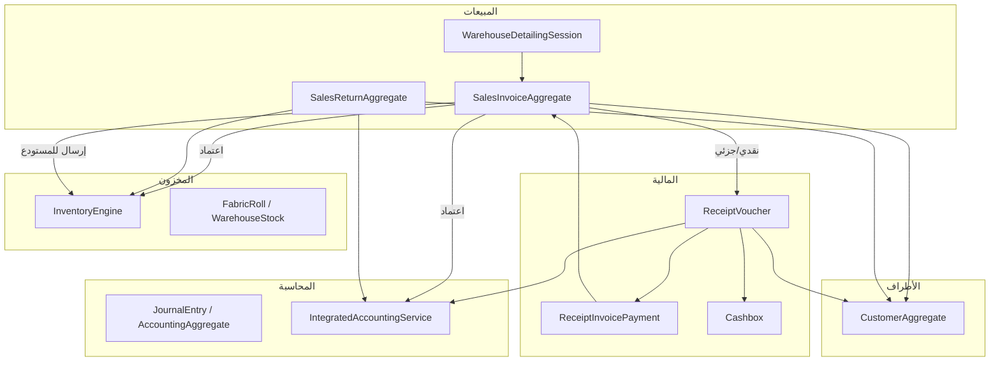

# تقرير التدقيق الشامل: رحلة البيع والأثر المحاسبي في ERP PRO

**تاريخ التدقيق:** 10 يوليو 2026  
**نطاق العمل:** تحليل قراءة فقط (Read-Only Audit) — لم يُعدَّل أي كود أو قاعدة بيانات  
**المشروع:** `c:\Users\Homsi\Desktop\POS ERP C#\ERPSystem`  
**قاعدة البيانات:** PostgreSQL (`erp_pro`) عبر Entity Framework Core 9

---

## 1. Executive Summary

### مستوى سلامة رحلة البيع

ERP PRO هو نظام ERP متخصص في **بيع الأقمشة المستوردة من الصين** (حاويات → مخزون → تفصيل مستودع → اعتماد فاتورة). رحلة البيع **منظمة معماريًا** (Clean Architecture: Domain → Application → Infrastructure) وتتبع نمط Aggregate/Command Handler، لكنها **ليست نظام ERP محاسبي عامًا** بل مسار فاتورة واحد مدمج مع تفصيل المستودع.

**التقييم العام: 5.5 / 10** لجاهزية الاستخدام المحاسبي الحقيقي.

| المحور | الموثوقية | الملخص |
|--------|-----------|--------|
| **المبيعات والإيراد** | متوسطة | الإيراد يُثبت عند الاعتماد عبر قيد AR + إيراد + COGS — صحيح محاسبيًا لكن بدون ضريبة |
| **أرصدة العملاء** | منخفضة–متوسطة | رصيد مخزّن + رصيد محسوب + أستاذ عام — مصادر متعددة قد تتباين |
| **الصندوق والبنك** | متوسطة | سندات قبض مستقلة + تحديث رصيد صندوق تشغيلي؛ GL يستخدم حساب نقدي ثابت |
| **المخزون** | متوسطة–جيدة | حركة عند الاعتماد (ليس التسليم)؛ تتبع لفات/رول؛ مرتجعات لا تستعيد الرول |
| **الأرباح** | متوسطة | COGS من تكلفة الرول المحددة؛ عكس المرتجع بمتوسط وليس التكلفة الأصلية |
| **الضرائب** | **غير موثوقة** | حقل `TaxTotal` موجود لكنه دائمًا صفر — لا محرك ضريبة |

### أخطر المشاكل (Top 5)

1. **لا يوجد احتساب أو ترحيل ضريبة مبيعات** رغم وجود الحقل في DB والواجهة.
2. **لا يمكن عكس فاتورة مبيعات معتمدة** — الإلغاء محظور بعد الاعتماد؛ العكس الوحيد هو مرتجع بيع.
3. **مصادر متعددة لرصيد العميل** (حقل مخزّن، كشف حساب، أستاذ مساعد، تقارير) بدون مصدر حقيقة واحد.
4. **ترحيل القبض يستخدم حساب نقدي ثابت** (`CashUsd`) وليس حساب الصندوق المرتبط (`Cashbox.AccountId`).
5. **منع التكرار المحاسبي ضعيف** — `PostIfNotExistsAsync` فحص تطبيقي فقط بدون قيد فريد على `(SourceType, SourceId)`.

### هل النظام جاهز للاستخدام المحاسبي الحقيقي؟

**لا — ليس للإنتاج المحاسبي الكامل** دون إصلاحات حرجة. يصلح كـ **نظام تشغيلي لتجارة الأقمشة** مع محاسبة مبسّطة بالدولار، لكنه يفتقد: ضريبة القيمة المضافة، فترات مالية، أعمار ديون حقيقية، عكس فواتير، تخصيص دفعات صارم، وفصل تسليم/مخزون حسب سياسة الشركة.

---

## 2. Current Architecture Map

### 2.1 التقنيات

| الطبقة | التقنية |
|--------|---------|
| Runtime | .NET 9.0 |
| Desktop | WPF (`ERPSystem.csproj`) — الواجهة الرئيسية |
| API | ASP.NET Core Minimal APIs + JWT (`ERPSystem.Api`) |
| Web | React 19 + TypeScript + Vite (`web-client/`) |
| ORM | EF Core 9 + Npgsql |
| DB | PostgreSQL متعدد الـ Schemas |
| PDF | QuestPDF + DocumentEngine |
| معمارية | Clean Architecture / DDD Aggregates |

### 2.2 هيكل الحل (Solution)

```
ERPSystem.sln
├── ERPSystem/                    # WPF Host (Modules, Controls, Services)
├── ERPSystem.Domain/             # Aggregates, Entities, Enums, Domain Services
├── ERPSystem.Application/        # Commands, Queries, Handlers, DTOs
├── ERPSystem.Infrastructure/     # EF, Repositories, Migrations, IntegratedAccountingService
├── ERPSystem.Api/                # REST API
├── ERPSystem.DocumentEngine/     # قوالب الطباعة
└── ERPSystem.Application.Tests/
```

### 2.3 خريطة الوحدات المرتبطة برحلة البيع



### 2.4 مسارات الملفات المهمة

| المجال | المسار |
|--------|--------|
| **Sales Module (WPF)** | `Modules/SalesModule.xaml`, `Controls/Sales/` |
| **Sales Aggregate** | `ERPSystem.Domain/Aggregates/SalesInvoiceAggregate.cs` |
| **Sales Handlers** | `ERPSystem.Application/UseCases/Sales/SalesInvoiceHandlers.cs` |
| **Sales API** | `ERPSystem.Api/Endpoints/SalesEndpoints.cs` |
| **Sales Returns** | `ERPSystem.Application/UseCases/Sales/SalesReturnHandlers.cs` |
| **Customers** | `ERPSystem.Domain/Aggregates/CustomerAggregate.cs`, `Controls/Customers/` |
| **Receipts** | `ERPSystem.Application/UseCases/Finance/FinanceHandlers.cs` |
| **Accounting Engine** | `ERPSystem.Infrastructure/Services/IntegratedAccountingService.cs` |
| **Inventory Engine** | `ERPSystem.Infrastructure/Services/InventoryEngine.cs` |
| **Journal Entries** | `ERPSystem.Application/UseCases/Accounting/JournalEntryHandlers.cs` |
| **Cashbox** | `ERPSystem.Application/UseCases/Finance/CashboxHandlers.cs`, `Controls/Finance/` |
| **Reports** | `ERPSystem.Infrastructure/Repositories/ModuleReportRepository.cs` |
| **Dashboard** | `ERPSystem.Application/UseCases/Queries/CustomerQueryHandlers.cs` (`GetDashboardSummaryHandler`) |
| **Permissions** | `ERPSystem.Application/Services/PermissionService.cs`, `Infrastructure/Seed/DatabaseSeeder.cs` |
| **Audit** | `Infrastructure/Audit/AuditSaveChangesInterceptor.cs` |
| **Migrations** | `ERPSystem.Infrastructure/Migrations/` |
| **DB Context** | `ERPSystem.Infrastructure/Persistence/ErpDbContext.cs` |

### 2.5 Schemas قاعدة البيانات ذات الصلة

`sales`, `parties`, `finance`, `accounting`, `inventory`, `audit`, `identity`

---

## 3. Actual Sales Workflow

### 3.1 طرق بدء البيع — الواقع الفعلي

| الطريقة | موجود؟ | نقطة البداية | المسؤول | الجداول المتأثرة |
|---------|--------|--------------|---------|------------------|
| **فاتورة مبيعات مباشرة (مسودة)** | ✅ نعم | WPF: `NewSalesInvoiceControl` / API: `POST /api/v1/sales/invoices` | `CreateSalesInvoiceDraftHandler` | `sales.sales_invoices`, `sales_invoice_items`, `sales_invoice_roll_details` |
| **إرسال للمستودع** | ✅ | نفس النموذج أو API | `SendSalesInvoiceToWarehouseHandler` | + `warehouse_detailing_sessions`, حجز مخزون |
| **تفصيل مستودع** | ✅ | `WarehouseDetailingPageControl` / API detailing | `CompleteWarehouseDetailingHandler` | تحديث أطوال الرولات، `SubTotal`, `GrandTotal` |
| **اعتماد فاتورة** | ✅ | `SalesPopupService.ApproveAsync` / API | `ApproveSalesInvoiceHandler` | فاتورة، عميل، مخزون، قيود، سند قبض (نقدي) |
| **تسليم** | ✅ لوجستي فقط | `SalesDeliveryPopupControl` | `ConfirmSalesInvoiceDeliveryHandler` | حقول تسليم على الفاتورة |
| **مرتجع بيع** | ✅ | `SalesReturnFormPopupControl` | `CreateSalesReturnHandler` → `PostSalesReturnHandler` | `sales_returns`, مخزون، قيود |
| **سند قبض مستقل** | ✅ | `ReceiptVoucherPageControl` | `CreateReceiptVoucherHandler` → `PostReceiptVoucherHandler` | `finance.receipt_vouchers`, `receipt_invoice_payments` |
| **عرض سعر** | ❌ | مفتاح ترجمة فقط `Sub_Sales_Quotes` | — | — |
| **أمر بيع** | ❌ | مفتاح ترجمة `Sub_Sales_Orders` | — | — |
| **نقطة بيع POS** | ❌ محذوف | `Core/Sales/SalesModels.cs` legacy | — | — |
| **طلب عميل** | ❌ | — | — | — |
| **فاتورة من عقد** | ❌ | — | — | — |
| **استيراد فواتير** | ❌ | — | — | — |
| **Bulk Import مبيعات** | ❌ | يوجد فقط استيراد رصيد افتتاحي للعملاء | — | — |
| **API** | ⚠️ جزئي | `SalesEndpoints`, `DetailingEndpoints`, `ReceiptEndpoints` | Handlers | — |

### 3.2 تفاصيل إنشاء المسودة

- **الحالة الابتدائية:** `SalesInvoiceStatus.Draft` (0)
- **رقم تسلسلي:** نعم — `INumberingService.NextSalesInvoiceNumberAsync`
- **Validation:** مستودع إلزامي، حاوية صينية إلزامية (`ChinaContainerId`), عميل، أسطر
- **صلاحيات:** `sales.create` في الـ Handlers
- **موافقة:** لا عند الإنشاء
- **تكرار فاتورة:** لا آلية duplicate-check على رقم الفاتورة من الواجهة (يعتمد على `DocumentCounter`)
- **تجاوز دورة العمل:** API يمكنه `approve` مباشرة دون إكمال تفصيل إذا تجاوز الحالات — لكن `InvoiceCanBeApprovedSpecification` يمنع ذلك

### 3.3 دورة الحياة الفعلية

```
Draft → AwaitingDetailing → Detailed → [ReadyForApproval*] → Approved → [Printed] → Delivered
                                                                              ↓
                                                                    PartiallyReturned / Returned
أي حالة قبل الاعتماد → Cancelled

* ReadyForApproval: enum موجود + MarkReadyForApproval() لكن لا Handler يستدعيه
```

---

## 4. Expected Professional Workflow

في ERP احترافي متكامل، المتوقع:

1. **عرض سعر (اختياري)** → **أمر بيع (اختياري)** → **فاتورة مبيعات** → **إذن تسليم** → **تحصيل**
2. **فصل الحالات:** حالة المستند / حالة الدفع / حالة التسليم / حالة الترحيل المحاسبي
3. **الإيراد:** عند الفاتورة أو عند التسليم (سياسة قابلة للإعداد)
4. **المخزون:** عند التسليم أو الفاتورة (سياسة قابلة للإعداد)
5. **الضريبة:** محرك ضريبة (سطر/فاتورة، شامل/غير شامل) + حساب ضريبة مستحقة
6. **الدفع:** سند قبض مستقل دائمًا مع Payment Allocation صارم
7. **العكس:** Reversal Entry للفواتير المعتمدة
8. **فترة مالية** + منع الترحيل في فترات مغلقة
9. **مصدر حقيقة واحد** للأرصدة: الأستاذ العام

---

## 5. Gap Analysis

| الجزء | الموجود حاليًا | المتوقع | الفجوة | الخطورة |
|-------|---------------|---------|--------|---------|
| عرض سعر / أمر بيع | غير موجود | مستندات منفصلة | كامل | Medium |
| فاتورة مبيعات | موجودة مع تفصيل مستودع | فاتورة قابلة للتخصيص | مدمجة مع سير أقمشة | Low |
| إذن تسليم | حقول على الفاتورة + PDF | مستند مستقل | لا فصل | Medium |
| حالة الدفع | محسوبة من `ReceiptInvoicePayment` | Enum مستقل | مختلطة مع التحصيل | Medium |
| حالة الترحيل | = `Approved` | Posted/Unposted منفصل | مدمجة | High |
| ضريبة المبيعات | `TaxTotal` = 0 دائمًا | VAT 15% + حساب ضريبة | كامل | **Critical** |
| تاريخ استحقاق | `PaymentTermsDays` على العميل فقط | `DueDate` على الفاتورة | غير مطبق | High |
| أعمار الديون | تقدير UI | Buckets 0-30-60-90+ | مبسّط/خاطئ | High |
| عكس فاتورة | ممنوع بعد الاعتماد | Reversal Entry | كامل | **Critical** |
| Credit Note | UI enum فقط | مستند مستقل | يُستبدل بمرتجع | Medium |
| فترة مالية | غير موجودة | Fiscal Period | كامل | High |
| تخصيص الدفع | جدول `receipt_invoice_payments` | Allocation Engine صارم | جزئي بدون تحقق خادم | High |
| حساب الصندوق في GL | `CashUsd` ثابت | حساب الصندوق المختار | خطأ محتمل | **Critical** |
| POS | محذوف | — | — | N/A |
| API كامل | جزئي | جميع العمليات | تسليم/مرتجع WPF فقط | Medium |
| Idempotency | فحص تطبيقي | DB Unique Constraint | ضعيف | **Critical** |
| FK على التخصيصات | indexes فقط | Foreign Keys | سلامة بيانات | High |
| تسليم جزئي | غير مدعوم | متعدد التسليمات | كامل | Medium |
| FIFO/LIFO COGS | Specific cost per roll | قابل للإعداد | محدود | Medium |
| بنك عام AR/AP | غير موجود | حسابات بنك | فقط شركاء رأس المال | Medium |

---

## 6. Scenario Analysis

### 6.1 بيع نقدي بالكامل (1,000 + 150 ضريبة = 1,150)

**الواقع في النظام (بدون ضريبة فعلية):**

مثال بإجمالي 1,150 (الضريبة لن تُحسب — `TaxTotal` يبقى 0):

#### القيد عند الاعتماد (قيد 1 — فاتورة):
| حساب | مدين | دائن |
|------|------|------|
| ذمم عملاء (AR) | 1,150 | |
| إيراد مبيعات | | 1,150 |
| تكلفة مبيعات (COGS) | 600 | |
| مخزون | | 600 |

**الطريقة:** فصل AR ثم تحصيل (وليس مباشرة صندوق → إيراد) — **صحيح محاسبيًا**.

#### القيد عند التحصيل التلقائي (قيد 2 — سند قبض):
| حساب | مدين | دائن |
|------|------|------|
| نقدية (`CashUsd` ثابت) | 1,150 | |
| ذمم عملاء | | 1,150 |

**التحقق:**

| السؤال | النتيجة |
|--------|---------|
| الفاتورة مدفوعة؟ | نعم — `RemainingBalance = 0` إذا `CollectedAmount = GrandTotal` |
| رصيد العميل صفر؟ | لعميل **ائتماني**: نعم (+1150 ثم -1150). لعميل **نقدي**: الحقل لا يُحدَّث أصلًا |
| ينشأ سند قبض؟ | نعم — تلقائي في `PostCashCollectionAsync` |
| يتغير الصندوق؟ | نعم — `cashbox.ApplyReceipt()` |
| مطابقة فاتورة/دفعة؟ | نعم — `ReceiptInvoicePayment` |
| يظهر في كشف العميل؟ | نعم — الفاتورة + السند |
| مبيعات نقدية في التقارير؟ | لا يوجد تقرير مخصص؛ يُستنتج من `PaymentType = Cash` |
| التدفق النقدي؟ | يظهر في قيد السند فقط |
| ينخفض المخزون؟ | **نعم عند الاعتماد** — `DeductForInvoiceAsync` |
| متى ينخفض؟ | **الاعتماد** — ليس التسليم |

### 6.2 بيع آجل بدون دفعة (1,150)

#### القيد عند الاعتماد:
| حساب | مدين | دائن |
|------|------|------|
| AR | 1,150 | |
| إيراد | | 1,000* |
| COGS | 600 | |
| مخزون | | 600 |

*بدون ضريبة: الإيراد = 1,150 كاملًا

| السؤال | النتيجة |
|--------|---------|
| يرتفع رصيد العميل؟ | نعم — `ApplyPostedInvoice` لعميل `Credit` |
| تظهر غير مدفوعة؟ | نعم — `CollectedAmount = 0`, `RemainingBalance = 1150` |
| تاريخ استحقاق؟ | **لا** — لا `DueDate` على الفاتورة |
| تتحول متأخرة تلقائيًا؟ | **لا** |
| أيام التأخير؟ | في `ReceivablesAgingControl` فقط — من أقدم فاتورة |
| أعمار الديون؟ | مبسّطة — `Collected = TotalInvoiced - Balance` |
| الحد الائتماني؟ | يُفحص عند الاعتماد فقط — `CreditLimitChecker` |
| تجاوز الحد؟ | يرفض الاعتماد + إشعار |
| يرفع الصندوق خطأً؟ | **لا** — لا سند قبض |
| الإيراد في قائمة الدخل؟ | نعم — عبر قيد الإيراد |
| التحصيل في التدفق النقدي خطأً؟ | **لا** |
| الضريبة عند الفاتورة أم الدفع؟ | **غير مطبقة** |

### 6.3 بيع آجل مع دفعة جزئية (400 من 1,150)

**عند الاعتماد:** قيد فاتورة كامل + سند قبض 400 تلقائي (إذا `PartialPaymentAmount` مضبوط + صندوق).

| السؤال | النتيجة |
|--------|---------|
| مدفوعة جزئيًا؟ | نعم — UI: `"محصّلة جزئياً"` |
| المتبقي 750؟ | نعم — `RemainingBalance = GrandTotal - Collected` |
| علاقة دفعة/فاتورة؟ | `ReceiptInvoicePayment` |
| دفعة واحدة لعدة فواتير؟ | نعم — `CreateReceiptVoucherHandler` يدعم allocations متعددة |
| عدة دفعات لفاتورة؟ | نعم — عبر سندات قبض لاحقة |
| Payment Allocation صارم؟ | **لا** — `ReceiptVoucherValidator` لا يتحقق من المجاميع |
| دفعة أكبر من المتبقي؟ | **غير ممنوع في الخادم** |
| المبلغ الزائد → رصيد دائن؟ | **لا آلية واضحة** |
| Advance Payment؟ | **غير مدعوم** كمفهوم مستقل |
| تكرار قيد الإيراد عند الدفع؟ | **لا** — قيد السند يخصم AR فقط |
| قيد متوازن؟ | نعم — ضمن سياسة ±0.01 |

### 6.4 دفعة لاحقة

- عبر `ReceiptVoucherPageControl` → `CreateReceiptVoucherHandler` → `PostReceiptVoucherHandler`
- قيد: نقدية Dr / AR Cr
- يُحدَّث `Customer.Balance` عبر `RecordPostedReceipt`
- **لا Transaction** صريحة في `PostReceiptVoucherHandler`

### 6.5 دفعة زائدة

- **غير ممنوعة** في Domain Validator
- قد ينتج رصيد عميل سالب في الحقل المخزّن دون معالجة رصيد دائن

### 6.6 إلغاء

| الحالة | النتيجة |
|--------|---------|
| مسودة | ✅ إلغاء + `ReleaseForInvoiceAsync` |
| قبل الاعتماد | ✅ |
| معتمدة | ❌ `InvalidInvoiceWorkflowException` |
| مدفوعة | ❌ |
| مُسلَّمة | ❌ |

### 6.7 مرتجع

- `SalesReturnAggregate` = Credit Note functionally
- عكس إيراد + AR + COGS + إعادة مخزون (أمتار فقط، بدون رول)
- يُحدَّث `Customer.Balance` عبر `RecordSalesReturn` (= طرح من الذمة)

### 6.8 Credit Note

- **غير موجود** كمستند — `TransactionType.CreditNote` في `Core/Customers/CustomerModels.cs` للعرض فقط

### 6.9 تسليم جزئي

- **غير مدعوم**

### 6.10 دفع بعملة مختلفة

- المبيعات افتراضيًا USD (`Money` بدون تعدد عملات على الفاتورة)
- **لا Exchange Gain/Loss**

---

## 7. Accounting Entries Matrix

| السيناريو | المتوقع (ERP احترافي) | الفعلي في ERP PRO | تطابق؟ |
|-----------|----------------------|-------------------|--------|
| بيع نقدي | فاتورة AR+إيراد ثم قبض صندوق+AR | نفس النمط + COGS | ✅ جزئي (بدون ضريبة) |
| بيع نقدي مباشر | بعض الأنظمة: صندوق→إيراد | AR وسيط | ✅ (أفضل) |
| بيع آجل | AR+إيراد+COGS | نفسه | ✅ |
| تحصيل لاحق | صندوق+AR | `PostReceiptVoucherAsync` | ✅ |
| دفعة جزئية عند الاعتماد | فاتورة كاملة + قبض جزئي | نفسه | ✅ |
| تسليم | لا قيد (إذا المخزون عند التسليم) | لا قيد | ⚠️ المخزون عند الاعتماد |
| إلغاء معتمد | Reversal | **غير متاح** | ❌ |
| مرتجع | عكس إيراد+AR+COGS | `PostSalesReturnAsync` | ✅ |
| ضريبة 15% | حساب ضريبة مستحقة | **لا يوجد** | ❌ |
| خصم سطر | حساب خصم مبيعات | `SalesDiscounts` | ✅ |

---

## 8. Inventory Impact Matrix

| السيناريو | انخفاض الكمية | انخفاض القيمة | COGS | التوقيت |
|-----------|--------------|--------------|------|---------|
| حفظ مسودة | لا | لا | لا | — |
| إرسال للمستودع | حجز (`Reserve`) | — | لا | قبل الاعتماد |
| اعتماد فاتورة | `IssueForInvoice` | نعم | `meters × CostPerMeter` | **الاعتماد** |
| تسليم | لا | لا | لا | لوجستي فقط |
| إلغاء قبل الاعتماد | `Release` | — | لا | — |
| مرتجع | `ReceiveSalesReturn` | أمتار للمخزون | عكس بمتوسط | عند ترحيل المرتجع |
| صنف خدمي | N/A | N/A | N/A | النظام أقمشة فقط |
| Serial/Batch | Roll-level | Roll `CostPerMeter` | Specific | — |
| مخزون غير كافٍ | يُرفض عند الحجز/الصرف | — | — | — |
| FIFO | حجز بترتيب RollNumber | — | Specific cost | — |
| Average | Opening stock فقط | — | — | — |
| Standard | **غير موجود** | — | — | — |
| Double COGS | — | — | `PostIfNotExists` يمنع تكرار قيد | ⚠️ |

---

## 9. Customer Balance Analysis

### 9.1 مصادر الرصيد

| المصدر | الآلية | الملف |
|--------|--------|-------|
| **حقل مخزّن** | `Customer.Balance` | `PartyEntities.cs` |
| زيادة عند فاتورة | `ApplyPostedInvoice` — **Credit فقط** | `PartyEntities.cs:55-58` |
| نقص عند قبض | `ApplyPostedReceipt` — **كل الأنواع** | `PartyEntities.cs:61-62` |
| مرتجع | `RecordSalesReturn` → `ApplyPostedReceipt` | `CustomerAggregate.cs:26-27` |
| **كشف حساب** | فواتير معتمدة + سندات مرحّلة | `GetCustomerStatementHandler` |
| **أستاذ مساعد** | سطر بسطر + تعديلات خصم/ضريبة | `GetCustomerAccountLedgerHandler` |
| **GL** | `GetPartyOpeningBalanceAsync` | `AccountingReportRepository` |
| **تقارير الذمم** | `Customers.Balance` | `ModuleReportRepository` |
| **Dashboard** | `Sum(c => c.Customer.Balance)` | `GetDashboardSummaryHandler:59` |
| **أعمار الديون UI** | `Collected = TotalInvoiced - Balance` | `AgingListControls.cs:78` |

### 9.2 Source of Truth الحالي

**لا يوجد مصدر واحد.** الأقرب للمحاسبة: **قيود الأستاذ العام**، لكن التشغيل يعتمد **`Customer.Balance` المخزّن**.

### 9.3 مشاكل التباين المحتملة

1. عميل `Cash` — الرصيد المخزّن لا يتحرك لكن GL يمر عبر AR
2. `RemainingBalance` على الفاتورة لا يخصم المرتجعات
3. أرصدة افتتاحية — مسار GL منفصل عن `Balance` إذا لم تُزامَن
4. `RecordPostedReceipt` على قبض لعميل نقدي يُنقص رصيدًا كان صفرًا → سالب محتمل
5. لا عكس رصيد عند إلغاء فاتورة معتمدة (لأن الإلغاء ممنوع)
6. تقريب: سياسة ±0.01 في `AccountingPostingPolicy`

---

## 10. Payment and Allocation Analysis

### 10.1 أنواع الدفع المدعومة

| النوع | مدعوم؟ | ملاحظات |
|-------|--------|---------|
| Cash | ✅ | `PaymentType.Cash` على الفاتورة |
| Credit | ✅ | `PaymentType.Credit` |
| Partial | ✅ | `PartialPaymentAmount` |
| Bank Transfer | ❌ على المبيعات | موجود في مصروفات فقط |
| Card / Cheque | ❌ | — |
| Mixed Payment | ❌ | صندوق واحد فقط |
| Advance Payment | ❌ | — |
| Customer Credit (رصيد دائن) | ❌ | — |

### 10.2 سند القبض

- **مستند مستقل:** `ReceiptVoucher` مع `VoucherStatus`: Draft → Approved → Posted
- **رقم فريد:** `NextReceiptNumberAsync` + فهرس `(CompanyId, EntryNumber)` للقيود
- **طباعة:** `DocumentEngine/Templates/ReceiptVoucher/`
- **ربط محاسبي:** `PostReceiptVoucherAsync` — لكن **حساب `CashUsd` ثابت** وليس `cashbox.AccountId`
- **إلغاء دفعة:** لا Handler لعكس سند قبض مرحّل

### 10.3 Payment Allocation

- جدول: `sales.receipt_invoice_payments` (`SalesInvoiceId`, `ReceiptVoucherId`, `Amount`)
- إنشاء عند: اعتماد نقدي تلقائي + `CreateReceiptVoucherHandler`
- **تحقق UI:** `ReceiptVoucherPageControl` — ليس في `ReceiptVoucherValidator`
- **FK:** غير موجود في Migration `20260711120000_AddSalesReturnsAndDelivery.cs`

---

## 11. Reports Reconciliation

### 11.1 التقارير الموجودة (عبر `ModuleReportRegistry` + `ModuleReportRepository`)

| التقرير | موجود | مصدر البيانات |
|---------|-------|---------------|
| فواتير المبيعات | ✅ | `sales_invoices` |
| مبيعات حسب العميل | ✅ | فواتير + `receipt_invoice_payments` |
| مرتجعات | ✅ | `sales_returns` |
| تسليم | ✅ | `DeliveredAt` على الفاتورة |
| سندات قبض | ✅ | `receipt_vouchers` |
| أرصدة عملاء | ✅ | `Customers.Balance` |
| دفتر يومية / ميزان | ✅ | `AccountingReportRepository` |
| مبيعات نقدية/آجلة منفصلة | ❌ | — |
| أعمار ديون Buckets | ❌ | — |
| هامش ربح | ❌ | — |
| تدفق نقدي | ❌ كتقرير مبيعات | — |
| ضريبة | ❌ | — |
| `inv.stocktake` | مسجّل | **غير منفّذ** — "قيد التطوير" |

### 11.2 تطابق الأرقام

| المقارنة | متوقع التطابق | الواقع |
|----------|--------------|--------|
| ذمم التقرير vs GL | متطابق | **قد يختلف** — التقرير يستخدم `Balance` المخزّن |
| متبقي فواتير vs ذمم | متطابق | **قد يختلف** — المتبقي لا يخصم المرتجعات |
| مبيعات Dashboard vs تقرير | متطابق | Dashboard: فواتير اليوم المعتمدة فقط |
| صندوق GL vs رصيد صندوق | متطابق | **قد يختلف** — حساب GL ثابت vs صناديق متعددة |

### 11.3 ما يُستبعد من التقارير

- المسودات: ✅ مستبعدة (`Status >= Approved` في معظم الاستعلامات)
- الملغاة: ✅ `!= Cancelled` في aging UI
- الفواتير غير المعتمدة في المبيعات: ✅
- المرتجعات كمبيعات موجبة: ✅ منفصلة
- الدفعات الملغاة: لا يوجد إلغاء سندات

---

## 12. UX Problems

### 12.1 الشاشات الرئيسية

| الشاشة | المسار | ملاحظات UX |
|--------|--------|------------|
| فاتورة جديدة | `Controls/Sales/NewSalesInvoiceControl` | سير متعدد الخطوات؛ حاوية صينية إلزامية |
| قائمة الفواتير | `SalesInvoiceListPageControl` | حالة واحدة فقط (لا فصل دفع/تسليم) |
| مركز عمليات الفاتورة | `SalesInvoiceOperationsCenterControl` | جيد — يعرض محصّل/متبقي/قيود/سندات/مرتجعات |
| تفصيل مستودع | `WarehouseDetailingPageControl` | اسم مربك — ليس "تسليم" |
| تأكيد تسليم | `SalesDeliveryPopupControl` | واضح أنه لوجستي فقط |
| سند قبض | `ReceiptVoucherPageControl` | تخصيص في UI |
| كشف عميل | `CustomerAccountStatementControl` | مسار منفصل عن الأستاذ المفصّل |
| أعمار ديون | `ReceivablesAgingControl` | **لا buckets** — `Collected` تقديري |
| Web مبيعات | `web-client/src/pages/Sales.tsx` | لا تسليم/مرتجع |
| Web تسليم | `web-client/src/pages/Delivery.tsx` | **تفصيل مستودع** وليس تسليم |

### 12.2 خلط الحالات في الواجهة

- **حالة الفاتورة** (`SalesInvoiceStatus`) تغطي التفصيل والاعتماد والتسليم والمرتجع
- **حالة الدفع** مشتقة: `"مُحصّلة بالكامل"` / `"محصّلة جزئياً"` / `"غير مُحصّلة"` — `SalesInvoiceOperationsCenterControl.cs:79-81`
- **حالة الترحيل** = `Approved` — لا `Posted` منفصل
- **Legacy model** `Core/Sales/SalesModels.cs` — `InvoiceStatus` و `PaymentStatus` منفصلة لكن **غير موصولة**

### 12.3 عدد الخطوات التقريبي

| الرحلة | الخطوات (WPF) |
|--------|---------------|
| بيع نقدي | إنشاء مسودة → إرسال مستودع → تفصيل → اعتماد (يشمل قبض تلقائي) → [تسليم] = **4-5** |
| بيع آجل | نفسه بدون قبض تلقائي = **4** + سند قبض لاحق = **+2** |
| دفعة جزئية | نفس النقدي مع إدخال `PartialPaymentAmount` |
| مرتجع | إنشاء مسودة مرتجع → ترحيل = **2** |
| كشف حساب | فتح عميل → كشف = **2** |

---

## 13. Permissions and Audit Problems

### 13.1 صلاحيات المبيعات (من `DatabaseSeeder`)

| الصلاحية | Backend | Frontend |
|----------|---------|----------|
| `sales.create` | ✅ Handlers | ✅ `SalesUiService` |
| `sales.send-to-warehouse` | ✅ | ✅ |
| `warehouse.detailing` | ✅ | ✅ |
| `sales.approve` | ✅ | ✅ |
| `sales.cancel` | ✅ | ✅ |
| `sales.deliver` | ✅ | ✅ |
| `sales.return` | ✅ | ✅ |
| `finance.receipt.create/post` | ✅ | ✅ |
| تجاوز حد ائتماني | ❌ صلاحية منفصلة | يرفض للجميع |
| خصم يحتاج اعتماد | ❌ | تسجيل audit فقط عند خصم سطر |
| تغيير سعر | ❌ | audit `SalesPriceOverride` |
| فترة مغلقة | ❌ | — |
| مشاهدة التكلفة | `CheckSalesInvoiceBelowCost` | popup |

### 13.2 تجاوز API

- API يستدعي نفس Handlers → **الصلاحيات مطبقة في Backend**
- JWT مطلوب على `/api/v1/sales/*`
- **القبض التلقائي عند الاعتماد** يتجاوز `finance.receipt.create/post` — ينفّذ داخل `ApproveSalesInvoiceHandler` مباشرة

### 13.3 Audit

- **عام:** `AuditSaveChangesInterceptor` — Added/Modified/Deleted
- **خصوصي:** `SalesPriceOverride`, `ExpenseAuditLog`, `InventoryAuditEntry`
- **اعتماد فاتورة:** `ApprovedByUserId`, `ApprovedAt` على الفاتورة
- **لا audit workflow** للموافقات متعددة المستويات

---

## 14. Technical Debt

| المشكلة | الدليل |
|---------|--------|
| Business logic في UI | `AgingListControls.cs` — حساب aging في WPF |
| تكرار نموذج مبيعات | `Core/Sales/SalesModels.cs` vs `SalesInvoiceAggregate` |
| حسابات ثابتة | `AccountingAccountIds.cs` — GUIDs مُدمجة |
| لا Fiscal Period | لا حقل في `JournalEntryEntity` |
| لا Cost Center على القيود | — |
| لا Optimistic Concurrency | لا `RowVersion` على الفواتير |
| Soft delete غير آمن | إلغاء فقط قبل الاعتماد |
| PostIfNotExists race condition | فحص ثم إدراج بدون lock |
| `CreateAndPostJournalAsync` يحفظ داخلياً | قد يتداخل مع UoW خارجي |
| N+1 في Operations Center | حلقة `GetByIdAsync` لكل قيد |
| Magic number مخزون منخفض | `50m` في تقارير وdashboard |
| تعليق خاطئ | `OperationsQueryHandlers.cs:202` يذكر "delivery/COGS" لكن COGS عند الاعتماد |
| `ReadyForApproval` ميت | enum بدون handler |
| Web API ناقص | لا deliver/return على API |
| `OpenReceiptsCount = 0` | hardcoded في Dashboard |
| لا FK على جداول مالية حرجة | migration returns/delivery |

---

## 15. Critical Bugs

| # | المشكلة | الأثر |
|---|---------|-------|
| C1 | لا ضريبة مبيعات | إقرارات ضريبية خاطئة |
| C2 | لا عكس فاتورة معتمدة | بيانات ملتصقة؛ يجب مرتجع كامل |
| C3 | `CashUsd` ثابت في قبض | صندوق GL لا يطابق صندوق التشغيل |
| C4 | Idempotency ضعيف | قيد مكرر عند double-click/API retry |
| C5 | رصيد عميل متعدد المصادر | قرارات ائتمان خاطئة |
| C6 | `RemainingBalance` يتجاهل المرتجعات | متبقي فاتورة خاطئ |
| C7 | قبض بدون Transaction | عدم اتساق عند فشل جزئي |
| C8 | لا تحقق تخصيص في الخادم | دفعة زائدة / تخصيص خاطئ |
| C9 | COGS مرتجع بمتوسط ≠ أصلي | ربح خاطئ |
| C10 | `RecordPostedReceipt` لعميل نقدي | رصيد سالب محتمل |

---

## 16. Risk Classification

### Critical (10)
C1–C10 أعلاه

### High (18)
- لا `DueDate` على فواتير المبيعات
- لا أعمار ديون buckets حقيقية
- لا فترة مالية / إقفال
- لا عكس سند قبض مرحّل
- مخزون عند الاعتماد لا التسليم (فجوة سياسة)
- لا تسليم جزئي
- مرتجع لا يستعيد FabricRoll
- FK مفقود على `receipt_invoice_payments`
- القبض التلقائي يتجاوز صلاحيات finance
- تباين Dashboard ذمم vs فواتير مفتوحة
- لا تقرير مبيعات نقدية/آجلة
- لا Exchange rate على المبيعات
- `ApproveSalesInvoiceHandler` يسجل فاتورة على عميل Credit حتى لو `PaymentType.Cash`
- عدم خصم المرتجع من `RemainingBalance` في مركز العمليات
- Aging: `Collected = TotalInvoiced - Balance` تقديري
- لا Unique على journal source
- لا rollback في `PostReceiptVoucherHandler`
- Web client لا يكمل دورة البيع

### Medium (22)
- لا عرض سعر/أمر بيع
- إذن تسليم غير مستقل
- `ReadyForApproval` غير مستخدم
- `Printed` اختياري غير مرتبط بالتسليم إلزاميًا
- Credit Note كـ enum فقط
- تقارير أرباح غير موجودة
- `inv.stocktake` غير منفّذ
- بنك عام غير موجود
- حد ائتماني فقط عند الاعتماد
- لا Advance payment
- تعديل فاتورة بعد دفعات — محظور بعد الاعتماد (جيد) لكن لا حماية على المسودة مع حجز
- `CustomerType` ≠ `PaymentType` — مربك
- تقرير الحالة يحذف Printed/Returned
- لا idempotency على API
- Container إلزامي — يقيّد أنواع البيع
- لا multi-currency
- Transfer unit cost = 0 في InventoryEngine
- لا HR تقارير رغم التسجيل
- Notifications API in-memory stub
- Payment vouchers WPF-only
- Legacy SalesModels يربك المطورين
- لا اختبارات تكامل لسيناريوهات محاسبية كاملة

### Low (12)
- POS محذوف لكن بقايا localization
- `DeliveryNote` entity غير مستخدم
- `IsArchived` على الفاتورة بدون workflow
- `ReversedByJournalEntryId` على الفاتورة غير مستخدم
- OpenReceiptsCount = 0
- تكرار عتبة 50m
- Web enums منفصلة عن domain
- PDF يعرض ضريبة صفر
- لا طباعة إلزامية قبل التسليم
- Submodule تسمية "Delivery" للتفصيل
- DocumentType.DeliveryNote بلا pipeline
- Performance indexes حديثة — جيد لكن لا يعالج المشاكل المنطقية

**إجمالي المشاكل المكتشفة: 62** (10 Critical, 18 High, 22 Medium, 12 Low)

---

## 17. Evidence

### E1 — لا ضريبة على المبيعات
- **File:** `ERPSystem.Domain/Aggregates/SalesInvoiceAggregate.cs`
- **Class:** `SalesInvoiceAggregate`
- **Lines:** 28, 306
- **السلوك:** `TaxTotal = Money.Zero()` افتراضيًا؛ `RecalculateGrandTotal` يجمعه لكن لا method يضبطه
- **المشكلة:** حقل DB موجود دائمًا بصفر
- **مثال:** فاتورة 1,000 + 15% متوقعة → `TaxTotal = 0`, `GrandTotal = 1000`

### E2 — قيد المبيعات عند الاعتماد
- **File:** `ERPSystem.Infrastructure/Services/IntegratedAccountingService.cs`
- **Method:** `PostSalesInvoiceApprovalAsync`
- **Lines:** 68-99
- **السلوك:** AR Dr, Revenue Cr, Discounts Dr, COGS Dr, Inventory Cr
- **مثال:** فاتورة 1,150 → AR مدين 1,150

### E3 — قبض نقدي تلقائي
- **File:** `ERPSystem.Application/UseCases/Sales/SalesInvoiceHandlers.cs`
- **Method:** `PostCashCollectionAsync`
- **Lines:** 578-611
- **السلوك:** ينشئ `ReceiptVoucher`, يخصص, يعتمد, يرحّل, يحدّث صندوق وعميل
- **مثال:** بيع نقدي → سند قبض بقيمة `GrandTotal`

### E4 — حساب نقدي ثابت
- **File:** `IntegratedAccountingService.cs`
- **Method:** `PostReceiptVoucherAsync`
- **Lines:** 102-118
- **السلوك:** دائمًا `AccountingAccountIds.CashUsd`
- **المشكلة:** `Cashbox.AccountId` موجود (`FinanceEntities.cs:109`) لكن غير مستخدم هنا

### E5 — رصيد عميل مخزّن
- **File:** `ERPSystem.Domain/Entities/Parties/PartyEntities.cs`
- **Methods:** `ApplyPostedInvoice`, `ApplyPostedReceipt`
- **Lines:** 55-62
- **السلوك:** Credit فقط عند فاتورة؛ الكل عند قبض

### E6 — منع إلغاء معتمد
- **File:** `SalesInvoiceAggregate.cs`
- **Method:** `Cancel`
- **Lines:** 318-325
- **السلوك:** يرمي `InvalidInvoiceWorkflowException` لـ Approved/Printed/Delivered

### E7 — مخزون عند الاعتماد
- **File:** `SalesInvoiceHandlers.cs` + `InventoryEngine.cs`
- **Methods:** `DeductForInvoiceAsync`, `IssueForInvoiceAsync`
- **السلوك:** صرف رولات بـ `CostPerMeter`

### E8 — تسليم بلا أثر
- **File:** `SalesDeliveryHandlers.cs`
- **Lines:** 43-45
- **السلوك:** `aggregate.Deliver()` فقط

### E9 — Idempotency ضعيف
- **File:** `IntegratedAccountingService.cs`
- **Method:** `PostIfNotExistsAsync`
- **Lines:** 437-461
- **السلوك:** `AnyAsync` ثم `CreateAndPostJournalAsync` — لا unique constraint

### E10 — تخصيص بدون تحقق خادم
- **File:** `ERPSystem.Domain/Validators/DomainValidators.cs`
- **Class:** `ReceiptVoucherValidator`
- **Lines:** 89-99
- **السلوك:** يتحقق من عميل/صندوق/مبلغ فقط — لا allocations

### E11 — RemainingBalance
- **File:** `OperationsQueryHandlers.cs`
- **Method:** `GetSalesInvoiceOperationsCenterHandler`
- **Lines:** 241-293
- **السلوك:** `GrandTotal - Sum(payments)` — لا يخصم مرتجعات

### E12 — Aging تقديري
- **File:** `Controls/Accounting/AgingListControls.cs`
- **Lines:** 68-78
- **السلوك:** `Collected = totalInvoiced - dto.Balance`

### E13 — Dashboard مبيعات اليوم
- **File:** `CustomerQueryHandlers.cs`
- **Lines:** 62-64
- **السلوك:** `Status >= Approved` و `InvoiceDate == UtcNow.Date`

### E14 — مرتجع COGS متوسط
- **File:** `InventoryEngine.cs`
- **Method:** `ReceiveSalesReturnAsync`
- **Lines:** ~745-749
- **السلوك:** `soldRolls.Average(r => r.CostPerMeter)`

### E15 — حالات الفاتورة
- **File:** `ERPSystem.Domain/Enums/SalesInvoiceStatus.cs`
- **Lines:** 1-15
- **القيم:** Draft, AwaitingDetailing, Detailed, ReadyForApproval, Approved, Printed, Delivered, Cancelled, PartiallyReturned, Returned

---

## 18. Recommended Target Design

> تصميم مقترح فقط — دون تنفيذ

### 18.1 Workflow States (فصل منطقي)

```
DocumentStatus: Draft | Submitted | Approved | Posted | Cancelled | Reversed
PaymentStatus:  Unpaid | PartiallyPaid | Paid | Overpaid
DeliveryStatus: NotDelivered | PartiallyDelivered | Delivered
FiscalStatus:   Open | Closed
```

### 18.2 Posting Engine موحّد

- `IPostingEngine.Post(documentType, documentId, postingProfile)`
- Transaction واحدة: مستند + مخزون + قيود
- Unique index: `(CompanyId, SourceType, SourceId, PostingKind)`
- Idempotency key على API
- ربط حساب الصندوق/البنك من `Cashbox.AccountId`

### 18.3 Payment Allocation Engine

- جدول `payment_allocations` مع FKs
- قواعد: `Sum(allocations) <= payment.Amount`, `Sum(allocations per invoice) <= invoice.OpenAmount`
- OpenAmount = GrandTotal - Allocated - Returned
- دعم رصيد دائن / Advance

### 18.4 Inventory Posting

- سياسة قابلة للإعداد: `OnInvoice` | `OnDelivery`
- تسليم جزئي بمستند `DeliveryNote`
- مرتجع يستعيد Roll أو ينشئ Roll جديد

### 18.5 Customer Ledger

- **مصدر حقيقة:** GL sub-ledger بـ `PartyId`
- `Customer.Balance` = materialized view أو يُحذف
- كشف حساب = استعلام GL فقط

### 18.6 Tax Engine

- معدلات ضريبة، شامل/غير شامل، حساب `VAT Payable`
- تطابق: UI = DB = PDF = JE

### 18.7 Audit Trail

- كل انتقال حالة: من/إلى/مستخدم/وقت
- Reversal مرتبط بالقيد الأصلي

### 18.8 Reporting Source of Truth

- تقارير تشغيلية من **Posted documents**
- تقارير مالية من **GL**
- reconcilation job يومي

---

## 19. Phased Implementation Plan

### Phase 0: حماية البيانات
- نسخ احتياطي كامل PostgreSQL
- تجميد تغييرات المحاسبة في الإنتاج
- تصدير أرصدة عملاء/GL للمقارنة

### Phase 1: إصلاح القيود الحرجة
- محرك ضريبة مبيعات + حساب VAT
- ربط `PostReceiptVoucherAsync` بـ `Cashbox.AccountId`
- Unique constraint على `(SourceType, SourceId)` للقيود الآلية
- Transaction حول `PostReceiptVoucherHandler`

### Phase 2: توحيد الترحيل
- فصل `Posted` عن `Approved`
- `ReverseSalesInvoice` بقيد عكسي
- Fiscal periods + قفل فترات

### Phase 3: الدفع والتخصيص
- Allocation validator في Domain
- OpenAmount على الفاتورة
- عكس سند قبض
- رصيد دائن / Advance

### Phase 4: المخزون والتسليم
- سياسة توقيت الصرف
- `DeliveryNote` مستقل
- مرتجع بتكلفة أصلية
- استعادة Roll traceability

### Phase 5: التقارير
- مبيعات نقدية/آجلة
- AR aging buckets
- reconcilation Dashboard vs GL
- تقرير ضريبة

### Phase 6: UX
- فصل حالات الدفع/التسليم في UI
- إكمال Web API
- إزالة `Core/Sales/SalesModels.cs` legacy

### Phase 7: اختبارات وترحيل
- اختبارات تكامل للسيناريوهات الـ 16
- UAT محاسبي
- ترحيل أرصدة ومراجعة

---

## 20. Final Verdict

| السؤال | الإجابة |
|--------|---------|
| **هل يمكن الوثوق بالمبيعات؟** | **جزئيًا** — الإيراد يُسجّل عند الاعتماد بشكل متسق، لكن بدون ضريبة وتقارير ناقصة |
| **هل يمكن الوثوق بأرصدة العملاء؟** | **لا بشكل كامل** — مصادر متعددة وتباينات محتملة مع المرتجعات والعملاء النقديين |
| **هل يمكن الوثوق بالصندوق والبنك؟** | **جزئيًا** — رصيد الصندوق التشغيلي موثوق؛ GL قد لا يعكس الصندوق المختار |
| **هل يمكن الوثوق بالمخزون؟** | **جيد نسبيًا** للأقمشة بالرول — ضعيف عند المرتجعات ونقل المخزون |
| **هل يمكن الوثوق بالأرباح؟** | **جزئيًا** — COGS من تكلفة رول؛ مرتجعات بمتوسط تشوّه الهامش |
| **هل يمكن الوثوق بالضرائب؟** | **لا** — غير مُنفَّذة على المبيعات |
| **أول شيء يُصلَح قبل الإنتاج؟** | **1)** ضريبة المبيعات **2)** ربط GL بالصندوق **3)** توحيد رصيد العميل مع GL **4)** منع القيد المكرر **5)** التحقق من تخصيص الدفعات |

---

## ملحق أ — جدول حالات فاتورة المبيعات

| الحالة | القيمة | كيف تدخل؟ | المسؤول | الشروط | أثر محاسبي | أثر مخزني | عمليات لاحقة |
|--------|--------|-----------|---------|--------|------------|-----------|--------------|
| Draft | 0 | `CreateDraft` | `CreateSalesInvoiceDraftHandler` | مستودع+حاوية+عميل | لا | لا | تعديل، إرسال، إلغاء |
| AwaitingDetailing | 1 | `SendToWarehouse` | `SendSalesInvoiceToWarehouseHandler` | أسطر موجودة | لا | حجز | تفصيل، إلغاء |
| Detailed | 2 | `CompleteDetailing` | `CompleteWarehouseDetailingHandler` | كل الأطوال > 0 | لا | لا | اعتماد، إلغاء |
| ReadyForApproval | 3 | `MarkReadyForApproval` | **لا handler** | كان Detailed | لا | لا | اعتماد |
| Approved | 4 | `Approve` | `ApproveSalesInvoiceHandler` | تفصيل مكتمل | **قيد AR+إيراد+COGS** + قبض محتمل | **صرف** | طباعة، تسليم، مرتجع |
| Printed | 5 | `Print` | UI | Approved | لا | لا | تسليم، مرتجع |
| Delivered | 6 | `Deliver` | `ConfirmSalesInvoiceDeliveryHandler` | Approved/Printed | لا | لا | مرتجع |
| Cancelled | 7 | `Cancel` | `CancelSalesInvoiceHandler` | قبل الاعتماد | لا | تحرير حجز | — |
| PartiallyReturned | 8 | `ApplyReturn(false)` | `PostSalesReturnHandler` | بعد مرتجع جزئي | قيد عكس جزئي | استلام أمتار | مرتجع إضافي |
| Returned | 9 | `ApplyReturn(true)` | `PostSalesReturnHandler` | مرتجع كامل | قيد عكس | استلام | — |

### حالات مشتقة (ليست enum)

| المفهوم | المصدر | القيم |
|---------|--------|-------|
| حالة الدفع | محسوبة | غير مُحصّلة / جزئية / كاملة |
| حالة الترحيل | = Approved+ | لا Unposted |
| حالة الموافقة | = اعتماد الفاتورة | لا workflow متعدد |

---

## ملحق ب — اختبارات الاتساق المحاسبي (تحليل منطقي)

| # | الاختبار | قابل للتحقق؟ | النتيجة المتوقعة في الكود الحالي |
|---|----------|-------------|----------------------------------|
| 1 | مجموع مدين = دائن | ✅ | `AccountingPostingPolicy` ±0.01 |
| 2 | ذمم مساعد = GL | ⚠️ | قد يختلف بسبب `Balance` المخزّن |
| 3 | صندوق = حركات GL | ❌ | حساب ثابت vs صناديق متعددة |
| 4 | بنك = حركات | N/A | لا بنك عام |
| 5 | مخزون = حساب مخزون | ⚠️ | تقريبًا عند الاعتماد |
| 6 | COGS = حركات مخزنية | ⚠️ | مرتجع بمتوسط |
| 7 | متبقي فواتير = ذمم | ❌ | لا يخصم مرتجعات |
| 8 | مدفوعة → متبقي 0 | ✅ | إذا allocations كاملة |
| 9 | غير مدفوعة → لا تخصيص كامل | ⚠️ | لا منع صارم |
| 10 | جزئية → 0 < مدفوع < إجمالي | ✅ | محسوب |
| 11 | ملغاة لا تؤثر | ✅ | مستبعدة من التقارير |
| 12 | مرحّل لا يُعدَّل | ✅ | `EnsureEditable` يمنع |
| 13 | كل قيد له مرجع | ✅ | `SourceType` + `SourceId` |
| 14 | تخصيص لفاتورة صحيحة | ⚠️ | لا FK |
| 15 | مجموع تخصيصات ≤ قيمة السند | ❌ | غير مُطبَّق في الخادم |
| 16 | تخصيصات الفاتورة ≤ إجماليها | ❌ | غير مُطبَّق |

---

## ملحق ج — سجل الفحص

| البند | القيمة |
|-------|--------|
| ملفات المصدر في المشروع (نطاق الفحص) | **846** ملف `.cs/.xaml/.tsx/.ts` |
| ملفات تمت مراجعتها مباشرة (قراءة/بحث مستهدف) | **~130** ملفًا |
| Migration files | 28 |
| مشاكل مكتشفة | **62** (10 Critical, 18 High, 22 Medium, 12 Low) |
| تعديلات على الكود | **0** |
| تعديلات على قاعدة البيانات | **0** |

### أقسام لم تُتحقق بالكامل

| القسم | السبب |
|-------|--------|
| اختبارات Runtime فعلية على DB | التدقيق قراءة فقط — لا تنفيذ على بيانات حية |
| تطابق PDF مع القيم بعد الطباعة | لم يُشغَّل QuestPDF — يعتمد على قراءة `SalesDocumentService` |
| سلوك Concurrent Payments تحت حمل | تحليل منطقي فقط — لا اختبار ضغط |
| Seed data فعلية للحسابات في بيئة المستخدم | يعتمد على `DatabaseSeeder` — لم تُفحص بيانات إنتاج |
| Web client كامل على الجوال | فُحص الكود فقط دون تشغيل |
| إشعارات API | Stub in-memory — لا سلوك حقيقي |

---

*نهاية التقرير — ERP PRO Sales & Accounting Audit, July 2026*
