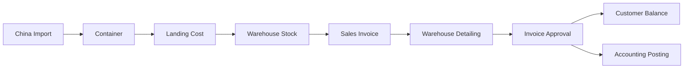
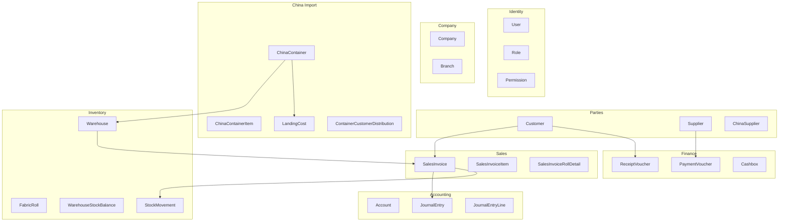
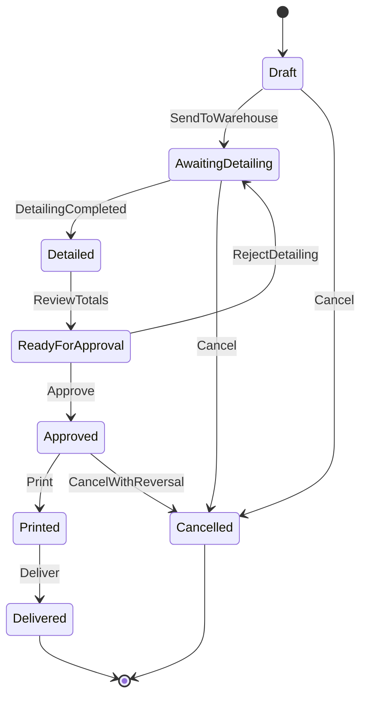
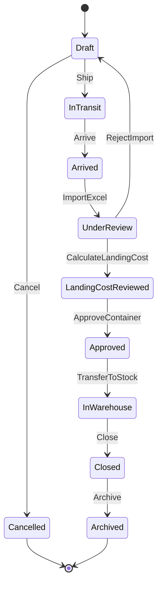
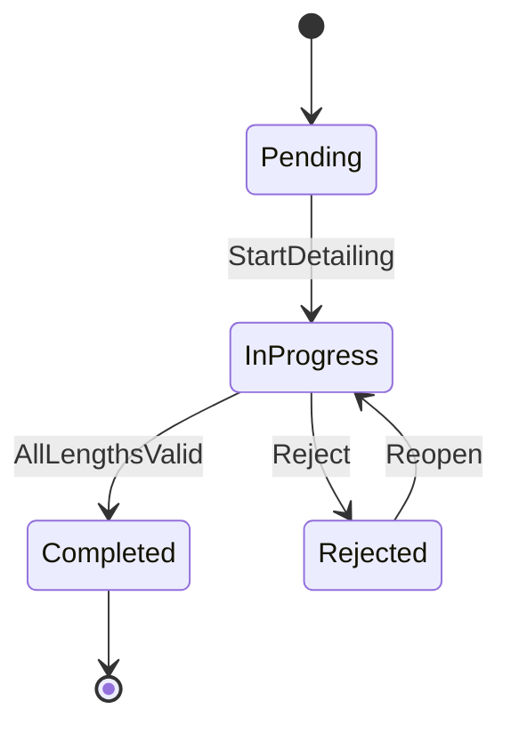
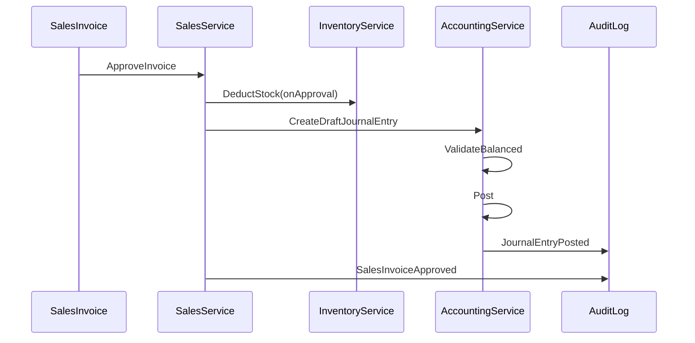
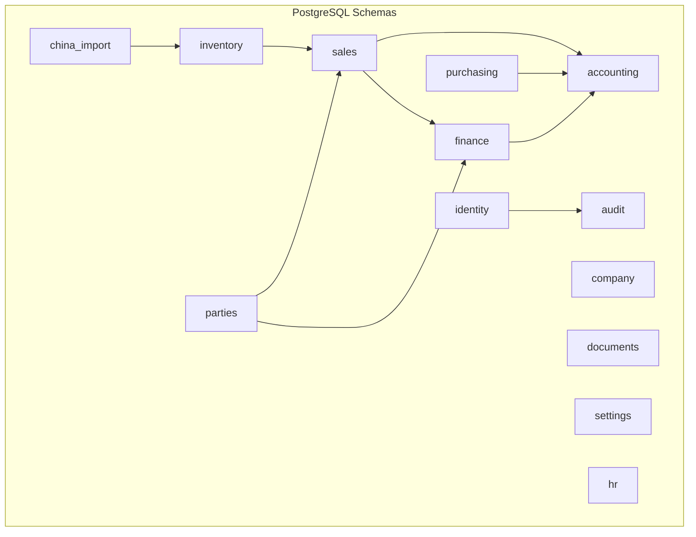
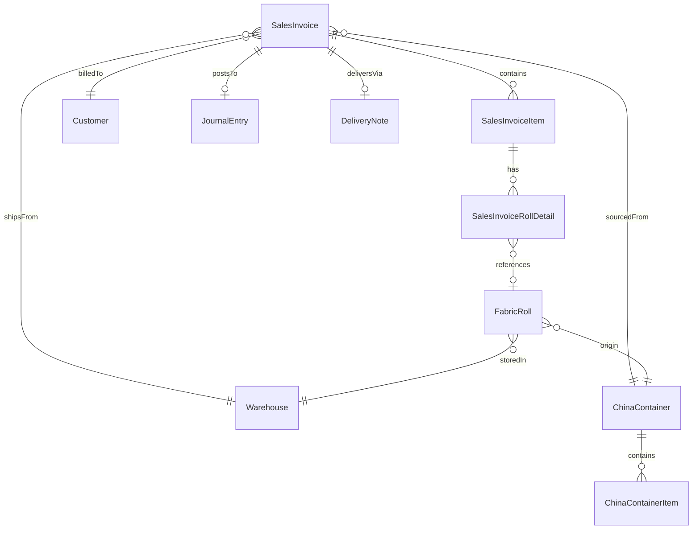
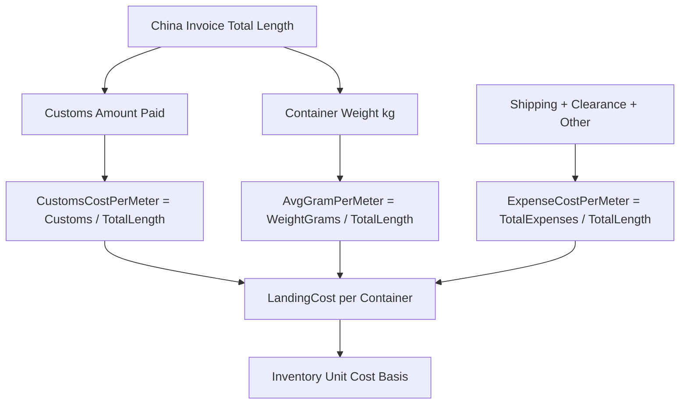
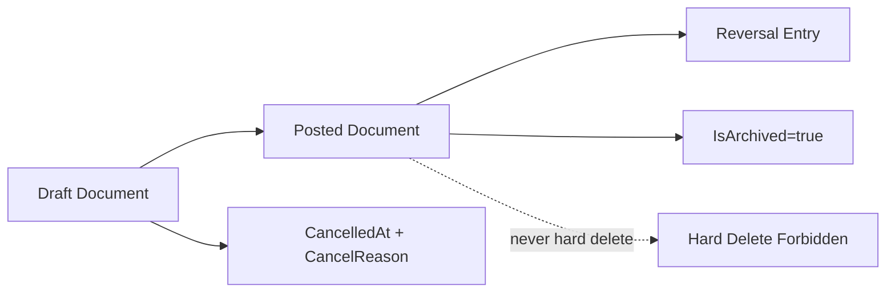

# ERP PRO — Domain Model Diagrams

Companion to [`ERP_PRO_DOMAIN_FOUNDATION.md`](ERP_PRO_DOMAIN_FOUNDATION.md).  
Visual reference only — not executable code.

---

## 1. Core Business Pipeline

---

## 2. Aggregate Map (Bounded Contexts)

---

## 3. Sales Invoice State Machine

---

## 4. China Container State Machine

---

## 5. Warehouse Detailing State Machine

---

## 6. Accounting Posting Flow

---

## 7. Future PostgreSQL Schema Groups

---

## 8. Entity Relationship — Sales Detailing (Critical Path)

---

## 9. Landing Cost Calculation Data Flow

---

## 10. Soft Delete / Immutability Pattern

